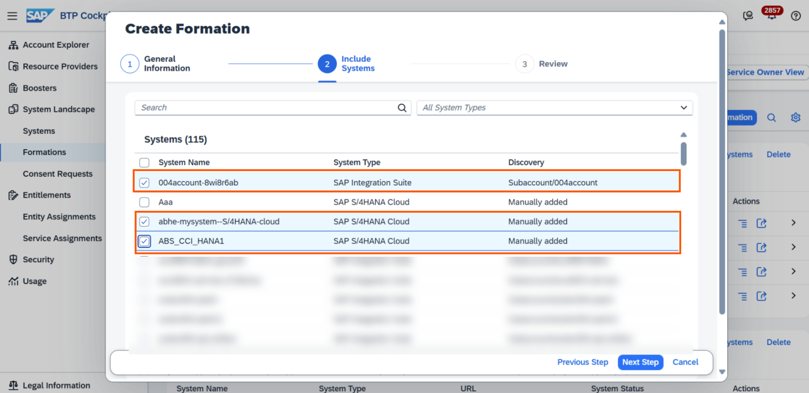

<!-- loiobd5c1f4f18f54f1083835cdab1b224fc -->

# Create an API Artifact Using a Discoverable System

A discoverable system is a backend system \(for example, SAP S/4HANA or Gateway system\) that has been pre-configured in SAP Integration Suite so that the APIs it exposes — along with their metadata — can be discovered and consumed directly within API Management. By referring to a discoverable system, you can manage the APIs it exposes and add a layer of protection and security to them. This involves discovering the APIs and their corresponding metadata from the pre-configured discoverable systems and creating API Artifacts that act as governed proxies in front of them.

<a name="loiobd5c1f4f18f54f1083835cdab1b224fc__prereq_dfg_hfb_pcc"/>

## Prerequisites

-   The *PI\_Integration\_Developer* role collection should be assigned to you.

-   Create a content package. See, [Creating an Integration Package](https://help.sap.com/docs/integration-suite/sap-integration-suite/creating-integration-package?version=CLOUD).

-   Activate API Management capability. See, [Activate and Configure the API Management Capability](activate-and-configure-the-api-management-capability-f6eb433.md).

-   Activate Integration Cell runtime. See, [Activate Integration Cell](activate-integration-cell-1a627da.md).

-   Assign the *PI\_Integration\_Developer* role collection to yourself.

-   If your discoverable system type is SAP Gateway \(Internet/ On-Premise\), your sub-account administrator first need to configure a destination in the subscribers' sub-account in SAP BTP Cockpit with the details of your SAP Gateway system.

    <table>
    <tr>
    <th valign="top">

    Discoverable Systems
    
    </th>
    <th valign="top">

    Adding Formations
    
    </th>
    </tr>
    <tr>
    <td valign="top">
    
    SAP S/4HANA Cloud
    
    </td>
    <td valign="top">
    
    To accomplish this, the administrator creates a formation that includes an SAP Integration Suite system and one or more SAP S/4HANA Cloud systems, all assigned to a common sub-account, as shown in the image. For SAP Integration Suite to recognize these systems, they need to be part of the group. See [Enabling System Landscape for SAP Integration Suite](https://help.sap.com/docs/btp/sap-business-technology-platform/enabling-system-landscape-for-sap-integration-suite) topic for step-by-step instructions on how to register and connect the SAP Integration Suite discoverable system with the SAP S/4HANA Cloud systems.
    
    </td>
    </tr>
    <tr>
    <td valign="top">
    
    SA Gateway
    
    </td>
    <td valign="top">
    
    To accomplish this, you must create a destination using the details of the SAP Gateway system. This destination allows the platform to connect to SAP Gateway and retrieve the list of available backend APIs. See, [Connecting to SAP Gateway System for API Discovery](connecting-to-sap-gateway-system-for-api-discovery-a0092ee.md).
    
    </td>
    </tr>
    </table>
    
    

## Context

Your global account administrator pre-configures the discoverable systems in the global account. Your sub-account administrator configures the destinations for the APIs within the discoverable systems in your sub-account.

This destination contains a full specification of the access information for a system, which includes:

-   A tenant-unique destination name

-   The URL of the target system

-   The authentication method used, and corresponding credentials \(token service, client secret, passwords, etc.\)

-   Additional required headers

<a name="loiobd5c1f4f18f54f1083835cdab1b224fc__steps_efv_wb5_ncc"/>

## Procedure

1.  Log on to SAP Integration Suite.

2.  From the left navigation pane, choose *Design* \> *Integrations and APIs* to view the list of integration packages.

3.  Select the *<integration package\>* where you want to add an API artifact and choose *Edit*.

4.  On the *<integration package\>* details page, choose *Artifacts* and under the *Add* option, select *API*.

    The *Create API* dialog opens.

5.  Select the Integration Cell *Runtime Profile* and choose *Next*.

6.  Select *API Provider* from the available methods and choose *Next*.

    This navigates you to the page where you can select the type of API provider. The*Discoverable Systems* tab is selected by default. On this tab, you can view all the system instances grouped in formations for the sub-account.

7.  Select the discoverable system from the list and choose *Next*.

    The next screen displays all the APIs of the selected system.

8.  Choose the API that you want to proxify and choose *Next*.

    When you select an API, a list of destinations appear. For more details on the filter criterion for destinations, refer to the respective discoverable sytems topics in the*Related links* sections.

9.  Select the destination and choose *Next*.

    If there are multiple matching destinations, choose the appropriate one.

10. The *API Details* page auto-populates the details.

    <table>
    <tr>
    <th valign="top">

    API Details
    
    </th>
    <th valign="top">

    Description
    
    </th>
    </tr>
    <tr>
    <td valign="top">
    
    Name
    
    </td>
    <td valign="top">
    
    Enter an intuitive name. The name must start with a letter or underscore \(\_\), and may include letters, numbers, spaces, periods \(.\), or hyphens \(-\). It must not end with a period \(.\).
    
    </td>
    </tr>
    <tr>
    <td valign="top">
    
    ID
    
    </td>
    <td valign="top">
    
    APIs are identified by their IDs on the home screen. APIs are identified by their IDs on the home screen. Although spaces and special characters are supported, their use is discouraged. Use a lowercase, intuitive name without spaces, special characters, or forward slashes \(/\).
    
    </td>
    </tr>
    <tr>
    <td valign="top">
    
    API Provider
    
    </td>
    <td valign="top">
    
    The destination selected in step 9.
    
    </td>
    </tr>
    <tr>
    <td valign="top">
    
    Relative URL
    
    </td>
    <td valign="top">
    
    This is the relative path of the service. For example, in this URL < https: //<host\>:<port\>/sap/opu/odata/iwbep/GWSAMPLE\_BASIC, "/sap/opu/odata/iwbep/GWSAMPLE\_BASIC" is the relative path.

    > ### Note:  
    > In a REST API, it is recommended not to include query parameters in the URL field. For example, the URL should be in the format `https://<host>:<port>/anything` instead of `https://<host>:<port>/anything?$format=json`. Including query parameters in the URL can cause the validation of the artifact to fail during deployment.
    > 
    > If you need to use query parameters, it is best to append them during the execution of the API rather than including them in the URL field.

    
    </td>
    </tr>
    <tr>
    <td valign="top">
    
    Service Type
    
    </td>
    <td valign="top">
    
    API artifacts can be exposed as REST, SOAP, and ODATA.
    
    </td>
    </tr>
    <tr>
    <td valign="top">
    
    API Base Path
    
    </td>
    <td valign="top">
    
    The unique path prefix for the API. For example, `v1/SFlight`.

    > ### Note:  
    > The base path shouldn't be left empty or set to only "/".

    
    </td>
    </tr>
    <tr>
    <td valign="top">
    
    API State
    
    </td>
    <td valign="top">
    
    API state is used only for demarcation and not used to govern the lifecycle of the API. Choose Alpha if the version of an API is used for exploratory purposes, Beta if the API isn’t meant for productive use, and Active if the API is meant for productive use. The default value is "Active".
    
    </td>
    </tr>
    <tr>
    <td valign="top">
    
    API Version
    
    </td>
    <td valign="top">
    
    Add a version if you want to improve, upgrade, or customize the functional behaviour of an existing API artifact. Versioning allows the creation and management of multiple releases of an API. For example, v1.
    
    </td>
    </tr>
    <tr>
    <td valign="top">
    
    Runtime Profile
    
    </td>
    <td valign="top">
    
    The runtime node on which the API artifact will be deployed. Each runtime profile is mapped to one or more virtual hosts.
    
    </td>
    </tr>
    <tr>
    <td valign="top">
    
    Virtual Host
    
    </td>
    <td valign="top">
    
    You can view the Virtual Host URL for the selected Runtime Profile from this page. The virtual host defines the public-facing hostname and base path through which your API is exposed.

    For example, even if your backend service is hosted at https://internal.services.local/orders, you can expose it externally as https://api.yourdomain.com/v1/orders using a virtual host.

    This helps in proxification of the internal URL, improving security and allowing for more flexible deployment configurations.
    
    </td>
    </tr>
    </table>
    
11. Choose *Create*.

    The API artifact gets created. You can edit it further and configure the following:

    <table>
    <tr>
    <th valign="top">

    Tab
    
    </th>
    <th valign="top">

    Details
    
    </th>
    </tr>
    <tr>
    <td valign="top">
    
    Overview
    
    </td>
    <td valign="top">
    
    You can edit the following:

    -   Name of the API
    -   Host Alias
    -   API Base Path
    -   API State
    -   API Description

    
    </td>
    </tr>
    <tr>
    <td valign="top">
    
    Target EndPoint
    
    </td>
    <td valign="top">
    
    You can change the API provider by choosing an appropriate destination from the list of available destinations. You can also edit the RelativeURL at this point if you want to.
    
    </td>
    </tr>
    <tr>
    <td valign="top">
    
    Resources
    
    </td>
    <td valign="top">
    
    You can add resources. Resources refer to the individual endpoints or services that are exposed through APIs. For more information, see [Add Resources to an API Artifact](add-resources-to-an-api-artifact-b5d0e4c.md).
    
    </td>
    </tr>
    <tr>
    <td valign="top">
    
    Policies
    
    </td>
    <td valign="top">
    
    To enforce security or control API traffic, add policy steps to the API artifact. For more information about how to create a policy, see[Add Policies to Artifacts](add-policies-to-artifacts-c2b3e56.md).
    
    </td>
    </tr>
    </table>
    

12. Once you’ve modeled and managed your API, you can select one of the following actions for the API:

    <table>
    <tr>
    <th valign="top">

    Action
    
    </th>
    <th valign="top">

    Description
    
    </th>
    </tr>
    <tr>
    <td valign="top">
    
    *Save* 
    
    </td>
    <td valign="top">
    
    Saves the artifact as Draft version.
    
    </td>
    </tr>
    <tr>
    <td valign="top">
    
    *Save as version* 
    
    </td>
    <td valign="top">
    
    Creates a new version of the artifact.

    Specify the version in the *Version Information* dialog. In the *Comment* section, you can add additional information specific to the artifact for later reference. This helps you determine the purpose of each version.
    
    </td>
    </tr>
    <tr>
    <td valign="top">
    
    *Deploy* 
    
    </td>
    <td valign="top">
    
    Deployes the API artifact.
    
    </td>
    </tr>
    <tr>
    <td valign="top">
    
    *Delete* 
    
    </td>
    <td valign="top">
    
    Deletes the API artifact from the package.
    
    </td>
    </tr>
    <tr>
    <td valign="top">
    
    *Cancel* 
    
    </td>
    <td valign="top">
    
    Ends your edit session without saving any of the changes you have made.
    
    </td>
    </tr>
    </table>
    

**Related Information**  

[Connecting to SAP S/4HANA Business System for API Discovery](connecting-to-sap-s-4hana-business-system-for-api-discovery-309929d.md "Create a destination in SAP BTP cockpit to enable discovery of APIs from an SAP S/4HANA Cloud system.")

 <?sap-ot O2O class="- topic/link " href="876cea2f90ad4dd49a05c8efa496fd9c.xml" text="" desc="" xtrc="link:2" xtrf="file:/home/builder/src/dita-all/slu1713332208086/loiod8a6092f89b24b5e8531d35c034be3aa_en-US/src/content/localization/en-us/bd5c1f4f18f54f1083835cdab1b224fc.xml" output-class="" outputTopicFile="file:/home/builder/tp.net.sf.dita-ot/2.3/plugins/com.elovirta.dita.markdown_1.3.0/xsl/dita2markdownImpl.xsl" ?> 

[Configure a BTP Destination for API Discovery from an SAP Gateway System \(Internet-Based\)](configure-a-btp-destination-for-api-discovery-from-an-sap-gateway-system-internet-based-9bb2c8a.md "To create an API artifact by discovering your SAP cloud backends through an internet-based SAP Gateway service, you must first configure your gateway system details as a BTP destination. This destination is then available under Discoverable Systems during the API provider creation flow.")

[Configure a BTP Destination for API Discovery from an SAP Gateway System \(On-Premise\)](configure-a-btp-destination-for-api-discovery-from-an-sap-gateway-system-on-premise-7e84b0e.md "After you have discovered the list of APIs via the Gateway service destination, configure a destination with the Proxy Type set to OnPremise to make the runtime calls for the created API artifact. You can also reuse the same destination that was used for API discovery.")

