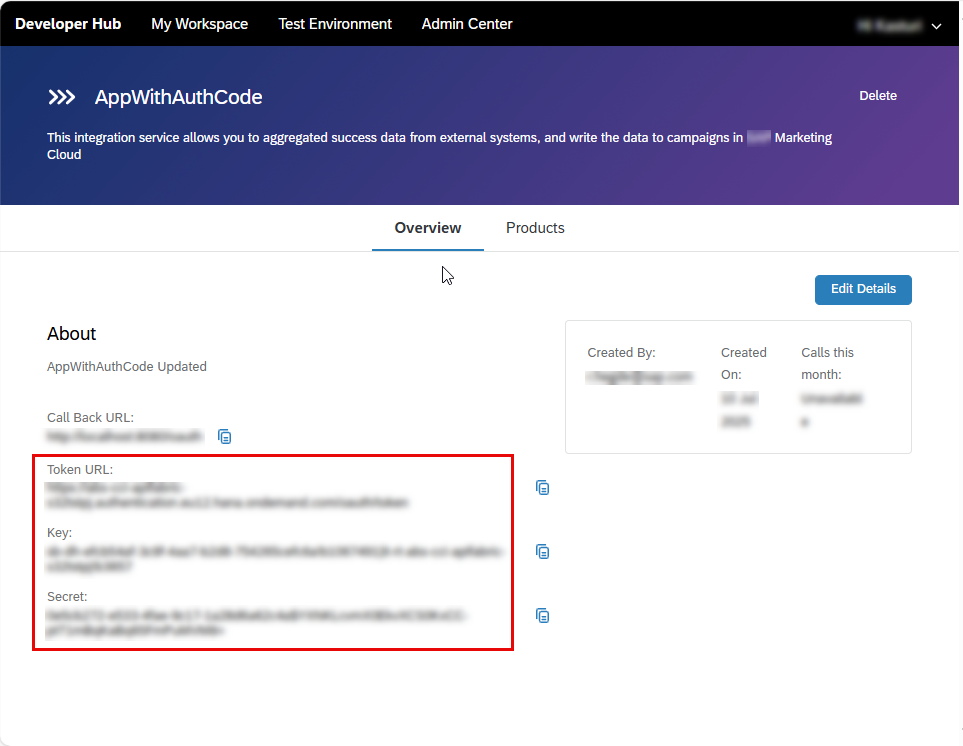

<!-- loiobffa481f06704bcb8df0bfdad853c4b7 -->

# Invoke an MCP Server Artifact by Obtaining Credentials via Developer Hub

To invoke an MCP server artifact, you need to obtain the credentials from the subscription for application you created when subscribing to a product in Developer Hub. This method of obtaining credentials is supported only for MCP server artifacts deployed on the Integration Cell runtime.

<a name="loiobffa481f06704bcb8df0bfdad853c4b7__prereq_nls_54p_42c"/>

## Prerequisites

The *AuthGroup.API.ApplicationDeveloper* role collection must be assigned to you.

The content administrator has already added an MCP server artifact to a product and have published the product. For more information, see [Discover and Publish APIs from SAP Integration Suite](discover-and-publish-apis-from-sap-integration-suite-81b3323.md).

## Context

To obtain the necessary credentials:

## Procedure

1.  Log on to Developer Hub.

2.  Subscribe to the product that contains an MCP server artifact you want to invoke using a REST client. For more information see, [Subscribe to a Product to Consume APIs and Events in an Application](subscribe-to-a-product-to-consume-apis-and-events-in-an-application-f74f47d.md).

3.  Once the subscription is created, go to the *Overview* tab of your application.

    You will find the *Key*, *Secret*, and *Token URL*, which are used to generate the JWT token required to invoke an MCP server artifact.

    

<a name="loiobffa481f06704bcb8df0bfdad853c4b7__postreq_obg_zsp_hgc"/>

## Next Steps

1.  Copy the *Key*, *Secret* and *Token URL*.

2.  Open your REST client.

3.  Use the credentials to invoke an MCP server artifact by including them in the appropriate headers or authentication fields.

