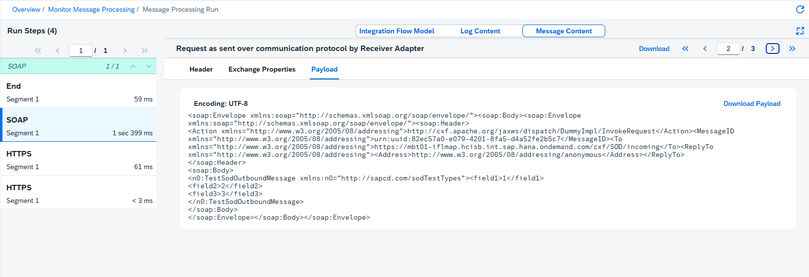

<!-- loioa9db4eab676443ec999e8f7f5b760c2e -->

# Message Processing Log - Adapter Tracing

The adapter tracing is part of the regular tracing feature and the payloads are recorded if you have set the log level to `Trace`.

The adapter tracing is only possible for adapters that transform the message either before sending or upon reception, such as *AS2*, *Ariba*, *LDAP*, *Mail*, *SuccessFactors* and *HTTP/HTTPS*. You also get tracing information for integration flows containing *CFX* based adapters such as*IDOC*, *SOAP*, *SAPRM*, but in this case you have to redeploy the integration flow to get the tracing data recorded in the regular tracing feature and displayed.

Adapter tracing is not possible for *SMS*, *SFTP*, *Facebook*, *Twitter* and *Process direct*, as they do not modify the payload.

> ### Remember:  
> For log level `Trace` , detailed information is recorded for all steps and in addition, the message content is tracked . The trace function expires after a certain time \(default value: 10 minutes\). After expiry the log level switches back to the log level set before. The recorded message content is also retained for a certain time \(default value: 1 hour\).

To view trace information, select an integration flow from the overview list. Go to the **Log** section and open the log level link. In the integration flow model, the system displays trace entries as envelope icons.

Select a step from the run steps panel and switch to the **Message Content** tab. There you can find headers, exchange properties, and payloads. You can also download all the details by choosing **Download** in the top right corner. A zip file containing one header file and one payload file is saved to your local file system.

To find the information you need, check the description field. This field contains contextual information such as, *Request as sent over communication protocol by Receiver Adapter*, *Response as received over communication protocol by Receiver Adapter*, or *Message before Step*. 

<a name="loioa9db4eab676443ec999e8f7f5b760c2e__section-header"/>

## Header

The *Header* tab displays the HTTP headers of the message as received by the adapter. These headers are set by the sender and carry metadata such as content type, authorization, and tracing identifiers.

To observe and correlate a message end-to-end across all participating systems, every message must carry a globally unique identifier in its transport headers.

The following identifier headers can be found on your message:

<table>
<tr>
<th valign="top">

Header

</th>
<th valign="top">

Description

</th>
</tr>
<tr>
<td valign="top">

`sap-passport`

</td>
<td valign="top">

SAP's internal correlation identifier. When two SAP systems communicate, the message carries a SAP Passport that encodes a uniquely generated trace identifier.

</td>
</tr>
<tr>
<td valign="top">

`traceparent`

</td>
<td valign="top">

SAP Cloud Integration adopts the W3C Trace Context standard as the universal trace identifier for cross-system tracing. W3C Trace Context is an open web standard defined by the World Wide Web Consortium \(W3C\). Cloud Integration includes the W3C Trace ID inside the SAP Passport so that the correlation chain is preserved when a message crosses from an OpenTelemetry-instrumented system into the SAP ecosystem.

If the incoming request includes a W3C trace context header \(`traceparent`\), Cloud Integration captures the Trace ID in the Message Processing Log. This allows you to correlate the MPL entry with the corresponding record in an external monitoring tool.

> ### Remember:  
> For SAP-to-SAP communication, the SAP Passport remains the primary carrier of trace information. Cloud Integration includes the W3C Trace ID inside the SAP Passport so that the correlation chain is preserved when a message crosses from an OpenTelemetry-instrumented system into the SAP ecosystem.

</td>
</tr>
</table>

<a name="loioa9db4eab676443ec999e8f7f5b760c2e__section-exchange-properties"/>

## Exchange Properties

The *Exchange Properties* tab displays runtime properties set on the message exchange during processing. These are key-value pairs written by integration flow steps and adapters: for example, routing decisions, message IDs, or adapter-specific context values. Exchange properties are internal to the integration flow and aren't transmitted to the receiver.

## Payload

Adapter tracing captures detailed payload information at several stages of message processing. Initially, each step records its payload before execution begins. However, adapters that perform message transformation can capture additional payloads: the outbound message as it's sent over the communication protocol and the inbound response as it's received. This results in multiple payload entries.

When multiple payloads exist for a single step, a paging area appears in the interface. You need to navigate between pages to access all available payload data.

> ### Note:  
> It is possible that the adapter logs different payloads at different times. This can result in multiple entries for the step on the left-hand side panel.

