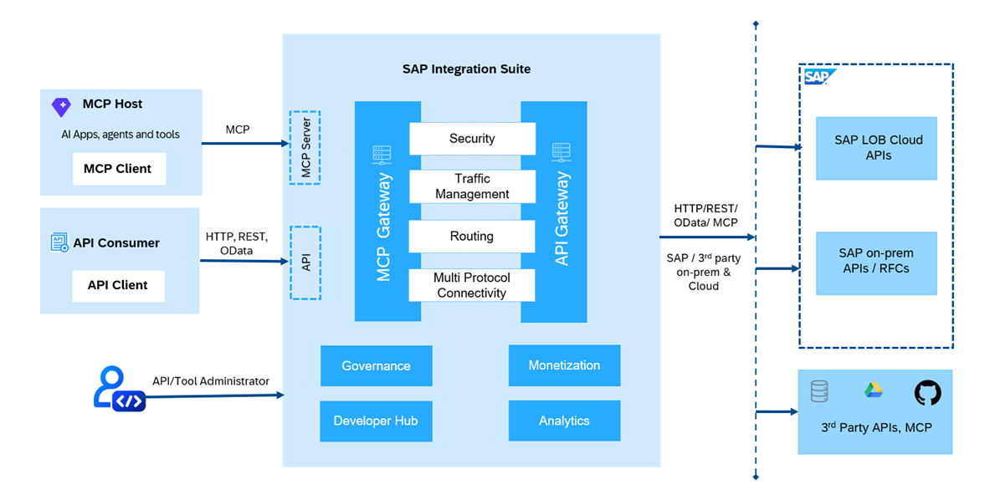

<!-- loio9eb9239c1b4c458198ca5234d191f8bd -->

# Model Context Protocol \(MCP\)

Model Context Protocol \(MCP\) is an open-source protocol designed to bridge the gap between AI applications or agents and enterprise tools and data. Just as REST APIs connect web applications to data and services, MCP enables AI-native integrations by exposing tools, APIs, and data sources to AI Agents.

> ### Note:  
> Availability of this feature depends upon the SAP Integration Suite service plan that you use. For more information about different service plans and their supported feature set, see SAP Note [2903776](https://launchpad.support.sap.com/#/notes/2903776).

In SAP Integration Suite, the MCP Server capability is realized through the MCP gateway. The MCP gateway acts as the runtime layer that exposes enterprise APIs, tools, and backend services as MCP-compatible endpoints for AI agents. It provides capabilities such as security, traffic management, routing, and multi-protocol connectivity while enabling governed access to enterprise systems

<a name="loio9eb9239c1b4c458198ca5234d191f8bd__section_wbh_c3k_kgc"/>

## Why MCP for APIs?

MCP makes it easy for AI agents to use tools, APIs, and data. While traditional APIs expose business logic and are managed through servers, MCP takes it further by making these APIs discoverable and usable by AI agents. It enables AI agents to understand context, interact with systems, and access enterprise data and services. In short, MCP connects your existing systems to intelligent AI agents, making them smarter and more useful. For more information, [How Model Context Protocol \(MCP\) Server Enables AI Integration](how-model-context-protocol-mcp-server-enables-ai-integration-572e7fd.md).

<a name="loio9eb9239c1b4c458198ca5234d191f8bd__section_dtq_ljk_kgc"/>

## MCP Gateway Architecture in SAP Integration Suite: An End-to-End Flow

This section outlines the architectural components and data flow involved in enabling Model Context Protocol \(MCP\) within SAP Integration Suite. The architecture supports both AI-native and traditional API-based integrations through dedicated MCP and API gateway capabilities.

The MCP Server capability is implemented through the MCP Gateway, which exposes enterprise APIs, tools, and backend services as MCP-compatible endpoints for AI agents. Similarly, the API gateway enables secure and governed access to APIs for traditional API consumers. Both gateways share common capabilities such as security, traffic management, and multi-protocol connectivity.

End-to-End Request Flow: MCP Client vs. API Client:

****

<table>
<tr>
<th valign="top">

Actions

</th>
<th valign="top">

MCP Client

</th>
<th valign="top">

API Client

</th>
</tr>
<tr>
<td valign="top">

Request Initiation

</td>
<td valign="top">

AI Agents act as MCP client to send context-aware requests.

</td>
<td valign="top">

Applications use the API client to access services via REST, OData, or HTTP.

</td>
</tr>
<tr>
<td valign="top">

Server Processing

</td>
<td valign="top">

All MCP requests are processed through the MCP gateway, where the MCP Server capability is realized. The gateway provides::

-   Tools and prompts for AI agents

</td>
<td valign="top">

All API requests are processed through the API gateway, which provides:

-   Multi-protocol support \(REST, SOAP, and OData\)
-   API artifacts for standard APIs

</td>
</tr>
<tr>
<td valign="top">

Backend Integration

</td>
<td valign="top">

Requests are routed to:

-   SAP LOB cloud
-   Third-party APIs \(for example, databases, GitHub, cloud storage\)
-   Managed API on the same Integration Cell tenant

</td>
<td valign="top">

Requests are routed to:

-   SAP LOB cloud
-   Third-party APIs \(for example, databases, GitHub, cloud storage\)

</td>
</tr>
<tr>
<td valign="top">

Response Delivery

</td>
<td valign="top">

AI agents receive responses in a format that is compliant with the MCP protocol.

</td>
<td valign="top">

API clients get standard REST/OData responses.

</td>
</tr>
</table>

This architecture enables reuse of existing APIs for both AI and API clients—ensuring secure, scalable, and governed access to enterprise systems in both AI-driven and traditional use cases.

## **MCP Server Primitives**

MCP server primitives define the core capabilities that an MCP server exposes to AI agents. They provide standardized ways for agents to perform actions, access contextual data, and use predefined interaction patterns.

An MCP server supports three primary primitives: Tools, Resources, and Prompts.

Each primitive serves a distinct purpose and is exposed through the MCP protocol. Together, they enable structured and controlled interactions between AI agents and enterprise services.

-   **MCP Tools**

    MCP tools represent actions that an AI agent can invoke to perform specific operations.

    They are derived from API operations and can represent actions such as retrieving, creating, updating, or deleting data. Each tool defines an input schema that specifies the parameters accepted from the agent and an output schema that describes the structure of the returned response.

    Tools enable AI agents to interact with backend services in a structured and controlled manner.

-   **MCP Resources**

    MCP resources provide AI agents with access to data and contextual information exposed by an MCP server.

    They represent information that agents can retrieve and use as context when performing tasks or generating responses. Resources are identified using URIs and can represent documents, records, configuration data, or other application-specific information.

    Unlike tools, resources are intended for retrieving information rather than performing actions.

-   **MCP Prompts**

    MCP prompts define reusable interaction patterns for AI agents.

    They provide predefined messages and instructions that guide how an agent performs a task. Prompts can accept arguments that dynamically customize their content. Messages can use **User** and **Assistant** roles to define a structured interaction flow.

    Prompts help ensure consistent and repeatable interactions between AI agents and the MCP server.

**Related Information**  

[API Artifact](api-artifact-a4f87b1.md "API artifacts are the core building blocks used to design, configure, publish, and manage APIs in SAP Integration Suite, API Management. These artifacts define how APIs behave, how they interact with backend systems, and how they are exposed to consumers.")

[Deploy an Artifact](deploy-an-artifact-b70e7ec.md "After creating an API or an MCP server artifact, it is necessary to deploy it on the chosen runtime in order to make it executable and ready for use.")

[Copy an Artifact](copy-an-artifact-820c9e8.md "Create a copy of an existing API artifact or an MCP server with all its configurations and policies intact. This can be useful when you want to create a similar artifact but with some modifications or variations.")

[Delete an Artifact](delete-an-artifact-81694d6.md "Use this procedure to delete an API or an MCP Server artifact from an integration package in the Design workspace.")

[How Model Context Protocol \(MCP\) Server Enables AI Integration](how-model-context-protocol-mcp-server-enables-ai-integration-572e7fd.md "The MCP server enables AI agents to interact with enterprise systems through a structured process.")

[Create an MCP Server from an API Artifact](create-an-mcp-server-from-an-api-artifact-9f18140.md "Create an MCP Server from an existing API artifact deployed on Integration Cell in SAP Integration Suite. This allows you to expose deployed integration APIs as tools that AI agents and AI clients can discover and invoke.")

[Create an MCP Server from an HTTP Endpoint](create-an-mcp-server-from-an-http-endpoint-b59f141.md "Create an MCP Server from any HTTP endpoint by providing its OpenAPI specification. This enables you to connect and expose REST-based services as MCP tools for AI-driven consumption.")

[Create an MCP Server by Referring to an RFC-Based Backend](create-an-mcp-server-by-referring-to-an-rfc-based-backend-cbb8b78.md "Create an MCP server by connecting to an RFC-based backend system and exposing selected RFC operations as MCP tools.")

