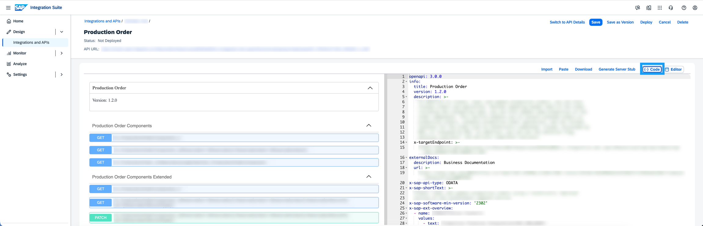
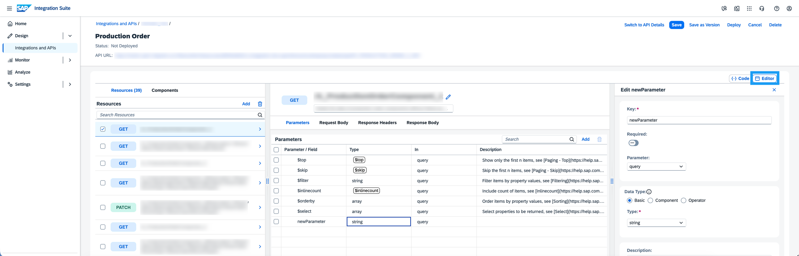

<!-- loio2bf94eb7947245259be340e3c7d89fee -->

# OpenAPI Specification Editors

SAP Integration Suite offers both a code editor and a visual editor for working with OpenAPI Specifications, allowing users to either create new APIs using YAML/JSON or update existing APIs through an interactive form. This enables flexibility and caters to different user preferences and stages of the API lifecycle.

## OpenAPI Specification Code Editor

The OpenAPI Specification Code Editor is a code-based editor for creating new API artifacts by writing an API specification directly in YAML or JSON. The editor includes a split-pane layout: you write the specification in the right-hand pane and preview the rendered reference documentation in the left-hand pane.

The code editor guides you through the full structure of an API definition.

## OpenAPI Specification Visual Editor

The OpenAPI Specification Visual Editor provides an interactive, form-based interface for adding new and modifying existing API objects, such as resources, parameters, responses, and schemas, without manually editing code. Instead of writing YAML or JSON directly, you work with structured input fields to modify API objects.

> ### Note:  
> The visual editor requires an existing API artifact. It cannot be used to create APIs from scratch.

## Choosing an Editor

<table>
<tr>
<th valign="top">

Features

</th>
<th valign="top">

Code Editor

</th>
<th valign="top">

Visual Editor

</th>
</tr>
<tr>
<td valign="top">

**Purpose**

</td>
<td valign="top">

Import or paste a new OpenAPI specification

</td>
<td valign="top">

Update an existing OpenAPI specification

</td>
</tr>
<tr>
<td valign="top">

**Input method**

</td>
<td valign="top">

YAML or JSON

</td>
<td valign="top">

Form-based interface

</td>
</tr>
<tr>
<td valign="top">

**Audience**

</td>
<td valign="top">

Users comfortable writing OpenAPI specifications

</td>
<td valign="top">

Users who prefer a guided, no-code approach

</td>
</tr>
<tr>
<td valign="top">

**Preview**

</td>
<td valign="top">

Live documentation preview

</td>
<td valign="top">

N/A

</td>
</tr>
</table>

**Related Information**  

[Modify an OpenAPI Specification Using the Code Editor](modify-an-openapi-specification-using-the-code-editor-4923e5e.md "Switch to OpenAPI Specification designer to create APIs.")

[Modify an OpenAPI Specification Using the Visual Editor](modify-an-openapi-specification-using-the-visual-editor-f3c95cd.md "The OpenAPI Specification visual editor provides an interactive interface to easily update and extend API objects, such as resources and schemas, for existing APIs.")

