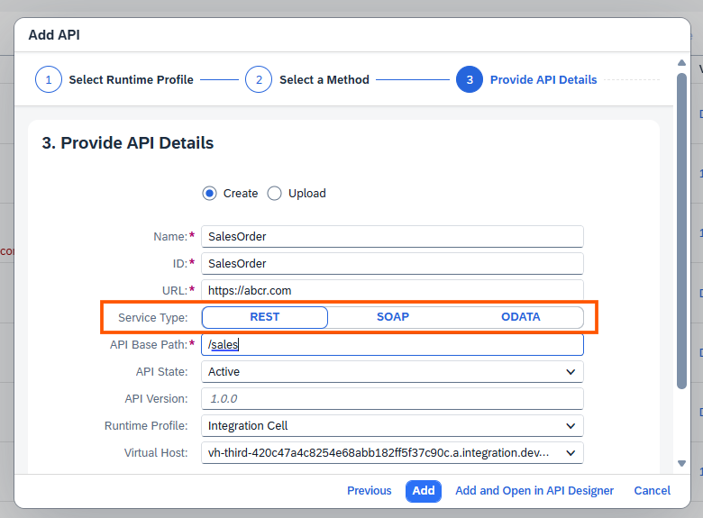
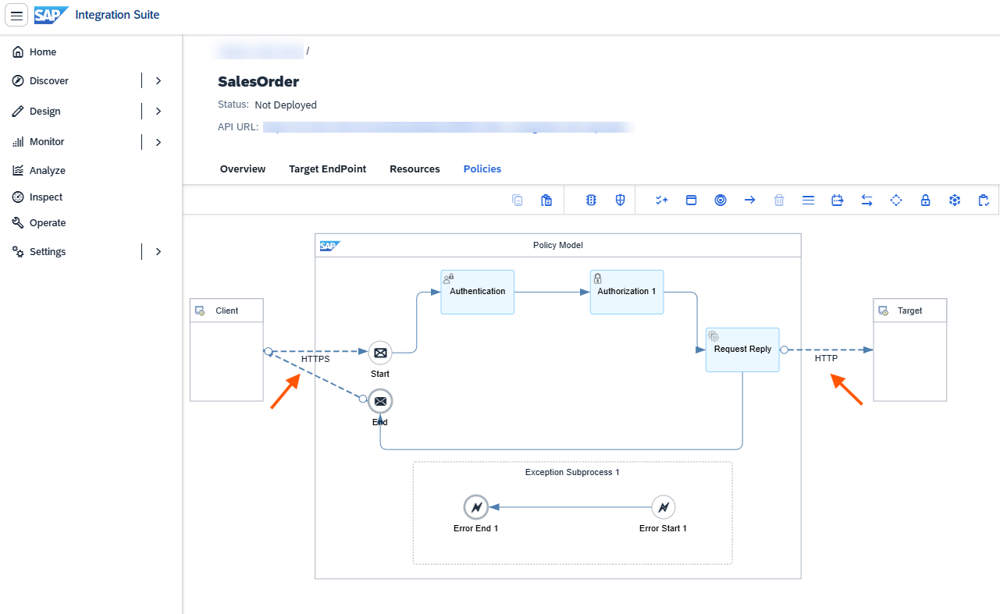

<!-- loio4dd2dde8f8d74f5aba830941c731dc9f -->

# Service Types for API Artifacts

Service types define the communication protocol for an API artifact and determine the default sender and receiver adapters and the generated policy model.

When you create an API artifact, you select a service type based on the protocol that the API exposes. The selected service type determines the default sender and receiver adapters that are automatically added to the API artifact. These adapters define how requests are received from clients and forwarded to the backend service.

The service type also determines the initial policy model generated for the API artifact. The generated model provides a predefined execution flow that you can further customize by adding, removing, or configuring policies to meet your integration requirements.

## Supported Service Types

The following service types are available when creating an API artifact.

<table>
<tr>
<th valign="top">

Service Type

</th>
<th valign="top">

Description

</th>
<th valign="top">

Default Sender Adapter

</th>
<th valign="top">

Default Receiver Adapter

</th>
</tr>
<tr>
<td valign="top">

*REST* 

</td>
<td valign="top">

Creates an API artifact for REST-based services. The generated policy model is configured for REST communication between clients and backend services.

</td>
<td valign="top">

HTTPS

</td>
<td valign="top">

HTTP

</td>
</tr>
<tr>
<td valign="top">

*SOAP* 

</td>
<td valign="top">

Creates an API artifact for SOAP web services. The generated policy model includes adapters that support SOAP message processing.

</td>
<td valign="top">

SOAP

</td>
<td valign="top">

SOAP

</td>
</tr>
<tr>
<td valign="top">

*OData* 

</td>
<td valign="top">

Creates an API artifact for OData services. The generated policy model is configured to process OData requests while forwarding them to the backend using the ODATA adapter.

> ### Note:  
> Currently, only the **ODATA V2** receiver adapter is supported.

</td>
<td valign="top">

ODATA

</td>
<td valign="top">

ODATA

</td>
</tr>
</table>

## Default Adapter Configuration

The sender adapter represents the entry point through which client requests are received by the API artifact. The receiver adapter represents the endpoint through which requests are forwarded to the target backend service. For more information, [Default Adapters for API Artifacts](default-adapters-for-api-artifacts-719d07c.md).

Depending on the selected service type, the API artifact is initialized with the following default adapter combinations:

<table>
<tr>
<th valign="top">

Service Type

</th>
<th valign="top">

Communication Flow

</th>
</tr>
<tr>
<td valign="top">

REST

</td>
<td valign="top">

Client → **HTTPS** \(Sender\) → Policy Model → **HTTP** \(Receiver\) → Backend Service

</td>
</tr>
<tr>
<td valign="top">

SOAP

</td>
<td valign="top">

Client → **SOAP** \(Sender\) → Policy Model → **SOAP** \(Receiver\) → Backend Service

</td>
</tr>
<tr>
<td valign="top">

OData

</td>
<td valign="top">

Client → **ODATA** \(Sender\) → Policy Model → **ODATA** \(Receiver\) → Backend Service

</td>
</tr>
</table>

For example, when you create an API artifact with the **REST** service type, the system automatically configures an **HTTPS** sender adapter to receive client requests and an **HTTP** receiver adapter to forward requests to the backend service. The generated policy model is preconfigured with these adapters, providing a starting point for implementing authentication, authorization, traffic management, and other API policies.

> ### Note:  
> The default sender and receiver adapters are generated based on the selected service type during API creation. You can further customize the policy model by configuring policies and other processing steps as required for your integration scenario.

