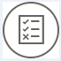

<!-- loiofb2c7aa34cdc443294a325ccb7876785 -->

# Debug API

You debug an API proxy to troubleshoot and monitor them in SAP API Management, by probing the details of each step through the API proxy flow.

## Procedure

1.  Log on to the API portal.

2.  Choose the navigation icon on the left and choose *Develop*.

3.  Select the required API that you want to debug.

4.  Choose *Debug* in the View API page.

5.  Alternatively, you can also launch the debug viewer from the API Test Console by following the substeps below:

    1.  Select the navigation icon and choose *Test*.

    2.  Select the required API from the APIs list.

    3.  Choose *Debug* at the bottom right corner.

6.  In the *API Debug Viewer*, choose *Start Debug*.

    When you start the debug, the API records details of each step in the processing pipeline. While the debug session is running, messages and contextual data are captured from live traffic.

    > ### Note:  
    > One debug session supports 20 request/response transactions per message processor through the selected API proxy. A debug session automatically stops after 10 minutes if you don't manually stop it. You can also start the debug session at any point in time of working in the API Management.

    You can view a list of captured request/response transactions on the left menu. Choose any of the transactions to view the detailed debug map and the corresponding properties.

7.  To view the transaction details at any point in time of an active debug session, choose *Refresh*.

8.  When you've captured a sufficient number of requests, choose *Stop Debug*.

9.  Debug the API using the guidance provided below:

    **Transaction Map details**

    <table>
    <tr>
    <th valign="top">

    Icon

    
    </th>
    <th valign="top">

    Description

    
    </th>
    </tr>
    <tr>
    <td valign="top">
    
    

    Condition

    
    </td>
    <td valign="top">
    
    Indicates a condition evaluated on the API

    
    </td>
    </tr>
    <tr>
    <td valign="top">
    
    

    State Change

    
    </td>
    <td valign="top">
    
    Indicates the change of state of the execution flow

    
    </td>
    </tr>
    <tr>
    <td valign="top">
    
    

    Flow Information

    
    </td>
    <td valign="top">
    
    Indicates the information about the current flow

    
    </td>
    </tr>
    <tr>
    <td valign="top">
    
    

    Execution

    
    </td>
    <td valign="top">
    
    Indicates the result of a condition execution

    
    </td>
    </tr>
    <tr>
    <td valign="top">
    
    

    Error

    
    </td>
    <td valign="top">
    
    Indicates an occurrence of error at the time of policy execution

    
    </td>
    </tr>
    </table>
    
    In addition to the above mentioned icons, each policy is represented by an icon. By choosing the icon, you can view the policy details.

    **Phase Details**

    Using phase details you can check the headers that are being sent to the backend, variables set by policies and so on. You can verify the base path to ensure that a policy is routing the message to correct server. Refer the table below to understand each phase:

    <table>
    <tr>
    <th valign="top">

    Phase

    
    </th>
    <th valign="top">

    Description

    
    </th>
    </tr>
    <tr>
    <td valign="top">
    
    Proxy Endpoint

    
    </td>
    <td valign="top">
    
    Indicates the selected proxy Endpoint flow for execution. An API proxy can have multiple named proxy endpoints

    
    </td>
    </tr>
    <tr>
    <td valign="top">
    
    Request Headers

    
    </td>
    <td valign="top">
    
    Lists the HTTP request headers

    
    </td>
    </tr>
    <tr>
    <td valign="top">
    
    Request Content

    
    </td>
    <td valign="top">
    
    Displays the HTTP request body

    
    </td>
    </tr>
    <tr>
    <td valign="top">
    
    Variables Read

    
    </td>
    <td valign="top">
    
    Lists the flow variables that were read by a policy

    
    </td>
    </tr>
    <tr>
    <td valign="top">
    
    Variables Read and Assigned

    
    </td>
    <td valign="top">
    
    Lists the flow variables that were read and assigned a value by a policy.

    
    </td>
    </tr>
    <tr>
    <td valign="top">
    
    Target Endpoint

    
    </td>
    <td valign="top">
    
    Indicates the selected Target Endpoint for execution

    
    </td>
    </tr>
    <tr>
    <td valign="top">
    
    Response Headers

    
    </td>
    <td valign="top">
    
    Lists the HTTP response headers

    
    </td>
    </tr>
    <tr>
    <td valign="top">
    
    Response Content

    
    </td>
    <td valign="top">
    
    Displays the HTTP response body

    
    </td>
    </tr>
    </table>
    

