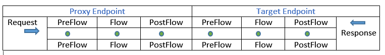

<!-- loio952cbd7d32c342788ba699227e734547 -->

# JSON Threat Protection

Minimizes the risk posed by content-level attacks by enabling specific limits on various JSON structures, such as arrays and strings.

You can attach this policy in the following locations:



> ### Note:  
> JSON Threat Protection policy can be applied only to POST or PUT operations of an API. Applying this policy to a GET operation of an API results in an error.

An example payload for the policy is as follows:

> ### Code Syntax:  
> ```
> <JSONThreatProtection async="false" continueOnError="false" enabled="true" xmlns="http://www.sap.com/apimgmt">
>                 <ArrayElementCount>15</ArrayElementCount>
>                 <ContainerDepth>15</ContainerDepth>
>                 <ObjectEntryCount>15</ObjectEntryCount>
>                 <ObjectEntryNameLength>25</ObjectEntryNameLength>
>                 <Source>request</Source>
>                 <StringValueLength>100</StringValueLength>
> </JSONThreatProtection>
> 
>  
> ```


<table>
<tr>
<th valign="top">

**Elements and Attributes**

</th>
<th valign="top">

**Description**

</th>
</tr>
<tr>
<td valign="top">

Array Element Count \(Optional\)

</td>
<td valign="top">

This attribute specifies the maximum number of elements allowed in an array.

The limit is not applied if you do not specify this element, or if you specify a negative integer.

Syntax: `<ArrayElementCount>10</ArrayElementCount>`

</td>
</tr>
<tr>
<td valign="top">

Container Depth \(Optional\)

</td>
<td valign="top">

This attribute specifies the maximum container depth allowed for objects or arrays.

For example, the container depth of an array containing an object, which contains another object is 3.

The limit is not applied if you do not specify this element, or if you specify a negative integer.

Syntax: `<ContainerDepth>5</ContainerDepth>`

</td>
</tr>
<tr>
<td valign="top">

Object Entry Count \(Optional\)

</td>
<td valign="top">

This attribute specifies the maximum number of entries allowed within an object.

The limit is not applied if you do not specify this element, or if you specify a negative integer.

Syntax: `<ObjectEntryCount>10</ObjectEntryCount>`

</td>
</tr>
<tr>
<td valign="top">

Object Entry Length Name \(Optional\)

</td>
<td valign="top">

This attribute specifies the maximum string length allowed for a property name within an object.

The limit is not applied if you do not specify this element, or if you specify a negative integer.

Syntax: `<ObjectEntryNameLength>100</ObjectEntryNameLength>`

</td>
</tr>
<tr>
<td valign="top">

Source \(Optional\)

</td>
<td valign="top">

This attribute indicates the message to be screened for JSON payload attacks.

**Request**: With a threat protection policy attached to any request flow, invalid messages return a 400 status code, along with a corresponding policy error message.

**Response**: Threat protection policy attached to any response flow, invalid messages still returns a 500 status code, and one of the corresponding policy error messages is thrown \(rather than just ExecutionFailed\).

Syntax: `<Source>response</Source>`

</td>
</tr>
<tr>
<td valign="top">

String Value Length \(Optional\)

</td>
<td valign="top">

This attribute specifies the maximum length allowed for a string value.

The limit is not applied if you do not specify this element, or if you specify a negative integer.

Syntax: `<StringValueLength>200</StringValueLength>`

</td>
</tr>
</table>

During the policy execution, the following errors can occur:

**Error Code**


<table>
<tr>
<th valign="top">

Error Name

</th>
<th valign="top">

HTTP Status

</th>
<th valign="top">

Cause

</th>
</tr>
<tr>
<td valign="top">

ExceededContainerDepth

</td>
<td valign="top">

500

</td>
<td valign="top">

JSONThreatProtection\[policy\_name\]: Exceeded container depth at line \[line\_num\]

</td>
</tr>
<tr>
<td valign="top">

ExceededObjectEntryCount

</td>
<td valign="top">

500

</td>
<td valign="top">

JSONThreatProtection\[policy\_name\]: Exceeded object entry count at line \[line\_num\]

</td>
</tr>
<tr>
<td valign="top">

ExceededArrayElementCount

</td>
<td valign="top">

500

</td>
<td valign="top">

JSONThreatProtection\[policy\_name\]: Exceeded array element count at line \[line\_num\]

</td>
</tr>
<tr>
<td valign="top">

ExceededObjectEntryNameLength

</td>
<td valign="top">

500

</td>
<td valign="top">

JSONThreatProtection\[policy\_name\]: Exceeded object entry name length at line \[line\_num\]

</td>
</tr>
<tr>
<td valign="top">

ExceededStringValueLength

</td>
<td valign="top">

500

</td>
<td valign="top">

JSONThreatProtection\[policy\_name\]: Exceeded string value length at line \[line\_num\]

</td>
</tr>
<tr>
<td valign="top">

Invalid JSON object

</td>
<td valign="top">

500

</td>
<td valign="top">

JSONThreatProtection\[policy\_name\]: The input JSON Payload is invalid.

</td>
</tr>
<tr>
<td valign="top">

SourceUnavailable

</td>
<td valign="top">

500

</td>
<td valign="top">

This error occurs when the message variable mentioned in the source element is either unavailable in the specific flow where the policy is being executed or it does not have a valid value \(request, response, or message\).

JSONThreatProtection\[policy\_name\]: Source \[var\_name\] is not available

</td>
</tr>
<tr>
<td valign="top">

NonMessageVariable

</td>
<td valign="top">

500

</td>
<td valign="top">

This error occurs when the source element is set to a variable type which is not a message.

JSONThreatProtection\[policy\_name\]: Variable \[var\_name\] does not resolve to a Message

</td>
</tr>
<tr>
<td valign="top">

ExecutionFailed

</td>
<td valign="top">

500

</td>
<td valign="top">

JSONThreatProtection\[policy\_name\]: Execution failed. reason: \[string\]

</td>
</tr>
</table>

Following fault variables is set when the policy triggers an error at runtime:

**Fault Variables**


<table>
<tr>
<th valign="top">

Variable Set

</th>
<th valign="top">

Where

</th>
<th valign="top">

Example

</th>
</tr>
<tr>
<td valign="top">

\[prefix\].\[policy\_name\].failed

</td>
<td valign="top">

\[prefix\]: jsonattack

\[policy\_name\]: The name of the policy to check.

</td>
<td valign="top">

jsonthreatprotection.JTP-SecureRequest.failed = true

</td>
</tr>
<tr>
<td valign="top">

fault.\[error\_name\]

</td>
<td valign="top">

\[error\_name\] = The specific error name to check for as listed in the table above.

</td>
<td valign="top">

fault.name Matches "SourceUnavailable"

</td>
</tr>
</table>

Following is an example of an error response:

> ### Sample Code:  
> ```
> {
>   "fault": {
>     "faultstring": "JSONThreatProtection[JPT-SecureRequest]: Execution failed. reason: JSONThreatProtection[JTP-SecureRequest]: Exceeded object entry name length at line 5",
>     "detail": {
>       "errorcode": "steps.jsonthreatprotection.ExecutionFailed"
>     }
>   }
> }
> ```

Following is an example of a fault rule:

> ### Sample Code:  
> ```
> <FaultRule name="JSON Threat Protection Policy Faults">
>     <Step>
>         <Name>CustomErrorResponse</Name>
>         <Condition>(fault.name Matches "ExecutionFailed") </Condition>
>     </Step>
>     <Condition>(jsonattack.JTP-SecureRequest.failed = true) </Condition>
> </FaultRule>
> ```

**Related Information**  


[JSON to XML](json-to-xml-908598d.md "API Management enables developers to convert messages from the JavaScript object notation (JSON) format to the extensible markup language (XML) format by using the JSON to XML policy type.")

[XML Threat Protection](xml-threat-protection-3de6615.md "")

[Regular Expression Protection](regular-expression-protection-0118f91.md "API Management helps to identify common content level threats that follow certain patterns, by enabling developers configure regular expressions that can be evaluated against API traffic at runtime.")

