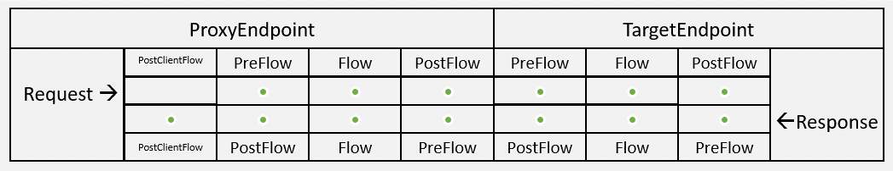

<!-- loio6407ae7701814caa8a5107bdc3f44fe2 -->

# Message Logging Policy

The Message Logging policy lets you send syslog messages to third-party log management services, such as Splunk, Sumo Logic, Loggly, or similar log management services.

If you want to send syslog to one of those services, follow the service documentation of the concerned service to obtain the host, port, and protocol, then set the <Syslog\> element on this policy accordingly.

You can attach this policy in the following locations: 

An example payload for the policy is as follows:

```
<MessageLogging async="false" continueOnError="false" enabled="true" xmlns='http://www.sap.com/apimgmt'>
	<Syslog>
		<Message>Message.id = {request.header.id}</Message>
    	<!-- Host must be valid DNS/IP -->
    	<!-- <Host>127.0.0.1</Host> -->
		<Host></Host>
    	<!-- This is default port value -->
	    <Port>514</Port>
	    <Protocol>TCP</Protocol>
 	<SSLInfo>  
    		<Enabled>false</Enabled> 
     	<ClientAuthEnabled>false</ClientAuthEnabled> 
     	<KeyStore/> 
     	<KeyAlias/> 
     	<TrustStore/> 
     	<Ciphers/> 
     	<Protocols/> 
 	</SSLInfo> 
	</Syslog>
</MessageLogging>
```

> ### Note:  
> When using Loggly, <FormatMessage\>true</FormatMessage\> is required in the policy as a child of the <Syslog\>element.


<table>
<tr>
<th valign="top" colspan="2">

Elements and Attributes

</th>
<th valign="top">

Description

</th>
</tr>
<tr>
<td valign="top" rowspan="6">

`Syslog` destination

To send syslog to Splunk, Sumo Logic, Loggly, or similar log management services.

</td>
<td valign="top">

`Message` 

</td>
<td valign="top">

Build the message to be sent to the syslog, combining text with variables to capture the information you want.

> ### Note:  
> Response variables will not be available in PostClientFlow following an Error Flow. Use message variables to log response information for both error and success situations.


</td>
</tr>
<tr>
<td valign="top">

`Host` 

</td>
<td valign="top">

The hostname or IP address of the server where the syslog should be sent. If the element is not specified, the default is localhost.

</td>
</tr>
<tr>
<td valign="top">

`Port` 

</td>
<td valign="top">

Port where the syslog is running. If you don't include this element, the default is 514.

</td>
</tr>
<tr>
<td valign="top">

`Protcol` 

</td>
<td valign="top">

TCP or UDP \(default\). While UDP is more performant, the TCP protocol guarantees message log delivery to the syslog server. For sending syslog messages over TLS/SSL, only TCP is supported.

</td>
</tr>
<tr>
<td valign="top">

`FormatMessage` 

</td>
<td valign="top">

`true` or `false`

Optional, but <FormatMessage\>true</FormatMessage\> is required for use with Loggly.

This element lets you control the format of generated content prepended to the message. If set to true, the syslog message is prepended by a fixed number of characters, which lets you filter out that information from messages.

</td>
</tr>
<tr>
<td valign="top">

SSLInfo

</td>
<td valign="top">

If you don't include this element or leave it empty, the default value is false.

Lets you log messages through SSL/TLS. Use with sub elements

-   Enabled: Indicates whether TLS/SSL is enabled for the endpoint. The default value is false.
-   ClientAuthEnabled: Outbound client authentication \(2-way TLS/SSL\)
-   Keystore: A keystore containing private keys used for outbound client authentication
-   KeyAlias: The key alias of the private key used for outbound client authentication
-   TrustStore: A keystore containing trusted server certificates.
-   Ciphers: Supported ciphers for outbound TLS/SSL.To restrict ciphers, add the following elements listing the supported ciphers:

    > ### Sample Code:  
    > ```
    > <Ciphers>
    >  <Cipher>TLS_RSA_WITH_3DES_EDE_CBC_SHA</Cipher>    
    >  <Cipher>TLS_RSA_WITH_DES_CBC_SHA</Cipher>
    > </Ciphers>
    > ```

-   Protocols: Supported protocols for outbound TLS/SSL.To restrict protocols, add the following elements listing the supported protocols:

    > ### Sample Code:  
    > ```
    > <Protocols>
    >  <Protocol>TLSv1</Protocol>
    >  <Protocol>TLSv1.2</Protocol>
    >  <Protocol>SSLv2Hello</Protocol> 
    > </Protocols>
    > ```


> ### Sample Code:  
> ```
> 
>  <SSLInfo>
>       <Enabled>false</Enabled>
>       <ClientAuthEnabled>false</ClientAuthEnabled>
>       <KeyStore>myKeystore</KeyStore>
>       <KeyAlias>myKey</KeyAlias>
>       <TrustStore>myTruststore</TrustStore>
>     </SSLInfo>
> 
> ```


</td>
</tr>
</table>

