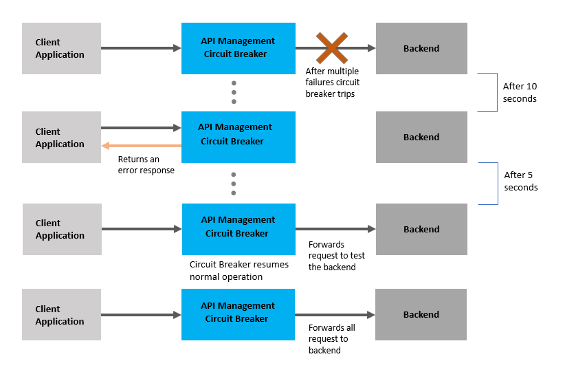

<!-- loiobd3c2d5be9ec4051ac6c0295173b4c22 -->

# Circuit Breaker for On-Premise Provider

In the context of an API or service proxy, a circuit breaker is a design pattern used to improve the resilience and fault tolerance of the system. It is typically used to prevent cascading failures when a service or API endpoint becomes unresponsive or starts to exhibit high latency.

The circuit breaker monitors the requests being made to a particular service or endpoint. If the number of failed requests exceeds a certain threshold within a specified time period, the circuit breaker "trips" and starts to short-circuit subsequent requests. Instead of forwarding the requests to the unresponsive service, the circuit breaker returns an error response immediately.

By doing this, the circuit breaker helps to protect the system from overloading and allows it to gracefully handle failures. It also provides a fallback mechanism, where alternative actions can be taken when a service is unavailable, such as returning cached data or using a different service.

The circuit breaker can periodically attempt to close the circuit and forward requests to the service again. If the service starts to respond successfully, the circuit breaker will reset and resume normal operation. However, if the service continues to fail, the circuit breaker will remain open, preventing further requests from being sent.

Consider the following example:

If the number of failed requests exceeds a certain threshold within a 10-second timeframe, the circuit breaker will activate and begin to intercept subsequent requests. Instead of forwarding these requests to the unresponsive service, the circuit breaker will return an error response.

After 5 seconds, the circuit breaker will test the backend by forwarding a few requests to it. If these requests succeed, the circuit breaker will close and resume normal operation by forwarding all requests to the backend.

