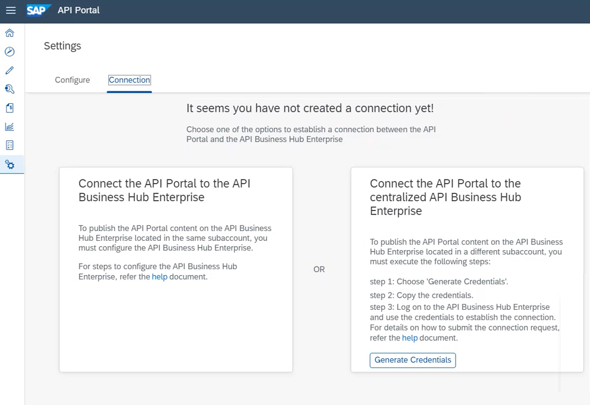

<!-- loio9d8c7ae4849941a9a528f752235c6867 -->

<link rel="stylesheet" type="text/css" href="../../css/sap-icons.css"/>

# Setting Up API Portal Application Using API Management Standalone Tile

You can provision the API portal using the **API Management, API Portal** standalone tile from the SAP BTP cockpit.

<a name="loio9d8c7ae4849941a9a528f752235c6867__prereq_hgt_tfb_stb"/>

## Prerequisites

> ### Note:  
> If you’re a new user, you can't subscribe to the API Management, API portal service independently anymore. To provide a comprehensive integration experience, API Management is only available as a capability of the SAP Integration Suite. For a new subscription of API Management, API portal subscribe to SAP Integration Suite. For more information, see [Activating and Managing Capabilities](https://help.sap.com/docs/integration-suite/sap-integration-suite/activating-and-managing-capabilities?q=Create%20an%20API%20Provider&version=CLOUD). For visual instructions on how to set up and configure API Management capability from Integration Suite, see [Set Up API Management from Integration Suite](https://developers.sap.com/tutorials/api-mgmt-isuite-initial-setup.html) tutorial published on SAP site.

-   You already have a subaccount and have enable the Cloud Foundry environment in this subaccount. For more information, see [Create a Subaccount](https://help.sap.com/docs/BTP/65de2977205c403bbc107264b8eccf4b/05280a123d3044ae97457a25b3013918.html?q=entitlements).

-   An *API Management, API portal* entitlement has been created for your subaccount. For more information, see [Configure Entitlements and Quotas for Subaccounts](https://help.sap.com/docs/BTP/65de2977205c403bbc107264b8eccf4b/5ba357b4fa1e4de4b9fcc4ae771609da.html?q=entitlements).

<a name="loio9d8c7ae4849941a9a528f752235c6867__context_kqs_twb_stb"/>

## Context

You should have API Management, API portal subscription to set up the API portal application.

> ### Note:  
> Ensure that you don’t have an instance of a starter plan created in the same subaccount where you plan to create an API Management, API portal subscription. Also, note that API Management capabilities from Integration Suite and API Management subscriptions using the stand-alone tile can’t coexist in the same subaccount.

Perform the step-by-step instructions to set up the API portal application. However, you can also refer the following video for visual instructions: 

<a name="loio9d8c7ae4849941a9a528f752235c6867__steps_bnm_ft1_stb"/>

## Procedure

1.  Log on to SAP BTP Cockpit and navigate to your subaccount.

2.  Navigate to *Service Marketplace* search for *API Management, API portal* tile and choose *Create*.

    Alternatively, navigate to *Services* \> *Instances and Subscriptions*, and choose *Create*.

3.  On the *New Instances and Subscriptions* dialog, choose Integration Suite as the *Service*, select the *Standard* plan from the dropdown list, and choose *Create*.

    Wait for the subscription to complete successfully.

4.  Choose *View Subscription* on the *Creation in Progress* dialog.

    Check the status of the submission in subscriptions section on the *Instances and Subscriptions* page. If the subscription is successful you’ll notice the status of the *API Management, API portal* changes to *Subscribed*.

5.  To access the API Management, API portal, you must first assign the *APIManagement.Selfservice.Administrator* role to yourself.

    > ### Note:  
    > If you choose *Go to Application* without assigning the *APIManagement.Selfservice.Administrator* role, an application authentication error appears. If the error persists after assigning the role, clear your web browser cache, and log out of the application and log on again.

    To assign the role:

    1.  On the navigation pane, under *Security*, choose *Users*.

    2.  Select your Username and under *Role Collections* section, choose *Assign Role Collection*.

    3.  In the resulting dialog box, select the *APIManagement.Selfservice.Administrator* role and choose *Assign Role Collection*.

6.  Navigate back to the *Instances and Subscriptions* page, choose *API Management, API portal*, select  Actions and choose *Go To Application*.

    You’re navigated to the *API Portal*.

7.  On the *Configure the API Management Service* screen, select the following and choose *Set Up*:

    -   Select the *Account type*:

        -   Select the *Non Production* account type for non-business critical activities, such as integrating test systems, testing new scenarios, performance testing, and sandbox activities.
        -   Select the *Production* account type for business critical usages, such as integrating production systems, and productive APIs.

    -   In the *Virtual Host* section, enter the *Host Alias*.

    -   Provide an email ID in the *Notification Contact* field to receive updates.

    In the *Set-up Confirmation* window, review the provided details and choose *Confirm* to start the onboarding process.

    You’re redirected to a progress window, which states *API Management Service Setup In Progress*.

    The *Configuration* process is triggered, where the necessary resources are provisioned for you. It’s followed by *Testing the Setup* process, where a simple API Proxy is deployed and invoked to check that everything is set up properly.

    When the processes complete, the indicators turn green to indicate that the processes are successful. A *Release Notification* mail is sent out to the email IDs provided in the *Configure the API Management Service* screen. This email contains details of the newly set up API Management service on your account.

    The API Management, API portal application is now configured.

8.  You must log out of the*API Portal* and login again.

    Now, you can create APIs, build API proxies as a service provider, or use APIs and other convenient services.

<a name="loio9d8c7ae4849941a9a528f752235c6867__result_gny_mrk_4pb"/>

## Results

The API portal is now configured. Log on to the API portal again. You can now create APIs, build API proxies as a service provider, or use APIs and other convenient services.

<a name="loio9d8c7ae4849941a9a528f752235c6867__postreq_zsz_5rk_4pb"/>

## Next Steps

To start publishing the API portal content, you must enable the API Business Hub Enterprise. To publish the API portal content on the API Business Hub Enterprise located in the same subaccount, see [Set Up API business hub enterprise Application Using the Standalone Tile](set-up-api-business-hub-enterprise-application-using-the-standalone-tile-80c0519.md). To publish the API portal content on the centralized API Business Hub Enterprise, follow the on-screen instructions and see [Centralized API business hub enterprise \[Classic Design\]](centralized-api-business-hub-enterprise-classic-design-33b706f.md).

Once API Business Hub Enterprise is set up, navigate to :gear: and choose *Connection*.

**Related Information**  

[Enable API Management Capability](enable-api-management-capability-f6eb433.md "You can provision the API Management capability from the Integration Suite launchpad.")

[Assign User Roles in API Management](https://help.sap.com/viewer/de4066bb3f9240e3bfbcd5614e18c2f9/Cloud/en-US/911ca5a620e94ab581fa159d76b3b108.html "Use role collections to group together different roles that can be assigned to API Portal and API business hub enterprise users.") :arrow_upper_right:

[Cancel API Management Service Subscription](cancel-api-management-service-subscription-df6df2b.md "You can deactivate your API Management capability from Integration Suite to disable your account from the API Management service.")

[Build API Proxies](../build-api-proxies-74c042b.md "provides a common platform for API designers to define and publish APIs. Every customer is provided with their own application on cloud. The offers capabilities to configure systems, build and publish APIs, analyze and test APIs.")

[Create an API Provider](../create-an-api-provider-6b263e2.md "Define the details of the host you want an application to reach by creating an API provider.")

[Different Methods of Creating an API Proxy](../different-methods-of-creating-an-api-proxy-4ac0431.md "An API proxy is the data object that contains all the functionality to be executed when an external user wants to access the backend service.")

[Configuring a Custom Domain for a Virtual Host](configuring-a-custom-domain-for-a-virtual-host-6b9e5a3.md "The API Management capability enables you to personalize the virtual host URL by configuring a custom domain of your choice. This means that you can have all your APIs displayed as &quot;https://api.bestrun.com/...&quot; if desired. Additionally, you have the option to set up multiple virtual hosts using the same custom domain, such as &quot;https://api1.bestrun.com,&quot; &quot;https://api2.bestrun.com,&quot; and so on.")

[Configuring Mutual TLs for Virtual Host](configuring-mutual-tls-for-virtual-host-9faf7ce.md "You can configure mutual TLs for a virtual host, which validates the identities of both the web server and the web client.")

