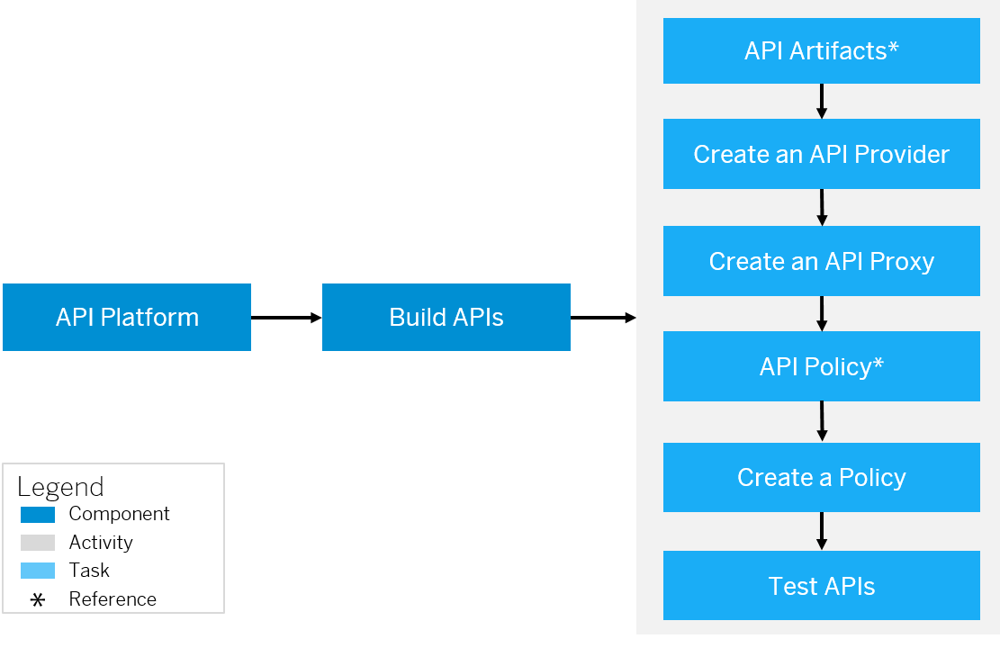

<!-- loio74c042b9710e4970ae51ec58b749fb4f -->

# Build API Proxies

provides a common platform for API designers to define and publish APIs. Every customer is provided with their own application on cloud. The offers capabilities to configure systems, build and publish APIs, analyze and test APIs.

## Prerequisites

Before you start the process of building APIs, it is important to understand the different artifacts associated to an API. For more information, see [Key Components of an API](key-components-of-an-api-19c0654.md).

## Context

To expose an API, you first need to create a system so you can connect to the API provider. After you have done this, you can create APIs by associating policies to it. Once you associate the policies and your API is ready to use, you test it using the API test console.

To build an API, you need to perform the following tasks:

## Procedure

1.  [Create an API Provider](create-an-api-provider-6b263e2.md).

2.  [Different Methods of Creating an API Proxy](different-methods-of-creating-an-api-proxy-4ac0431.md).

3.  [Associate policies to an API](policies-7e4f3e5.md).

4.  [Test APIs using the API Test Console](test-api-proxies-3ba6151.md).

    > ### Note:  
    > In order to achieve an effortless navigation to the API business hub enterprise, choose *Navigation Links*\(\) from the and select *API Business Hub Enterprise*.

