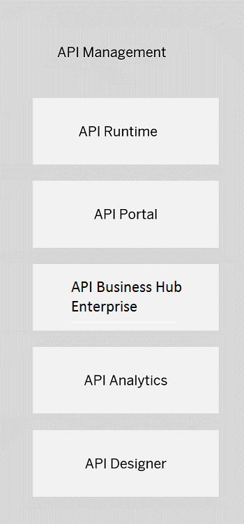
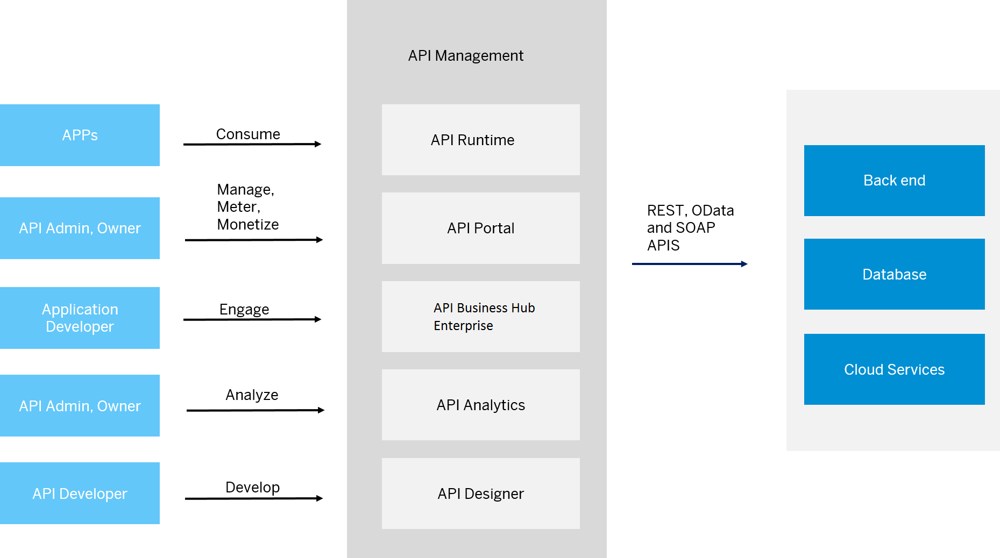

<!-- loio24f1af0b2f6041d49d0d65b5defb4eb8 -->

# Components of API Management

API Management component overview

The API Management infrastructure consists of five components: API Runtime, API Portal, API business hub enterprise, API Analytics, and API Designer.

### API Runtime

Allows you to deploy and productively use your APIs. Applications consume the API Runtime, request for API authentication, and access.

### API Portal

The one-stop-shop to create, secure, and publish API Proxies. This is the place for easy discovery of APIs, and you the API Administrator, can manage, meter, secure your APIs, as well as define and publish rate plans. To know more about using the API Portal see,  <?sap-ot O2O class="- topic/xref " href="adcbc07b031b4ac285b22867a1216306.xml" text="" desc="" xtrc="xref:6" xtrf="file:/home/builder/src/dita-all/djr1548327031813/loiocf0e5a9be9804817aa649f51a84b9f39_en-US/src/content/localization/en-us/24f1af0b2f6041d49d0d65b5defb4eb8.xml" output-class="" outputTopicFile="file:/home/builder/tp.net.sf.dita-ot/2.3/plugins/com.elovirta.dita.markdown_1.3.0/xsl/dita2markdownImpl.xsl" ?> .

### API Business Hub Enterprise

Self-service for application developers to discover, browse, and explore APIs, subscribe to rate plans, and build apps. To know more about using the API business hub enterprise, see [Consume API Proxies](consume-api-proxies-ea561e4.md).

### API Analytics

Provides powerful analytical tools to track your API usage. Use API Analytics to collect information on the URL, user ID for API call information, latency data, and so on. To know more about API Analytics, and how you can use it, see [Analyze APIs](analyze-apis-7712c61.md).

### API Designer

API developers can define, implement, and document APIs. It provides open API support, and a variety of outputs can be generated. For more information on the API Designer, see, [here](https://help.sap.com/viewer/e63fe47de8f84a68b618ed689af9a28b/Cloud/en-US).

You can use API Management with one of SAP's numerous in-house API providers as well as any non-SAP APIs. API Management leverages your investment in SAP solutions and can also be integrated with non-SAP solutions. It helps unlock the value of digital assets and enables you to create and deliver content. API Management enables applications to run seamlessly by accessing backend data securely. It provides **one-experience** for managing and monitoring APIs across various data platforms with real-time Analytics.

The following image shows how different stakeholders interact with the various API Management components, and how API Management in turn interacts with the different cloud and on-premise systems.

