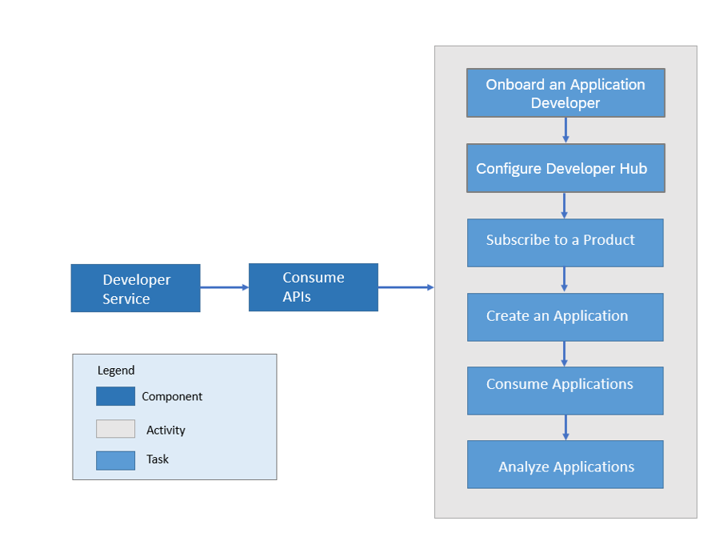

<!-- loioea561e424f6e44aa985fceedf7fabee7 -->

# Consume API Proxies

Consume API proxies via the Developer Hub. In the Developer Hub, an application developer registers, explores the API exposed by customers, creates applications, and tests API proxies.

> ### Caution:  
> Effective June 2024, the classic design of the Developer Hub will be deprecated and will no longer be accessible. The new design of the Developer Hub will be set as your default design from March 2024. For more information, see [User Roles and Responsibilities in Developer Hub](APIM-Initial-Setup/user-roles-and-responsibilities-in-developer-hub-54b4607.md).

If you've added Developer Hub as a capability with Integration suite, or if you’ve subscribed to the Developer Hub as part of the standalone API Management subscription, you have the option to experience the new design of the Developer Hub user interface along with the classic design.

> ### Note:  
> By default, the Site Administrator has an option to switch from classic to new design and set the new design as the default UI using the **Site Editor.** The Site Administrator has the right to enable the configuration to let all the other users switch between the old and the new design. For more information, see [Customize the Visual Format of the Developer Hub](customize-the-visual-format-of-the-developer-hub-2eacd52.md).

Developer Hub is an application that provides a common platform for Application developers to consume API proxies. Every API Management customer is provided with their own Developer Hub application on cloud. The Developer Hub offers capabilities to onboard application developers, explore and test API proxies, create and subscribe to Applications.

The Developer Hub supports the following features:

-   **Onboard an Application developer**- To explore the API proxies and subscribe to an Application, an Application developer must be registered to the Developer Hub. On registering, the Application developer is provided access to the Developer Hub.
-   **Browse Catalog**- Explore the Products \(assembled APIs\) available in the Catalog store, navigate to individual API proxies, read the API Documentation, and view the resources attached to the API proxies.

    > ### Note:  
    > A limitation within the open-source Swagger library, on which the Developer Hub relies, causes slow, improper, or no rendering of API schemas that contain circular references on deeply nested models on the platform.

-   **Create Applications** – An Application developer can create on or more applications to consume API proxies. To consume the API proxies, an Application developer must subscribe to an Application \(assembled Products\). It is by subscribing to an Application that you return to the developer the key required to access the API proxies.
-   **Download JSON**- You can download the open API specification for the APIs that are part of the Developer Hub in JSON format. This enables the developer to use the metadata of the APIs for various aspects such as code/SDK generation for developing applications.

-   **Download SDK**- You can also download the client software development kit \(SDK\) for developers through a non-commercial license on open source sites. You can use this SDK for developing applications.

-   **Test API Proxies** - You can test the API proxies and understand the runtime behavior of the API proxies better. Use the Test Console to explore the resources associated with an API and execute the operations.

**Related Information**  

[User Roles and Responsibilities in Developer Hub](APIM-Initial-Setup/user-roles-and-responsibilities-in-developer-hub-54b4607.md "After activating the Developer Hub in the Integration Suite, you need to assign users the necessary roles and role collections to access the various features and functionalities of Developer Hub.")

