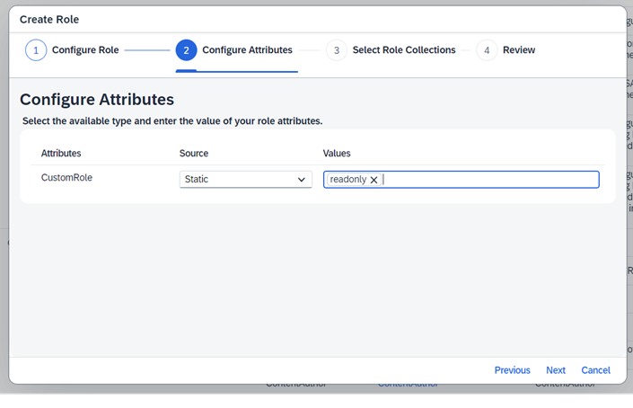

<!-- loio9d827cd46b6c486f8f74482c828e67cd -->

<link rel="stylesheet" type="text/css" href="../css/sap-icons.css"/>

# Creating and Assigning a Custom Role Collection

Only users assigned to the custom role collection can discover and subscribe to API products associated with it.

<a name="loio9d827cd46b6c486f8f74482c828e67cd__prereq_xqn_hwd_zdc"/>

## Prerequisites

The user whom you are trying to assign the custom role collection should already be onboarded to Developer Hub.

<a name="loio9d827cd46b6c486f8f74482c828e67cd__context_qzh_dxk_pkb"/>

## Context

In this section, we will guide you through the following:

-   Create a custom role collection.
-   Create a custom role.
-   Add the custom role to the custom role collection.
-   Assign the custom attribute of the custom role to the product you want to restrict access to.
-   Then, assign the custom role collection to the user who's already onboarded as an application developer to Developer Hub.

## Procedure

1.  Create a custom role collection.

    1.  Open the SAP BTP cockpit and go to your *Subaccount*.

    2.  In the left navigation pane, choose *Security* \> *Roles Collections* \> ** and choose *Create*.

    3.  In the *Create Role Collection* dialog, provide the *Name* and *Description* and choose *Create*.

    The custom role collection gets created.

2.  Create a custom role and add it to the role collection you created in Step 1.

    1.  From the left navigation pane, choose *Security* \> *Roles*.

        Here you see a complete list of all existing roles sorted by application name. It also contains the role template, role names, and role description. On the right side, you find the action buttons.

    2.  Choose *Create Role* in the row of the role template *ApplicationDeveloper*.

    3.  In the *Create Role* dialog, under *Configure Role* provide the *Role Name* and *Description* and choose *Next*.

        The *Role Template* field is pre-populated with *ApplicationDeveloper*.

    4.  Under *Configure Attributes*, keep the value of *Source* as *Static*.

        Under *Values* specify the attribute values and press enter. This value is later used to assign permission while creating an API product.

        

        > ### Note:  
        > Use only alphanumeric characters for the attribute values. Also, the attribute values shouldn't contain any spaces or special characters except for the hyphen '-' and underscore '\_'. It is recommended that you use CamelCase for better readability.
        > 
        > The *Next* option on the *Create Role* dialogue will remain greyed out until you press enter after typing the attribute values in the text box.

    5.  Under *Select Role Collections*, select the <Custom Role Collection\> you created in Step 1 and choose *Next*.

    6.  Review the details of the new role and choose *Finish*.

        A new role is created and added to the *Roles* list.

3.  Assign the custom attribute of the custom role \(created in Step 2d\) to the product you want to restrict access to. For detailed instructions, see [Restricting Access to API Products Using Custom Role Attribute](restricting-access-to-api-products-using-custom-role-attribute-09fb892.md).

4.  Assign the custom role collection to the user who's already onboarded as an application developer to the Developer Hub.

    1.  From the left navigation pane, choose *Security* \> *Users*.

    2.  To find a user, enter the user's name/email in the search bar.

        Once you've found the user in the search result, select it.

    3.  Under *Role Collections* choose the  Additional Options icon and select the *Assign Role Collection* option from the menu.

    4.  Now, in the*Assign Role Collection* dialog, search for the custom role collection you want to assign. Use the search bar to quickly find the role collection by name.

        Once you've found the custom role collection in the search results, select it.

    5.  Finally, choose*Assign Role Collection* to complete the process. This action will apply the custom role collection to the user, granting them the necessary access to the product.

**Related Information**  

[Create a Product](create-a-product-d769622.md "Explains how to create products to publish a bundle of API proxies together.")

