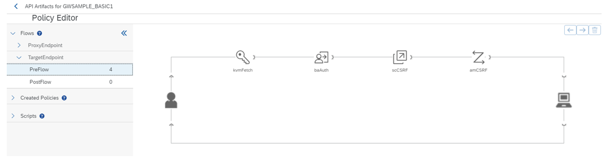

<!-- loio9881a45b350c4b5d942bfcbfe5a2fe78 -->

# CSRF Token Handling in API Management

While exposing any back-end services, like SAP GW OData service via API Management, you have to enable server to server authentication between the back-end and API Management system.

You enable the server to server authentication, so that the API consumers don't have to know the back-end system credentials, instead they can use the policy based authentication. Whenever you make a POST, PUT, and a DELETE HTTP verb, it requires a CSRF token validation from the back-end. In this section, we’ve described how to automate the CSRF token validation from the API Management layer.

The policies required to enable back-end authentication from API Management.


<a name="loio9881a45b350c4b5d942bfcbfe5a2fe78__section_eqv_j3c_jtb"/>

## Enabling Backend Authentication from API Management

1.  Create a Key value map for storing credential of back-end system.

    

2.  Implement the following 4 policies in the target endpoint:

    -   **kvmFetch \(KeyValueMapOperations\)**: Use this policy to retrieve the username and password from the key value map and assign them to the private variables.

        > ### Note:  
        > Condition strings aren’t required for this policy.

        

        ```
        <KeyValueMapOperations mapIdentifier="ES5Credential" continueOnError="false" enabled="true" xmlns="http://www.sap.com/apimgmt">
          <Get assignTo="private.BasicAuthUsername" index='1'>
            <Key><Parameter>Username</Parameter></Key>
          </Get>
          <Get assignTo="private.BasicAuthPassword" index='1'>
            <Key><Parameter>Password</Parameter></Key>
          </Get>
          <Scope>environment</Scope>
        </KeyValueMapOperations
        
        ```

    -   **baAuth \(BasicAuthentication\)**: Use this policy to encode the username and password in Base64 and assign that to the authorization header.

        > ### Note:  
        > Condition strings aren’t required for this policy.

        ```
        <BasicAuthentication continueOnError='false' enabled='true' xmlns='http://www.sap.com/apimgmt'>
          <Operation>Encode</Operation>
          <IgnoreUnresolvedVariables>false</IgnoreUnresolvedVariables>
          <User ref='private.BasicAuthUsername'></User>
          <Password ref='private.BasicAuthPassword'></Password>
          <AssignTo createNew="true">request.header.Authorization</AssignTo>
        </BasicAuthentication>
        
        ```

    -   **scCSRF \(ServiceCallout\)**: Use this policy to fetch the CSRF token from the back-end call. Use the following condition string:

        ```
        (request.verb = "POST" OR request.verb = "PUT" OR request.verb = "DELETE")
        ```

        Here we've used an API provider named ES5 for the back-end connection in API Management.

        ```
        <?xml version="1.0" encoding="UTF-8" standalone="yes"?>
        <ServiceCallout async="true" continueOnError="false" enabled="true" xmlns="http://www.sap.com/apimgmt">
            <Request>
          <Set>
            <Headers>
              <Header name="x-csrf-token">fetch</Header>
            <Header name="Authorization">{request.header.Authorization}</Header>
            </Headers>
            <Verb>GET</Verb>
          </Set>
          <IgnoreUnresolvedVariables>false</IgnoreUnresolvedVariables>
        </Request>
            <Response>callOutResponse</Response>
            <Timeout>30000</Timeout>
            <HTTPTargetConnection>
                <APIProvider>ES5</APIProvider>
        		 <Path>sap/opu/odata/IWFND/CATALOGSERVICE/ServiceCollection</Path>
            </HTTPTargetConnection>
        </ServiceCallout>
        
        ```

    -   **amCSRF \(AssignMessage\)**: Use this policy to assign the CSRF token and the cookies to the request message. Use the following condition string:

        ```
        (request.verb = "POST" OR request.verb = "PUT" OR request.verb = "DELETE")
        ```

        ```
        <!-- This policy can be used to create or modify the standard HTTP request and response messages -->
        <AssignMessage async="false" continueOnError="false" enabled="true" xmlns='http://www.sap.com/apimgmt'>
        	<!-- Sets a new value to the existing parameter -->
        	<Set>
        	    <Headers>
              <Header name="x-csrf-token">{callOutResponse.header.x-csrf-token}</Header>
              <Header name="Cookie">{callOutResponse.header.Set-Cookie.1};{callOutResponse.header.Set-Cookie.2};{callOutResponse.header.Set-Cookie.3}</Header>
            </Headers>
        	</Set>
        	<IgnoreUnresolvedVariables>false</IgnoreUnresolvedVariables>
        	<AssignTo createNew="false" type="request">request</AssignTo>
        </AssignMessage>
        
        ```

        > ### Note:  
        > The number of cookies is back-end specific. Therefore, set the number of cookie attributes in the cookie header accordingly.


<a name="loio9881a45b350c4b5d942bfcbfe5a2fe78__section_lmb_vmc_jtb"/>

## Conclusion

Alternatively, you can implement the Service Callout policy for on-premise APIs as shown below:

This implementation uses a local proxy call in the Service Callout policy.

```
<?xml version="1.0" encoding="UTF-8" standalone="yes"?>
<ServiceCallout async="true" continueOnError="false" enabled="true" xmlns="http://www.sap.com/apimgmt">
    <Request>
  <Set>
    <Headers>
      <Header name="x-csrf-token">fetch</Header>
    <Header name="Authorization">{request.header.Authorization}</Header>
    </Headers>
    <Verb>GET</Verb>
  </Set>
  <IgnoreUnresolvedVariables>false</IgnoreUnresolvedVariables>
</Request>
    <Response>callOutResponse</Response>
    <Timeout>30000</Timeout>
<LocalTargetConnection>
   	    <Path><API Base Path></Path>
       </LocalTargetConnection>
</ServiceCallout>

```

