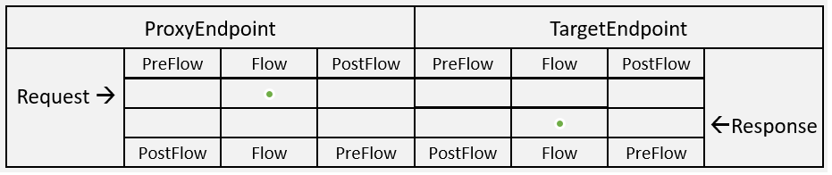

<!-- loio09b5abbd3d714ce29ee2366254261170 -->

# OAuth v2.0

OAuth 2.0 defines an authorization protocol for protected API resources.

To ensure that applications are allowed to act on behalf of users, OAuth 2.0 relies on 'access tokens'. To access protected resources, consumer applications must obtain 'access tokens'. The OAuth 2.0 specification defines the various ways that applications can request and use access tokens. API Management provides a policy type that enables you to configure OAuth 2.0 authorization for your APIs.

> ### Note:  
> The OAuthV2 policy returns certain non-RFC-compliant response elements. For example, the policy returns a token property, **"token\_type":"BearerToken"**, where the compliant token property is **"token\_type":"Bearer"**. For details on these non-compliant response elements, see [Non-RFC\_compliant Behaviour](non-rfc-compliant-behaviour-7a98cc9.md).

Setting up OAuth 2.0 authorization for your API is a three step process:

1.  Configure a token endpoint: An OAuth token endpoint defines a URI on API Management. The token endpoint is configured with a policy of type OAuthV2. In the OAuthV2 policy, the GenerateAccessToken operation is specified. When this operation is specified, you have the option of configuring one or more grant types. For each grant type specified, an additional set of configuration elements are exposed, providing flexibility in the way that APIs exposed through API Management manage OAuth-based authorization.
2.  Apply an OAuth validation policy to protected resource URIs: To enforce OAuth at runtime, attach a policy of type OAuthV2 to a Flow that exposes a protected resource. In the OAuthV2 policy, specify the VerifyAccessToken operation.
3.  Configure one or more API products: The VerifyAccessToken operation resolves the access token to an API product for which the application has been approved. The request URI is verified against the list of URIs defined in the API product. If the request URI is included in the list defined by the approved API product, then the request is forwarded to the protected resource.

You can attach this policy in the following locations:

> ### Note:  
> The elements and attributes in this table should be used in the following order:

**Element and Attribute Descriptions**


<table>
<tr>
<th valign="top">

**Elements & Attributes**

</th>
<th valign="top">

**Description**

</th>
</tr>
<tr>
<td valign="top">

AccessToken

</td>
<td valign="top">

By default, VerifyAccessToken expects the access token to be sent in an Authorization header. You can change that default using this element. For example `request.queryparam.access_token` indicates that the access token should be present as a query parameter.

</td>
</tr>
<tr>
<td valign="top">

AppEndUser

</td>
<td valign="top">

This element lets you specify where API Management should look for the end user ID

</td>
</tr>
<tr>
<td valign="top">

ClientId

</td>
<td valign="top">

This element lets you specify where API Management should look for the end user ID

</td>
</tr>
<tr>
<td valign="top">

Code

</td>
<td valign="top">

This element lets you specify where API Management should look for the authorization code. For example, it could be sent as a query parameter, HTTP header, or form parameter \(the default\).

</td>
</tr>
<tr>
<td valign="top">

Attributes

</td>
<td valign="top">

Use this element to include custom attributes to an access token or authorization code. For instance, you might want to embed a user ID or session identifier in the access token, which can later be extracted and verified at runtime.

</td>
</tr>
<tr>
<td valign="top">

GenerateErrorResponse

</td>
<td valign="top">

If set to true, the policy generates and returns a response if the ContinueOnError attribute is set to true. If false \(the default\), no response is sent.

</td>
</tr>
<tr>
<td valign="top">

ExpiresIn

</td>
<td valign="top">

Enforces the expiry time of access tokens and authorization codes in milliseconds. \(For refresh tokens, use <RefreshTokenExpiresIn\>.\) The expiry time value is a system generated value plus the `<ExpiresIn>` value. If `<ExpiresIn>` is set to -1, the token or code is given an infinite lifetime. If `<ExpiresIn>` is not specified, the system applies a default value configured at the system level.

</td>
</tr>
<tr>
<td valign="top">

ExternalAccessToken

</td>
<td valign="top">

Tells API Management where to find an external access token.

The variable `request.queryparam.external_access_token` indicates that the external access token should be present as a query parameter, as, for example, `?external_access_token=12345678`. To require the external access token in an HTTP header, for example, set this value to`request.header.external_access_token`. For more information, see [Third-Party OAuth Token Usage](third-party-oauth-token-usage-cccc881.md).

</td>
</tr>
<tr>
<td valign="top">

ExternalAuthorization

</td>
<td valign="top">

If this element is set to false or is not included, API Management will validate the client\_id and client\_secret as usual against the API Management authorization store. Use this element when working with third-party OAuth tokens. For more information on how to use this element, [Third-Party OAuth Token Usage](third-party-oauth-token-usage-cccc881.md).

</td>
</tr>
<tr>
<td valign="top">

ExternalAuthorizationCode

</td>
<td valign="top">

Tells API Management where to find an external auth code \(an auth code not generated by API Management\).

The variable `request.queryparam.external_auth_code` indicates that the external auth code should be present as a query parameter, as, for example, `?external_auth_code=12345678`. To require the external auth code in an HTTP header, for example, set this value to`request.header.external_auth_code`. For more information on how to use this element, [Third-Party OAuth Token Usage](third-party-oauth-token-usage-cccc881.md).

</td>
</tr>
<tr>
<td valign="top">

ExternalRefreshToken

</td>
<td valign="top">

Tells API Management where to find an external refresh token \(a refresh token not generated by API Management\).

The variable `request.queryparam.external_refresh_token` indicates that the external refresh token should be present as a query parameter, as, for example, `?external_refresh_token=12345678`. To require the external refresh token in an HTTP header, for example, set this value to`request.header.external_refresh_token`. For more information on how to use this element, [Third-Party OAuth Token Usage](third-party-oauth-token-usage-cccc881.md).

</td>
</tr>
<tr>
<td valign="top">

GrantType

</td>
<td valign="top">

Tells the policy where to find the grant type parameter that is passed in a request.

</td>
</tr>
<tr>
<td valign="top">

Operation

</td>
<td valign="top">

The OAuth 2.0 operation executed by the policy.

</td>
</tr>
<tr>
<td valign="top">

PassWord

</td>
<td valign="top">

This element is used with the password grant type only. With the password grant type, user credentials \(password and username\) must be made available to the OAuthV2 policy. The <PassWord\> and <UserName\> elements are used to specify variables where API Management can find these values. If these elements are not specified, the policy expects to find the values \(by default\) in form parameters named username and password.

</td>
</tr>
<tr>
<td valign="top">

RedirectUri

</td>
<td valign="top">

Specifies where to should look for the `redirect_uri` parameter in the request.

</td>
</tr>
<tr>
<td valign="top">

RefreshToken

</td>
<td valign="top">

When requesting an access token using a refresh token, you must supply the refresh token in the request. This element lets you specify where API Management should look for the refresh token. For example, it could be sent as a query parameter, HTTP header, or form parameter.

</td>
</tr>
<tr>
<td valign="top">

RefreshTokenExpiresIn

</td>
<td valign="top">

Enforces the expiry time of refresh tokens in milliseconds. The expiry time value is a system generated value plus the <RefreshTokenExpiresIn\> value. If <RefreshTokenExpiresIn\> is set to -1, the refresh token is given an infinite lifetime. If <RefreshTokenExpiresIn\> is not specified, the system applies a default value configured at the system level.

</td>
</tr>
<tr>
<td valign="top">

GenerateResponse

</td>
<td valign="top">

If set to true, the policy generates and returns a response.

</td>
</tr>
<tr>
<td valign="top">

ResponseType

</td>
<td valign="top">

This element informs API Management which grant type the client app is requesting. It is used only with the authorization code and implicit grant type flows.

</td>
</tr>
<tr>
<td valign="top">

ReuseRefreshToken

</td>
<td valign="top">

When set to true, the existing refresh token is reused until it expires. If false, a new refresh token is issued by API Management when a valid refresh token is presented.

</td>
</tr>
<tr>
<td valign="top">

Scope

</td>
<td valign="top">

If this element is present in one of the GenerateAccessToken or GenerateAuthorizationCode policies, it is used to specify which scopes to grant the token or code.

</td>
</tr>
<tr>
<td valign="top">

State

</td>
<td valign="top">

In cases where the client app must send the state information to the authorization server, this element lets you specify where API Management should look for the state values. For example, it could be sent as a query parameter or in an HTTP header.

</td>
</tr>
<tr>
<td valign="top">

StoreToken

</td>
<td valign="top">

Set this element to true when the <ExternalAuthorization\> element is true. The <StoreToken\> element tells API Management to store the external access token. Otherwise, it will not be persisted.

</td>
</tr>
<tr>
<td valign="top">

SupportedGrantTypes

</td>
<td valign="top">

Specifies the grant types supported by an OAuth token endpoint on API Management. An endpoint may support multiple grant types \(that is, a single endpoint can be configured to distribute access tokens for multiple grant types.\) The grant type is passed in token requests in a `grant_type` parameter.

If no supported grant types are specified, then the only allowed grant types are `authorization_code` and `implicit`.

</td>
</tr>
<tr>
<td valign="top">

Tokens

</td>
<td valign="top">

Used with the `ValidateToken` and `InvalidateToken` operations, the element specifies the flow variable that defines the source of the token to be revoked. For example, if developers are expected to submit access tokens as query parameters named `access_token`, use `request.queryparam.access_token`.

</td>
</tr>
<tr>
<td valign="top">

UserName

</td>
<td valign="top">

This element is used exclusively with the password grant type. With this grant type, user credentials \(username and password\) must be provided to the OAuthV2 policy. The <PassWord\> and <UserName\> elements specify the variables where API Management can retrieve these values.

</td>
</tr>
<tr>
<td valign="top">

AccessTokenPrefix

</td>
<td valign="top">

```
<AccessTokenPrefix>Bearer</AccessTokenPrefix>
```

By default, VerifyAccessToken expects the access token to be sent in an Authorization header as a Bearer token. For example:

```
-H "Authorization: Bearer Rft3dqrs56Blirls56a"
```


<table>
<tr>
<td valign="top">

Default:

</td>
<td valign="top">

Bearer

</td>
</tr>
<tr>
<td valign="top">

Presence:

</td>
<td valign="top">

Optional

</td>
</tr>
<tr>
<td valign="top">

Type:

</td>
<td valign="top">

String

</td>
</tr>
<tr>
<td valign="top">

Valid values:

</td>
<td valign="top">

Bearer

</td>
</tr>
<tr>
<td valign="top">

Used with operations:

</td>
<td valign="top">

VerifyAccessToken

</td>
</tr>
</table>


</td>
</tr>
</table>

Following flow variables are populated when the policy is executed:

**Flow Variables**


<table>
<tr>
<th valign="top">

Variable

</th>
<th valign="top">

Description

</th>
</tr>
<tr>
<td valign="top">

organization\_name

</td>
<td valign="top">

The name of the organization where the proxy is executing.

</td>
</tr>
<tr>
<td valign="top">

developer.id

</td>
<td valign="top">

The ID of the developer associated with the registered client app.

</td>
</tr>
<tr>
<td valign="top">

developer.app.name

</td>
<td valign="top">

The name of the developer associated with the registered client app.

</td>
</tr>
<tr>
<td valign="top">

client\_id

</td>
<td valign="top">

The client ID of the registered client app.

</td>
</tr>
<tr>
<td valign="top">

grant\_type

</td>
<td valign="top">

The grant type associated with the request.

</td>
</tr>
<tr>
<td valign="top">

token\_type

</td>
<td valign="top">

The token type associated with the request.

</td>
</tr>
<tr>
<td valign="top">

access\_token

</td>
<td valign="top">

The access token that is being verified.

</td>
</tr>
<tr>
<td valign="top">

accesstoken.\{custom\_attribute\}

</td>
<td valign="top">

A named custom attribute in the access token.

</td>
</tr>
<tr>
<td valign="top">

issued\_at

</td>
<td valign="top">

The date the access token was issued.

</td>
</tr>
<tr>
<td valign="top">

expires\_in

</td>
<td valign="top">

The expiration time for the access token

</td>
</tr>
<tr>
<td valign="top">

status

</td>
<td valign="top">

The status of the access token \(for example, approved or revoked\).

</td>
</tr>
<tr>
<td valign="top">

scope

</td>
<td valign="top">

The scope \(if any\) associated with the access token

</td>
</tr>
<tr>
<td valign="top">

apiproduct.<custom\_attribute\_name\>

</td>
<td valign="top">

A named custom attribute of the API product associated with the registered client app.

</td>
</tr>
<tr>
<td valign="top">

apiproduct.name

</td>
<td valign="top">

The name of the API product associated with the registered client app.

</td>
</tr>
<tr>
<td valign="top">

App-specific variables

app.name

app.id

app.accessType

app.callbackUrl

app.status

app.scopes

app.appFamily

app.apiproducts

app.appParentStatus

app.appType

app.appParentId

app.created\_by

app.created\_at

app.last\_modified\_at

app.last\_modified\_by

app.\{custom\_attributes\}

</td>
<td valign="top">

 

</td>
</tr>
<tr>
<td valign="top">

Developer-specific variables

developer.id

developer.userName

developer.firstName

developer.lastName

developer.email

developer.status

developer.apps

developer.created\_by

developer.created\_at

developer.last\_modified\_at

developer.last\_modified\_by

developer.\{custom\_attributes\}

</td>
<td valign="top">

Note : If the app.appType is "Developer", then developer attributes are populated.

</td>
</tr>
</table>

During the policy execution, the following errors can occur:

**Error Cause**


<table>
<tr>
<th valign="top">

Error Name

</th>
<th valign="top">

Cause

</th>
</tr>
<tr>
<td valign="top">

InvalidClientIdentifier

</td>
<td valign="top">

The client identifier sent from the client is invalid or missing. Check to be sure you are using the correct client key and secret values for the Developer App associated with your proxy. Typically, these values are sent as a Base64 encoded Basic Authorization header.

Important: This error name used to be called invalid\_client.

</td>
</tr>
<tr>
<td valign="top">

invalid\_client

</td>
<td valign="top">

This error name is no longer used. It was replaced by InvalidClientIdentifier.

</td>
</tr>
<tr>
<td valign="top">

invalid\_request

</td>
<td valign="top">

This error name is used for multiple different kinds of errors, typically for missing or incorrect parameters sent in the request. If <GenerateResponse\> is set to false, use fault variables \(described below\) to retrieve details about the error, such as the fault name and cause.

</td>
</tr>
<tr>
<td valign="top">

invalid\_access\_token

</td>
<td valign="top">

The access token sent from the client is invalid.

</td>
</tr>
<tr>
<td valign="top">

FailedToResolveToken

</td>
<td valign="top">

The policy expected to find a token in a variable specified in the <Tokens\> element, but the variable could not be resolved.

</td>
</tr>
<tr>
<td valign="top">

FailedToResolveClientId

</td>
<td valign="top">

The policy expected to find the Client ID in a variable specified in the <ClientId\> element, but the variable could not be resolved.

</td>
</tr>
<tr>
<td valign="top">

FailedToResolveAccessToken

</td>
<td valign="top">

The policy expected to find an access token in a variable specified in the <AccessToken\> element, but the variable could not be resolved.

</td>
</tr>
<tr>
<td valign="top">

FailedToResolveRefreshToken

</td>
<td valign="top">

The policy expected to find a refresh token in a variable specified in the <RefreshToken\> element, but the variable could not be resolved.

</td>
</tr>
<tr>
<td valign="top">

FailedToResolveAuthorizationCode

</td>
<td valign="top">

The policy expected to find an authorization code in a variable specified in the <Code\> element, but the variable could not be resolved.

</td>
</tr>
<tr>
<td valign="top">

UnSupportedGrantType

</td>
<td valign="top">

The client specified a grant type that is unsupported by the policy

</td>
</tr>
<tr>
<td valign="top">

InvalidTokenType

</td>
<td valign="top">

The <Tokens\>/<Token\> element requires you to specify the token type \(for example, refreshtoken\). If the client passes the wrong type, this error is thrown.

</td>
</tr>
<tr>
<td valign="top">

InvalidAPICallAsNoApiProductMatchFound

</td>
<td valign="top">

The API proxy is not in the Product associated with the access token.

</td>
</tr>
<tr>
<td valign="top">

InsufficientScope

</td>
<td valign="top">

The access token presented in the request has a scope that does not match the scope specified in the verify access token policy.

</td>
</tr>
<tr>
<td valign="top">

InvalidParameter

</td>
<td valign="top">

The policy must specify either an access token or an authorization code, but not both.

</td>
</tr>
<tr>
<td valign="top">

MissingParameter

</td>
<td valign="top">

The response type is token, but no grant types are specified.

</td>
</tr>
<tr>
<td valign="top">

InvalidValueForExpiresIn

</td>
<td valign="top">

For the <ExpiresIn\> element, valid values are positive integers and -1.

</td>
</tr>
<tr>
<td valign="top">

InvalidValueForRefreshTokenExpiresIn

</td>
<td valign="top">

For the <RefreshTokenExpiresIn\> element, valid values are positive integers and -1.

</td>
</tr>
<tr>
<td valign="top">

InvalidGrantType

</td>
<td valign="top">

An invalid grant type is specified in the <SupportedGrantTypes\> element.

</td>
</tr>
<tr>
<td valign="top">

ExpiresInNotApplicableForOperation

</td>
<td valign="top">

Be sure that the operations specified in the <Operations\> element support expiration.

</td>
</tr>
<tr>
<td valign="top">

RefreshTokenExpiresInNotApplicableForOperation

</td>
<td valign="top">

Be sure that the operations specified in the <Operations\> element support refresh token expiration.

</td>
</tr>
<tr>
<td valign="top">

GrantTypesNotApplicableForOperation

</td>
<td valign="top">

Be sure that the grant types specified in <SupportedGrantTypes\> are supported for the specified operation.

</td>
</tr>
<tr>
<td valign="top">

OperationRequired

</td>
<td valign="top">

You must specify an operation in this policy using the <Operation\> element.

</td>
</tr>
<tr>
<td valign="top">

InvalidOperation

</td>
<td valign="top">

You must specify a valid operation in this policy using the <Operation\> element.

</td>
</tr>
<tr>
<td valign="top">

TokenValueRequired

</td>
<td valign="top">

You must specify a token <Token\> value in the <Tokens\> element.

</td>
</tr>
</table>

Following fault variables are set when the policy triggers an error at runtime:

**Fault Variables**


<table>
<tr>
<th valign="top">

Variable Set

</th>
<th valign="top">

Where

</th>
<th valign="top">

Example

</th>
</tr>
<tr>
<td valign="top">

\[prefix\].\[policy\_name\].failed

</td>
<td valign="top">

The \[prefix\] is oauthV2. The \[policy\_name\] is the name of the policy that threw the error.

</td>
<td valign="top">

oauthV2.GenerateAccesstoken.failed = true

</td>
</tr>
<tr>
<td valign="top">

\[prefix\].\[policy\_name\].fault.name

</td>
<td valign="top">

The \[prefix\] is oauthV2.

The \[policy\_name\] is the name of the policy that threw the error.

</td>
<td valign="top">

oauthV2.GenerateAccesstoken.fault.name = invalid\_request

Note: For the VerifyAccessToken operation, the fault name includes this suffix: keymanagement.service For example: keymanagement.service.invalid\_access\_token

</td>
</tr>
<tr>
<td valign="top">

\[prefix\].\[policy\_name\].fault.cause

</td>
<td valign="top">

The \[prefix\] is oauthV2.

The \[policy\_name\] is the name of the policy that threw the error.

</td>
<td valign="top">

oauthV2.GenerateAccesstoken.cause = Required param : grant\_type

</td>
</tr>
<tr>
<td valign="top">

fault.name = \[error\_name\]

</td>
<td valign="top">

\[error\_name\] is the specific error name to check for as listed in the table above.

</td>
<td valign="top">

fault.name = "invalid\_request"

</td>
</tr>
</table>


<a name="loio09b5abbd3d714ce29ee2366254261170__section_uls_j15_54b"/>

## Non-RFC-compliant Behavior

The OAuthV2 policy returns a token response that contains certain non-RFC-compliant properties. The following table shows the non-compliant properties returned by the OAuthV2 policy and the corresponding compliant properties:


<table>
<tr>
<th valign="top">

OAuthV2 returns:

</th>
<th valign="top">

The RFC-compliant property is:

</th>
</tr>
<tr>
<td valign="top">

`"token_type":"BearerToken"` 

</td>
<td valign="top">

`"token_type":"Bearer"` 

</td>
</tr>
<tr>
<td valign="top">

`"expires_in":"3600"` 

</td>
<td valign="top">

`"expires_in":3600` 

</td>
</tr>
</table>

Also, the error response for an expired refresh token when grant\_type = refresh\_token is:`{"ErrorCode" : "invalid_request", "Error" :"Refresh Token expired"}`. However, the RFC-compliant response is: `{"error" : "invalid_grant", "error_description" :"refresh token expired"}`.

> ### Note:  
> If you require that these elements be compliant, you can create a policy, such as a JavaScript or AssignMessage policy, to transform the policy output into a compliant format.

**Related Information**  


[Generate Access Token](generate-access-token-f6f84ee.md "OAuth 2.0 policies are used both to generate and to validate OAuth 2.0-compliant tokens. To generate tokens on behalf of application end users, OAuth 2.0 policies that specify the GenerateAccessToken operation are attached to a token endpoint.")

[Generate Authorization Code](generate-authorization-code-46d9bb6.md "")

[Verify Access Tokens](verify-access-tokens-744ce8a.md "")

[Designing OAuth v2.0 Policies](designing-oauth-v2-0-policies-68f0246.md "")

[OAuth 2.0 Grant Types](oauth-2-0-grant-types-308a18a.md "")

