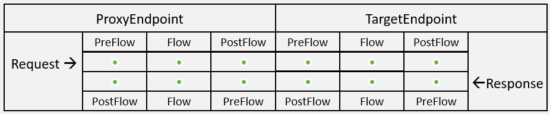

<!-- loio3446d59dc4f2478b863a20b8683b7cfe -->

# Open Connectors

API management provides open connector policy to be attached to an Open Connector type API.

For an open connector type API, you can attach only one open connector policy. The policy is either attached to the target endpoint or the proxy endpoint.

You can attach the policy in the following locations: 

An example payload of the payload is as follows:

> ### Sample Code:  
> ```
> 
> 			<OpenConnectors async="true" continueOnError="false" enabled="true" xmlns="http://www.sap.com/apimgmt">
>               <InstanceSecret kvm-map-name="apim.oc.instance.token" kvm-key-name="default"></InstanceSecret>
> 			</OpenConnectors>
> 
> 			# For API proxies that are created via service or imported, before attaching the policy, ensure that there is a KVM created with map name same as 'kvm-map-name' and KVM key with 'kvm-key-name'. 
> 		
> 
> ```

Following table lists the elements and attributes that you can configure on this policy.


<table>
<tr>
<th valign="top">

**Elements and Attributes**

</th>
<th valign="top">

**Description**

</th>
</tr>
<tr>
<td valign="top">

InstanceSecret

</td>
<td valign="top">

Specifies the KVM map name and key.

</td>
</tr>
<tr>
<td valign="top">

kvm-map-name

</td>
<td valign="top">

Map name that specifies the instance token.

</td>
</tr>
<tr>
<td valign="top">

kvm-key-name

</td>
<td valign="top">

Specifies the key to the KVM.

</td>
</tr>
</table>


<a name="loio3446d59dc4f2478b863a20b8683b7cfe__section_ztk_m1n_lhb"/>

## Open Connector Callout

This section describes the process to add a service callout policy to an open connector type API.

In the policy editor window, choose open connector policy. In the create policy window, enter the required details. Select the *External Call*checkbox. From the API Provider dropdown, discover an API Provider \(Only open connector type Providers are listed here\)\).

An example payload of the payload is as follows:

> ### Sample Code:  
> ```
> 
> 			<!-- Environment and Proxy scoped variables will be retrived and passed as authorization header to Backend -->
> <OpenConnectorCallout xmlns="http://www.sap.com/apimgmt" async="true" continueOnError="false" enabled="true">
> <Request>
>               <Set>
>                  <Headers></Headers>
>                  <FormParams></FormParams>
>                  <QueryParams></QueryParams>
>                  <Path>/elements/api-v2/ping</Path>
>                            <Verb>GET</Verb>
>                            <Payload/>
>               </Set>
>               </Request>
>               <APIProvider>OcSanity</APIProvider>
>               <Timeout>30000</Timeout>
>               <!-- PUT stores the key value pair mentioned inside the element -->
>               <InstanceSecret kvm-map-name="apim.occallout.instance.secret.Test5512" kvm-key-name="Haha_MyGmail"/>
>               <Response/>
> </OpenConnectorCallout>
> 
> 	# For API proxies that are created via service or imported, before attaching the policy, ensure that there is a KVM created with map name same as 'kvm-map-name' and KVM key with 'kvm-key-name'. 
> 
> ```

Following table lists the elements and attributes that you can configure on this policy.


<table>
<tr>
<th valign="top">

**Elements and Attributes**

</th>
<th valign="top">

**Description**

</th>
</tr>
<tr>
<td valign="top">

APProvider

</td>
<td valign="top">

Name of the open connector typeAPI Provider.

</td>
</tr>
<tr>
<td valign="top">

Timeout

</td>
<td valign="top">

Time the policy waits for a response from the target. Time in milliseconds

</td>
</tr>
<tr>
<td valign="top">

Headers

</td>
<td valign="top">

Overwriting existing HTTP headers.

> ### Sample Code:  
> This example sets the 'test' header to ' request.header.test'.
> 
> ```
> <Headers>
> 			<Header name="test">{request.header.test}</Header>
> 		  </Headers>	
> ```


</td>
</tr>
<tr>
<td valign="top">

QueryParams

</td>
<td valign="top">

Adds new query parameters to the request. Use this attribute for GET operation only.

> ### Sample Code:  
> The following example sets the "address" query parameter to the value of the request.header.address variable:
> 
> ```
> <QueryParams>
>     <QueryParam name="address">{request.header.address}</QueryParam>
>   </QueryParams>
> ```


</td>
</tr>
<tr>
<td valign="top">

Path

</td>
<td valign="top">

Path to the endpoint that is targeted

</td>
</tr>
<tr>
<td valign="top">

InstanceSecret

</td>
<td valign="top">

Specifies the KVM map name and key.

</td>
</tr>
<tr>
<td valign="top">

kvm-map-name

</td>
<td valign="top">

Map name that specifies the instance token.

</td>
</tr>
<tr>
<td valign="top">

kvm-key-name

</td>
<td valign="top">

Specifies the key to the KVM.

</td>
</tr>
</table>

