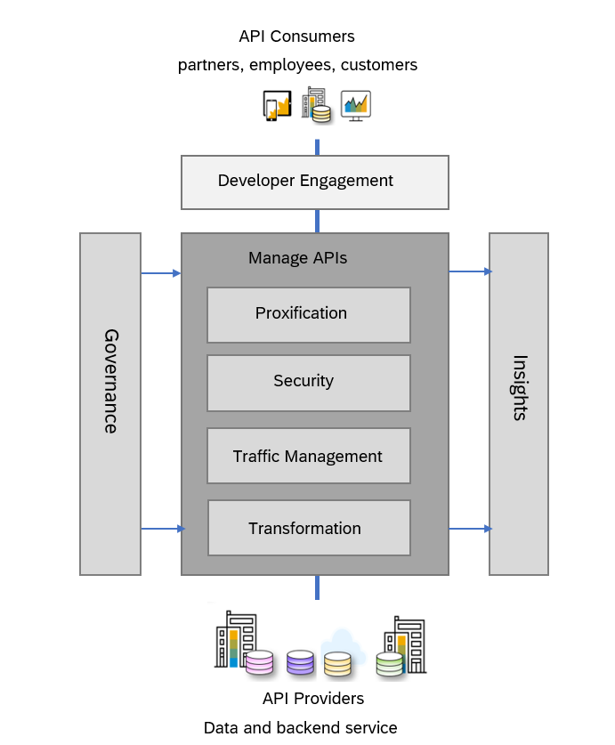

<!-- loio0aef7634df25497896abf18faac8a1ce -->

# What is API Management

API Management lets you publish, promote, and oversee APIs in a secure and scalable environment. Using API Management, you can create simple digital experiences for your consumers, partners, and employees.

The API Management capability in SAP Integration Suite is a complete solution, that addresses all enterprise requirements for API security and governance.

With API Management you can:

-   **Proxify your APIs**: Create your own unified and harmonised API presence, using your own domain.

-   **Secure your APIs**: Secure your APIs against unauthorized access and threats. API management helps organizations define a standardized set of policies to protect APIs and the underlying backends.

-   **Perform Traffic Management**: Configure cache, and control traffic quotas and spikes, using the traffic management policies.

-   **Govern your APIs**: Discover and document all your APIs, manage the lifecycle of your APIs and govern them using the policies. Over 30 different policy types are available, ranging from traffic management and security policies.

-   **Get Business Insights**: Monitor with usage analytics, logs, events and triggers; use business insights to monetize your APIs.

-   **Transform your APIs**: Apply advance header and payload modifications.

-   **Developer Engagements**: Developer Hub is a feature-rich, themed, and customizable portal designed specifically for application developers. It provides comprehensive API documentation, code snippets, and more. With Developer Hub, developers can easily engage with the platform, enabling them to discover, subscribe to, and consume APIs directly.

<a name="loio0aef7634df25497896abf18faac8a1ce__section_hvq_1p3_nzb"/>

## Features

<dl>
<dt><b>

Create omni-channel experiences

</b></dt>
<dd>

Use API Designer and Open APIs to create a omni-channel mobile experience across devices.

</dd><dt><b>

Secure your digital assets, interfaces

</b></dt>
<dd>

Help protect your data and digital assets in this hyper-connected world. Get deep insights on API usage.

</dd><dt><b>

Manage the end-to-end lifecycle of APIs

</b></dt>
<dd>

Scale billions of API calls to unlock new opportunities, new business potential and add additional value.

</dd><dt><b>

Engage developers and partners

</b></dt>
<dd>

Developer Hub simplifies sharing managed APIs and collaborations with customers, partners, and developers.

</dd><dt><b>

Grow new revenue streams

</b></dt>
<dd>

Monetize your data and digital assets with help of API Portal. Upsell and cross-sell through your ecosystem.

</dd><dt><b>

Evolve B2B integrations

</b></dt>
<dd>

Extend solutions with additional SAP BTP capabilities for mobile, offline and integration.

</dd><dt><b>

Benefit from multitenancy support 

</b></dt>
<dd>

Use this service in tenant-aware applications.

</dd>
</dl>

<a name="loio0aef7634df25497896abf18faac8a1ce__section_e1d_gxt_jgb"/>

## Use Cases

With the emergence of cloud, mobile and social technologies, new applications have become a driving force in the way people consume content and access services. Millions of mobile devices in use today are generating digital data at an exponential rate. This massive influx of digital information is changing the way businesses are operating. To keep up with the digital footprint produced, businesses identify and implement ways to reach out to their customer and meet their needs, easily and securely.

Through software interfaces called application programming interfaces \(APIs\), companies can provide business services and information directly to customers. APIs simplify the work of programming graphical user interface components for all types of apps on mobile devices, in the cloud, and on wearables. Exposing digital assets enable you to create and deliver content and business services to your customers, partners, and employees. That way they can better engage, collaborate, and innovate.

API Management technology helps you to share digital assets and enable developer communities to consume these assets in new channels, devices, and user interfaces. Available in the cloud, the technology helps promote coinnovation among employees, partners, and the developer community. To gain better insights about consumer needs, you can empower employees and partners with access to critical information and increase reach to a wider customer base.

API Management facilitates consumer engagement anywhere, any time. It reduces complexity by leveraging a single provisioning platform \(API Platform\) to provide unified access and governance of APIs across a heterogeneous landscape.

<a name="loio0aef7634df25497896abf18faac8a1ce__section_q5k_rh3_nzb"/>

## Getting Started

You can provision the API Management capability from the Integration Suite launchpad. For the detailed steps, see [Setting Up API Management Capability from Integration Suite](https://help.sap.com/docs/sap-api-management/sap-api-management/setting-up-api-management-capability-from-integration-suite?q=certain%20countries&version=Cloud)

