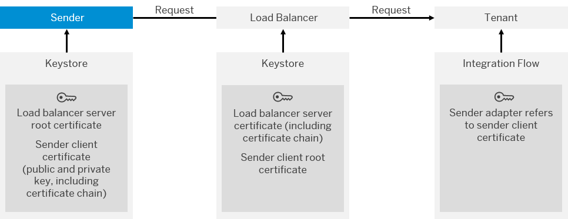

<!-- loioc1eeeab4877147ffa6a5997c76eaaaca -->

# Client Certificate Authentication \(Inbound\), Neo Environment

This option includes an authentication step based on a digital client certificate.

## How it Works

The following figure shows the complete setup of components and security artifacts required for this option.

When you have configured this authentication option, the authentication of the user is performed in the following way at runtime:

The TLS connection of the sender system and the integration platform is terminated and newly established by the load balancer. This means, that first the load balancer authenticates itself against \(as server\) the sender based on the load balancer server certificate. Vice versa, the sender authenticates itself against the load balancer as client using the sender client certificate.

To enable the sender to communicate that way with the load balancer, the sender administrator has to make sure that the sender client certificate is signed by one of the certification authorities that are supported by the load balancer.

The load balancer sets the following message header fields:

-   `SSL_CLIENT_CERT`

    Contains the Base64-encoded sender client certificate.

-   `SSL_CLIENT_USER`

> ### Note:  
> Mutual TLS \(mTLS\) is equivalent to client certificate authentication. While setting up the TLS connection, client and server exchange certificates. With mTLS, not only server certificates, but also client certificates are validated based on the signatures provided by certification authorities. For more information, see [Client Certificate Authentication \(Outbound\)](client-certificate-authentication-outbound-c4e4a15.md) and [Keystore](keystore-b163513.md).

## Required Security Material

**Certificates for Inbound Message Processing**

<table>
<tr>
<th valign="top">

Keystore

</th>
<th valign="top">

Certificate

</th>
<th valign="top">

Description

</th>
</tr>
<tr>
<td valign="top" rowspan="2">

Sender keystore

</td>
<td valign="top">

Load balancer server root certificate \(identifies CA that has signed the load balancer server certificate\)

</td>
<td valign="top">

This certificate is required to identify the root CA at the top of the certificate chain that ultimately guarantees the trustability of the load balancer server certificate.

In many cases, there is a multilevel setup of CAs so that a certificate is signed by an intermediate CA. The trustability of the intermediate CA is guaranteed by another intermediate CA one level higher, and so on, up to the root CA at the top of the **certificate chain**. In this case, it is necessary to assign the certificate chain to the certificate, to enable the connected component \(which has imported only the root CA into its keystore\) to evaluate the chain of trust.

</td>
</tr>
<tr>
<td valign="top">

Sender client certificate

</td>
<td valign="top">

This certificate is required to authenticate the sender \(client\) when calling Cloud Integration. On the Cloud Integration tenant side, this certificate is required to configure the authorization check.

</td>
</tr>
<tr>
<td valign="top" rowspan="2">

Load balancer keystore

</td>
<td valign="top">

Load balancer server certificate

</td>
<td valign="top">

This certificate is required to identify the load balancer as a trusted server \(to which clients like the sender system can connect\).

</td>
</tr>
<tr>
<td valign="top">

Sender client root certificate

</td>
<td valign="top">

This certificate is required to identify the root CA at the top of the certificate chain that ultimately guarantees the trustability of the sender client certificate. There is a list of CAs that are supported by the load balancer.

More information: [Load Balancer Root Certificates Supported by SAP](load-balancer-root-certificates-supported-by-sap-4509f60.md)

</td>
</tr>
</table>

For sakes of completeness, note that always a tenant keystore \(not depicted in the figure\) needs to be available to enable the system to do an additional outbound communication step that is required for technical purposes: The basic technical connectivity of a cluster is checked on a regular basis, as soon as the cluster is active. For this purpose, every 30 seconds the tenant management node sends an HTTPS request to an assigned runtime node via the load balancer. This simulates an external call to the runtime node. To enable this communication, a keystore needs to be deployed on the tenant, containing a valid client certificate that is accepted by the load balancer as well as the root certificate of the same. If this keystore is not available or contains an invalid certificate, the cluster will raise an error. The keystore and required certificate are provisioned by SAP together with the tenant.

> ### Note:  
> In a subsequent authorization check, the permissions of the sender are checked on the tenant by evaluating the distinguished name \(DN\) of the client certificate of the sender. The client certificate of the sender is being passed through to the tenant by the load balancer \(in the message header\). To provide the tenant with the information on the correct client certificate to be expected from the sender, a corresponding setting has to be made in the related integration flow.

