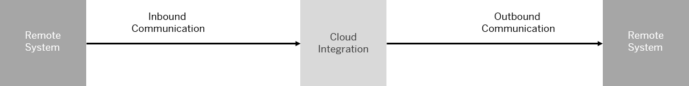

<!-- loio7cfe913ba85d463a9c5fce101c3ae460 -->

# Connecting a Customer System to Cloud Integration

You can set up the technical connection between a tenant and different kinds of remote systems \(in many cases located in the customer landscape\).

Throughout this documentation we assume the following basic setup of technical components and communication paths: A remote system \(which is not specified\) is being connected to one of the tenants that are assigned to the customer. The remote system can act either as a sender or a receiver of messages. The setup and the detailed configuration procedure differ according to the communication direction that is being set up: whether a remote system is supposed to send a message to the integration platform or the other way round.

Throughout this documentation, the terms *inbound* and *outbound* reflect the perspective of the integration platform.

-   **Inbound** refers to message processing from a remote system \(in many cases, located in the customer landscape\) to Cloud Integration. Here, the integration platform is the server.
-   **Outbound** refers to message processing from the integration platform to a remote system \(where the integration platform is the client\).

**Related Information**  

[Introduction](introduction-10dc4a3.md "You can connect various kinds of remote systems to the cloud-based integration platform using protocols such as HTTP/S, SSH and SMTP/S. Each communication protocol comes with certain options to protect the message exchange (security options).")

[Configuring Inbound Communication](configuring-inbound-communication-62690e5.md "Configuring inbound communication means setting up the connection between a remote sender system and the integration platform. Inbound communication refers to message processing from a remote system, often located in the customer landscape, to Cloud Integration. Here, the integration platform is the server.")

[Configuring Outbound Communication](configuring-outbound-communication-2c6dc72.md "Outbound communication refers to message processing from the integration platform to a remote system (where the integration platform is the client).")

[Setting up Message-Level Security Use Cases](setting-up-message-level-security-use-cases-f01ecaa.md "On top of the secure transport channel (that is based either on HTTPS or SFTP), you can additionally protect the message exchange by digital encrypting and signing the message.")

[Concepts of Secure Communication](concepts-of-secure-communication-3545808.md "There are several options to protect the message exchange. You can secure the communication on transport level by selecting the HTTPS or SFTP protocol and installing specific authentication methods. In addition to that, you can set up methods to encrypt and decrypt the content of the message and to digitally sign and verify the message.")

