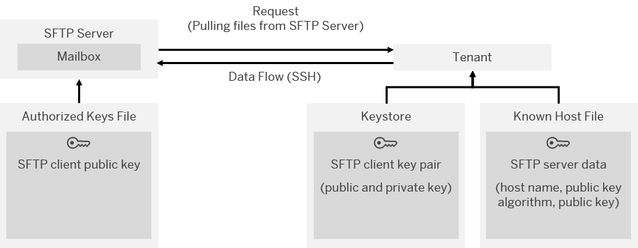

<!-- loio97e2baafd4184e98916f246c373af3bf -->

# Inbound SFTP With Public Key Authentication

For an SFTP client connected to an SFTP server using the Public Key authentication option, the following artifacts have to be generated and stored at the locations summarized in the following table. The table also shows which artifacts need to be exchanged between the client and the server \(during the onboarding process\):

****

<table>
<tr>
<th valign="top">

SFTP Client Side

</th>
<th valign="top">

SFTP Server Side

</th>
</tr>
<tr>
<td valign="top">

Public keys of all connected SFTP servers

A public key is used in order to authenticate the SFTP server \(as known host\) on the SFTP client side. Public keys of all connected SFTP servers are stored in a *<known\_hosts\>* file on the client side.

> ### Note:  
> The *<known\_hosts\>* file contains the public keys and addresses of the trusted SFTP servers. The client checks if the server is a trusted participant by evaluating a *<known\_hosts\>* file on the client side: If the server's public key is listed there, the identity of the server is confirmed.

> ### Note:  
> Generating the public key of the SFTP server is the task of the expert that hosts the SFTP server.

</td>
<td valign="top">

Public keys of all connected SFTP clients \(used in order to authenticate the SFTP clients on the SFTP server side\)

This file has to be stored in an *<authorized\_keys\>* file on the SFTP server.

> ### Note:  
> Generating this public key is the task of the expert that hosts the SFTP client.

</td>
</tr>
<tr>
<td valign="top">

Private key of SFTP client \(stored on client\)

> ### Note:  
> The private key of the SFTP client can be either an RSA private key file or a DSA private key file. The private key \(together with its associated public key\) has to be stored in a keystore.

> ### Note:  
> Generating this private key is the task of the expert that hosts the SFTP client.

</td>
<td valign="top">

Private key of SFTP server \(stored on server\)

> ### Note:  
> Generating this public key is the task of the expert that hosts the SFTP server.

</td>
</tr>
</table>

A tenant can connect as an SFTP client to an SFTP server \(the latter either hosted at SAP or in the customer landscape\).

The following figure shows the basic setup of components used for SFTP for inbound communication \(when the data flow is directed from an SFTP server to the tenant\).

To specify the technical details of the message flow from the SFTP sender to the tenant \(SFTP client\), a **sender SFTP adapter** has to be configured for the related integration flow.

