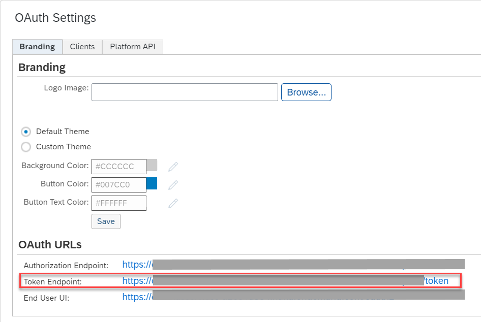

<!-- loiocf611eca57744d29be588b7d4ec900e1 -->

# OAuth Client Credentials Grant

You can configure OAuth authentication, in particular the Client Credentials Grant variant, for inbound calls from sender systems to the integration platform. This gives the sender \(client\) application access to the associated runtime node through OAuth authentication.

> ### Note:  
> This information is relevant only when you use SAP Cloud Integration in the Neo environment.

It works as follows: A client requests access to a protected a virtual environment, for example, a runtime node that is to be used to process messages received by the client application. The initial request is sent to an OAuth authorization server, which is part of SAP Cloud.

After the client has been authenticated successfully by the OAuth authorization server, it's provided with the access tokens that are required to process messages on the associated runtime node. In terms of OAuth, the client uses the access token to get access to the protected resources that are represented by the virtual environment of a runtime node.

This process is executed without any manual interaction, and is therefore best suited to system-to-system communication.

For a step-by-step description of how to set up such an authentication scenario, check out the following SAP Community blog: [Cloud Integration – Inbound HTTP Connections using OAuth Client Credentials Grant](https://blogs.sap.com/2019/02/14/cloud-integration-inbound-http-connections-using-oauth-client-credentials-grant/).

> ### Tip:  
> It's highly **recommended** to use JSON Web Token \(JWT\) for authentication.
> 
> A JWT contains the signed information required for the authentication of the caller \(for example, issuer of the token and expiry date\). Therefore, the runtime node can validate the token without the need to call the authorization service. If instead of a JWT, you use an access token retrieved from the authorization service by a call without the option `&token_format=jwt` in step 3a, the situation is different: In this case, each time the related integration flow endpoint is called, the runtime node has to communicate with the authorization service to validate the identity and the authorizations of the caller. Therefore, using JWT allows you to implement more robust integration scenarios with a higher performance.
> 
> Therefore, this feature results in a better performance under high load when a token is used for multiple calls within the limit of its validity period.
> 
> The JWT provided by the OAuth authorization server contains the calling user and is digitally signed by the identity provider. Therefore, SAP Cloud Integration can validate the user information without contacting the identity provider.

More information about these concepts:

[Protecting Applications with OAuth 2.0](https://help.hana.ondemand.com/help/frameset.htm?b7b589334d444293a2a91e0ef4234136.html)

[OAuth 2.0 Specification](https://oauth.net/2/)

> ### Note:  
> This option is supported for the following sender adapter types: SOAP \(SOAP 1.x\), SOAP \(SAP RM\), HTTPS, and OData.


## Configuring OAuth with a Client Credentials Grant

In the SAP BTP cockpit, perform the following steps:

1.  Register the client application as the OAuth client in the consumer account. In the *Security*** \> *OAuth* section, open the *Clients* tab.

    Also specify a subscription to restrict the authorizations associated with the access token on the particular runtime node.

    > ### Note:  
    > You can only subscribe to runtime nodes with node type `iflmap` or `hcioem`.

    Perform this step as described in [Register an OAuth Client](https://help.sap.com/viewer/ea72206b834e4ace9cd834feed6c0e09/Cloud/en-US/7e658b3e4cea4a79b035d0f1d2798c1f.html?q=Registering%20an%20OAuth%20Client#loio61d8095aa39547c7b30d9aeda771497f).

    To enable this security setting for the abovementioned scenario \(client application sending messages to the cloud-based integration platform\), specify the following information when registering the OAuth client:

    -   In *Subscription*, select the VM name of the runtime node that ends with the node type, for example, `….iflmap`.

        You can only register applications for node type `iflmap` or `hcioem`.

    -   Enter a client ID.

        You can either get a client ID from the client or you can choose one. You then have to forward this ID to the client.

    -   In *Authorization Grant*, choose *Client Credentials*.

    -   Enter a secret \(as assigned to the client application\).

    -   Specify a *Token Lifetime* to increase the security level.


2.  In the *Security Authorizations* section, assign the user with the name `oauth_client_<client ID>` to the `ESBMessaging.send` role in the subscription of the consumer account \(for the `iflmap/hcioem` node\).

    Perform this step as described in [Defining Authorizations for Integration Team Members](../Operations/defining-authorizations-for-integration-team-members-3ec7679.md).

3.  On the client side, perform the following steps:

    1.  To get an access token in JSON Web Token \(JWT\) format, perform a POST HTTPS call to `https://<Token Endpoint address>?grant_type=client_credentials&token_format=jwt`.

        Example:

        `https://oauthasservices-<consumer-account>.<landscape host name>/oauth2/api/v1/token?grant_type=client_credentials&token_format=jwt`

        > ### Note:  
        > You can also perform a POST HTTPS call to the following address \(without `&token_format=jwt`\):
        > 
        > `https://<Token Endpoint address>?grant_type=client_credentials`
        > 
        > However, it is recommended that you use JSON Web Token to get a more robust scenario.

        To find the Token Endpoint address, go to *Security* \> *OAuth*. In the *Branding* tab of the OAuth client created in step 1, in the *OAuth URLs* section, the URL is displayed under *Token Endpoint*.

        

        Use basic authentication where the client ID is the user and the secret is the password. This call returns the access token.

        Example:

        > ### Sample Code:  
        > ```
        > { 
        > "access_token": "8271a067 .... 07c6880", 
        > "token_type": "Bearer", 
        > "expires_in": 0, 
        > "scopes": [] 
        > }
        > ```

    2.  Perform an HTTPS call to the endpoint URI with the HTTP header with the name `“Authorization”` and value `“Bearer <access token>”`.

        You can repeat the call several times before the access token becomes invalid. Then execute step **a.** again.


