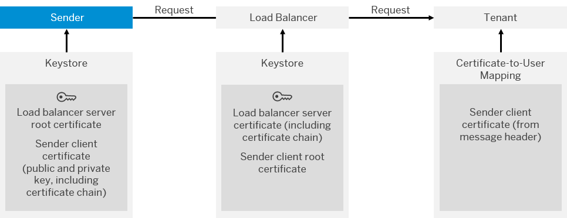

<!-- loio9949c61c0a624f5abb13b4d2bd706fd8 -->

# Setting Up Inbound HTTP Connections \(with Certificate-to-User Mapping\), Neo Environment

Using this option, authentication of a sender is performed based on a client certificate. With a certificate-to-user mapping, the certificate is mapped to a user, whose authorizations are checked on the tenant.

## Prerequisites

SAP has provided you or your organization with an account and tenant. Your tenant administrator has assigned you the integration developer permissions.

## Context

> ### Note:  
> This information is relevant only when you use SAP Cloud Integration in the Neo environment.

> ### Note:  
> This is the recommended and secure option for HTTP inbound connections.

The following figure shows the involved components and digital keys.

The table summarizes the required security artifacts required to set up this inbound authentication scenario and the configuration steps to be accomplished by the integration developer/tenant administrator and the administrator of the involved sender system.

-   For an overview of the procedure how to set up this authentication option, check out the numbered list below the following table.

-   For more information on how this authentication option works at runtime, check out: [Client Certificate Authentication and Certificate-to-User Mapping \(Inbound\), Neo Environment](client-certificate-authentication-and-certificate-to-user-mapping-inbound-neo-environment-4b5afdd.md)

-   For an end-to-end description of the procedure, check out the following blog: [Cloud Integration – How to Setup Secure HTTP Inbound Connection with Client Certificates](https://blogs.sap.com/2017/06/05/cloud-integration-how-to-setup-secure-http-inbound-connection-with-client-certificates/)

**Certificates for Inbound Message Processing**

<table>
<tr>
<th valign="top">

Security Artifact

</th>
<th valign="top">

Used at runtime to ...

</th>
<th valign="top">

Configuration Steps

</th>
</tr>
<tr>
<td valign="top">

Load balancer server root certificate

</td>
<td valign="top">

Make the sender trust the load balancer.

</td>
<td valign="top">

Sender administrator:

Get certificate using the Cloud Integration *Connectivity Test* \(pointing to endpoint address of integration flow\).

</td>
</tr>
<tr>
<td valign="top">

Load balancer server certificate \(including certificate chain\)

</td>
<td valign="top">

Qualify load balancer as trusted component \(for senders that like to connect to it\).

</td>
<td valign="top">

No action required as this artifact is maintained by the operator of the cloud infrastructure.

</td>
</tr>
<tr>
<td valign="top">

Sender client certificate

\(public and private key, including certificate chain\)

</td>
<td valign="top">

Authorize sender to call integration flow.

At runtime, system checks if a *Certificate-to-User Mapping* artifact exists that fits to the client certificate provided by the sender. It checks if the associated user has the required permission to call the integration flow.

</td>
<td valign="top">

Tenant administrator:

Creates and deploys a *Certificate-to-User Mapping* artifact and adds sender client certificate to it.

This key pair is to be signed by a CA supported by the load balancer. Only root certificates are being imported into the load balancer keystore. Therefore, the whole certificate chain must be assigned to the certificate to enable the connected component to evaluate the chain of trust.

</td>
</tr>
<tr>
<td valign="top">

Sender client root certificate

</td>
<td valign="top">

Sign sender client certificate.

</td>
<td valign="top">

Sender administrator:

Get sender client certificate signed by a certificate authority \(CA\) supported by the load balancer. The root certificates supported by the load balancer are listed at [Load Balancer Root Certificates Supported by SAP](load-balancer-root-certificates-supported-by-sap-4509f60.md).

</td>
</tr>
</table>

The tenant administrator also needs to deploy a *Certificate-to-User Mapping* artifact on the tenant.

This artifact is required to map the client certificate transferred with the inbound request to a user \(for which the permission to process messages have been specified\).

Furthermore, the tenant administrator goes to SAP BTP cockpit and assigns a role to be used to authorize the sender to call integration flow endpoint. You can either specify the predefined role `ESBMessaging.send` or a custom role.

## Procedure

1.  Configure the sender system.

    1.  Make sure that the sender keystore contains the root certificate of the load balancer server certificate.

        Get this certificate using the Cloud Integration *Connectivity Test* \(pointing to the integration flow endpoint address\). From downloaded`.zip` file, select the `*.cer` file of the root certificate and import this into the sender system keystore.

        More information: [Using the Connectivity Test to Get the Load Balancer Server Root Certificate](using-the-connectivity-test-to-get-the-load-balancer-server-root-certificate-5d6cbf4.md)

    2.  Make sure that the sender keystore contains a client certificate that is signed by one of the CAs supported by the load balancer.

    More information: [Load Balancer Root Certificates Supported by SAP](load-balancer-root-certificates-supported-by-sap-4509f60.md)

2.  Authorize the user \(to be related to the client certificate in the certificate-to-user mapping below\) to process messages on the runtime node.

    You perform user and authorization management using SAP BTP Cockpit. You have the following options:

    -   Assign the user \(for example, user `myUser`\) the role `ESBMessaging.send` \(predefined by SAP to define permission to process messages on the runtime node\).

    -   Define a custom role for the runtime node.

3.  Configure role-based authorization for the related integration flow.

    To open the design tool for integration flows, open a browser and enter the *Web UI URL* that you received from SAP in the mail informing you that your tenant has been provided.

    To create and design integration flows, go to the *Design* tab.

    1.  Open the integration flow with the integration designer and click the connection for the associated sender adapter.

    2.  Choose *User Role* as the *Authorization* and specify the role against which to check inbound authorization.

    3.  After you have finished configuring the integration flow \(including the processing steps for your scenario\), deploy the integration flow on the tenant.

4.  Define the certificate-to-user mapping.

    1.  Export the sender client certificate from the sender keystore to your local computer.

    2.  Create a *Certificate-to-User Mappings* artifact.

        You perform this step using the Web-based Monitoring application.

        Use the same URL as for the integration flow design tool and go to the *Monitoring* tab.

        To create a new artifact or edit an existing one for the tenant, click the *Certificate-to-User Mappings* tile under *Manage Security*.

        When specifying the properties of the *Certificate-to-User Mappings* artifact, select the sender client certificate from your hard disk and enter the user that is authorized to process messages on the tenant \(user `myUser` from above\).

        More information:

        [Managing Certificate-to-User Mappings, Neo Environment](../Operations/managing-certificate-to-user-mappings-neo-environment-88ea2e5.md)

**Related Information**  

[https://blogs.sap.com/2017/06/05/cloud-integration-how-to-setup-secure-http-inbound-connection-with-client-certificates/](https://blogs.sap.com/2017/06/05/cloud-integration-how-to-setup-secure-http-inbound-connection-with-client-certificates/)

[Client Certificate Authentication and Certificate-to-User Mapping \(Inbound\), Neo Environment](client-certificate-authentication-and-certificate-to-user-mapping-inbound-neo-environment-4b5afdd.md "This option includes an authentication step based on a digital client certificate and the mapping of the certificate to a user.")

[Managing Certificate-to-User Mappings, Neo Environment](../Operations/managing-certificate-to-user-mappings-neo-environment-88ea2e5.md "The Manage Security area provides an overview of security-related artifacts. It also provides access to all certificate-to-user mappings defined for the tenant.")

[Load Balancer Root Certificates Supported by SAP](load-balancer-root-certificates-supported-by-sap-4509f60.md "The load balancer supports a certain list of root certificates.")

[Defining Permissions for Senders to Process Messages on a Runtime Node](../Operations/defining-permissions-for-senders-to-process-messages-on-a-runtime-node-24585cc.md "")

