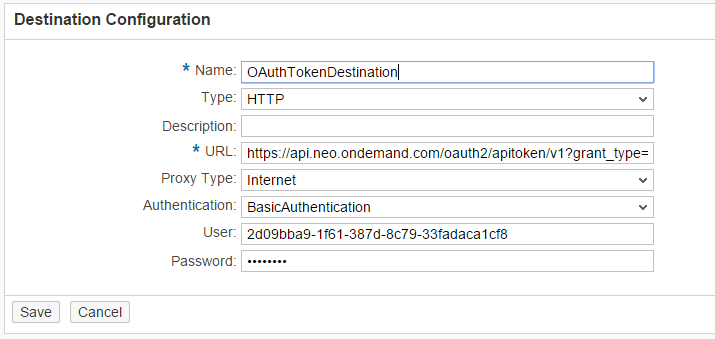

<!-- loiob5e75eaf95534baaa7c9bc2ac020391c -->

# Setting Up OAuth Configurations in Customer Account, Neo Environment

Through a REST API you can manage roles and their assignments to users.

## Context

> ### Note:  
> This information is relevant only when you use SAP Cloud Integration in the Neo environment.

You can setup OAuth configurations in the customer account for enabling the API using the following steps. These steps are one time manual steps per customer account when provisioning the Cloud Integration tenant.

## Procedure

1.  Get *OAuth Client Credentials* from the *Customer Account*.

    1.  Select *OAuth* tab.

    2.  Click on *Create API Client* button to create Client credentials from *Platform API* tab.

    3.  Select the check-box *Authorization Management* and click *Save*.

    4.  Make note of the credentials from the popup as these credentials are used to create HTTP destination named `OAuthTokenDestination` in the consumer account as shown below.

2.  Create a destination named *OAuthTokenDestination* from the account's cockpit as shown below.

    

    <table>
    <tr>
    <th valign="top">

    Destination Property, Value

    
    </th>
    <th valign="top">

    Description

    
    </th>
    </tr>
    <tr>
    <td valign="top">
    
    Name, OAuthTokenDestination

    
    </td>
    <td valign="top">
    

    
    </td>
    </tr>
    <tr>
    <td valign="top">
    
    Type, HTTP

    
    </td>
    <td valign="top">
    

    
    </td>
    </tr>
    <tr>
    <td valign="top">
    
    Url,https://api.\{landscapeHost\}/oauth2/apitoken/v1/?grant\_type=client\_credentials

    
    </td>
    <td valign="top">
    
    OAuth Token Enpoint Url.

    Landscape host:

    PROD: neo.ondemand.com

    FACTORY: hana.ondemand.com

    STAGING: staging.hanavlab.ondemand.com

    CANARY: sap.hana.ondemand.com

    For data center Rot \(Europe\): `https://hana.ondemand.com`

    For data center Ashburn \(USA\): `https://us1.hana.ondemand.com`

    For data center Sydney \(Asia-Pacific\): `https://ap1.hana.ondemand.com`

    For data center Phoenix \(USA - West\)

    `https://us2.hana.ondemand.com`

    
    </td>
    </tr>
    <tr>
    <td valign="top">
    
    Proxy Type, Internet

    
    </td>
    <td valign="top">
    

    
    </td>
    </tr>
    <tr>
    <td valign="top">
    
    Authentication, Basic Authentication

    
    </td>
    <td valign="top">
    

    
    </td>
    </tr>
    <tr>
    <td valign="top">
    
    User

    
    </td>
    <td valign="top">
    
    Client Id of the customer account as obtained in Step 1-E

    
    </td>
    </tr>
    <tr>
    <td valign="top">
    
    Password

    
    </td>
    <td valign="top">
    
    Client secret of the customer account as obtained in Step 1-E

    
    </td>
    </tr>
    </table>
    

