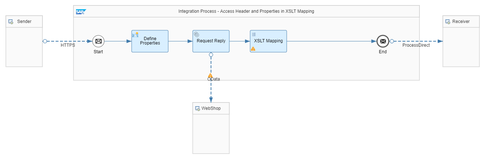

<!-- loiof917c39942284e0e971faed3521c4313 -->

# Access Header and Properties in XSLT Mapping

Learn how to access header and exchange properties in an XSLT mapping.

This section shows you how you can access both header values and exchange properties within an XSLT mapping in order to map the same to a target structure.

For more information on working with XSLT mappings, see [Create XSLT Mapping](create-xslt-mapping-5ce1f15.md).


<a name="loiof917c39942284e0e971faed3521c4313__section_zv2_qvg_smb"/>

## Implementation

To showcase the access of headers and exchange properties in an XSLT mapping, we've implemented the same integration scenario as shown in [Access Header and Properties in Message Mapping](access-header-and-properties-in-message-mapping-4f2a8c9.md). In the current integration flow, the message mapping has been replaced with an XSLT mapping. Similar to the message mapping, the XSLT mapping maps product information to an order.

The example integration flow *Modeling Basics - Access Header and Properties in XSLT Mapping* is designed the following way:



The example scenario works as follows:

The integration flow receives a message through an HTTPS adapter. In the message body, a product identifier and a quantity are provided. Furthermore, an order ID is passed to the integration flow as http header.

In a *Content Modifier* step, 2 exchange properties are defined holding the product identifier and the quantity value:


<table>
<tr>
<td valign="top">

Action

</td>
<td valign="top">

Name

</td>
<td valign="top">

Type

</td>
<td valign="top">

Data Type

</td>
<td valign="top">

Value

</td>
</tr>
<tr>
<td valign="top">

Create

</td>
<td valign="top">

quantity

</td>
<td valign="top">

XPath

</td>
<td valign="top">

java.lang.String

</td>
<td valign="top">

//quantity

</td>
</tr>
<tr>
<td valign="top">

Create

</td>
<td valign="top">

productID

</td>
<td valign="top">

XPath

</td>
<td valign="top">

java.lang.String

</td>
<td valign="top">

//productIdentifier

</td>
</tr>
</table>

In a *Request Reply* step, product data is read from an external source through the OData protocol \(using the OData receiver adapter\). For our scenario, we use the ESPM WebShop, which is based on the Enterprise Sales and Procurement Model \(ESPM\) provided by SAP. The demo application can be accessed at the following address: [https://refapp-espm-ui-cf.cfapps.eu10.hana.ondemand.com/webshop/index.html](https://refapp-espm-ui-cf.cfapps.eu10.hana.ondemand.com/webshop/index.html).

The query is defined as follows:

```
$select=ProductId,Category,CategoryName,CurrencyCode,DimensionDepth,DimensionHeight,DimensionUnit,DimensionWidth,LongDescription,Name,PictureUrl,Price,QuantityUnit,ShortDescription,SupplierId,Weight,WeightUnit&$filter=ProductId eq '${property.productID}'
```

Next, in an XSLT mapping, the response from the OData request as well as the header information and the quantity exchange property are mapped to an order structure.

All parameters defined in the XLST mapping are automatically bound to Camel headers. In case a property or header with that name already exists, its value is automatically assigned to the parameter.

In order to referring to a header or an exchange property that already exists, simply define a parameter with the same name.

```
	<xsl:param name="quantity"/>
```

Then gather the value of the parameter in a mapping using `$`.

```
	<xsl:element name="Price">
		<xsl:value-of select="./Price * $quantity"/>
	</xsl:element>

```

In order to set either the header or properties, define the namespace in which the extension functions *setHeader* and *setProperty* are registered.

```
<xsl:stylesheet xmlns:xsl="http://www.w3.org/1999/XSL/Transform"
	xmlns:cpi="http://sap.com/it/" exclude-result-prefixes="cpi" version="2.0">

```

Furthermore, the exchange must be included in the XSLT as a parameter.

```
	<xsl:param name="exchange"/>
```

Then, the extension functions can be called from within the XSLT style sheet. The 1st parameter of the functions is the exchange, the 2nd parameter holds the name of the header or property name, and the 3rd parameter holds the header or property value.

```
		<xsl:value-of select="cpi:setHeader($exchange, 'content-type', 'application/xml')"/>
```

The complete XSLT mapping is defined as follows.

```
<?xml version="1.0" encoding="UTF-8"?>
<xsl:stylesheet xmlns:xsl="http://www.w3.org/1999/XSL/Transform"
	xmlns:cpi="http://sap.com/it/" exclude-result-prefixes="cpi" version="2.0">

<!-- include exchange parameter -->
	<xsl:param name="exchange"/>
<!-- define property quantity -->
	<xsl:param name="quantity"/>
<!-- define header orderid -->
	<xsl:param name="orderid"/>

	<xsl:output method="xml" version="1.0" encoding="UTF-8" indent="yes"/>
	<xsl:strip-space elements="*"/>

	<xsl:template match="@* | node()">
		<xsl:apply-templates select="@* | node()"/>
	</xsl:template>

	<xsl:template match="/">
<!-- set headers -->
		<xsl:value-of select="cpi:setHeader($exchange, 'context', 'ModelingBasics-HeaderPropertiesInXSLT')"/>
		<xsl:value-of select="cpi:setHeader($exchange, 'content-type', 'application/xml')"/>
		<xsl:element name="PurchaseOrder">
			<xsl:element name="PurchaseOrderNumber">
<!-- use header orderid -->
				<xsl:value-of select="$orderid"/>
			</xsl:element>
			<xsl:element name="Items">
				<xsl:for-each select="/Products/Product">
					<xsl:call-template name="Order_Items"/>
				</xsl:for-each>
			</xsl:element>
		</xsl:element>
	</xsl:template>

	<xsl:template name="Order_Items">
		<xsl:element name="Item">
			<xsl:element name="ProductId">
				<xsl:value-of select="./ProductId"/>
			</xsl:element>
			<xsl:element name="ProductName">
				<xsl:value-of select="./Name"/>
			</xsl:element>
			<xsl:element name="Category">
				<xsl:value-of select="./Category"/>
			</xsl:element>
			<xsl:element name="Quantity">
<!-- use property quantity -->
				<xsl:value-of select="$quantity"/>
			</xsl:element>
			<xsl:element name="Price">
				<xsl:value-of select="./Price * $quantity"/>
			</xsl:element>
			<xsl:element name="Currency">
				<xsl:value-of select="./CurrencyCode"/>
			</xsl:element>
		</xsl:element>
	</xsl:template>

</xsl:stylesheet>
```

**Related Information**  


[Create XSLT Mapping](create-xslt-mapping-5ce1f15.md "You perform this task to assign XSLT mapping that is available in your local workspace.")

