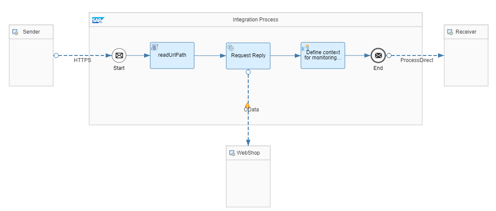
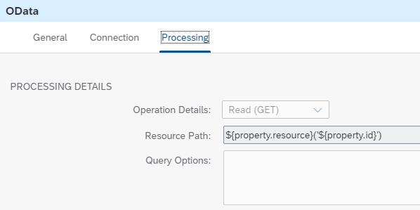

<!-- loiof0620cbc2cb94971a39135f0acb70013 -->

# Access URL Paths in Scripts

The integration flow *Scripting – Read Url Path* reads the individual elements of an incoming request \(e.g. https://<host\>:<port\>/<service\>/<resource\>/<id\>\) and uses them to call an external OData service.



First, the Script step *readUrlPath* is responsible for reading the path of the incoming URL and for saving the elements in properties. The URL can be found in the standard header `CamelHttpUrl`. Then, the retrieved string can be split in the elements service, resource, and id. This logic can be modified to apply to other path syntaxes as well.

> ### Sample Code:  
> ```
> import com.sap.gateway.ip.core.customdev.util.Message;
> import java.util.HashMap;
> 
> def Message extractUrlPath(Message message) {
> 
>        //get url 
>        def map = message.getHeaders();
>        def url = map.get("CamelHttpUrl");
> 
>        //split url
>        String[] vUrl;
>        vUrl = url.split('/');
>        int size = vUrl.length;
> 
>        message.setProperty("service", vUrl[size-3]);
>        message.setProperty("resource", vUrl[size-2]);
>        message.setProperty("id", vUrl[size-1]);
>        return message;
> }
> ```

In the next step, the WebShop example application \( [https://help.sap.com/viewer/DRAFT/368c481cd6954bdfa5d0435479fd4eaf/DEV/en-US/767d8ef11b0f4e04819f9fe03d76c4a2.html](https://help.sap.com/viewer/DRAFT/368c481cd6954bdfa5d0435479fd4eaf/DEV/en-US/767d8ef11b0f4e04819f9fe03d76c4a2.html)\) is called provided with the corresponding properties to build the right request.

The *Address* parameter of the OData receiver channel is specified in the following way:


The *Resource Path* parameter of the OData receiver channel is specified in the following way:



In the Postman collection, you can find the POST request `ReadUrlPath` to execute the integration flow. You can use, for example, information as:

**Example**


<table>
<tr>
<td valign="top">

Service

</td>
<td valign="top">

espm.svc

</td>
</tr>
<tr>
<td valign="top">

Resource

</td>
<td valign="top">

Products / ProductCategories

</td>
</tr>
<tr>
<td valign="top">

Id

</td>
<td valign="top">

HT-1073 / Software

</td>
</tr>
</table>


The response is saved in the data store *Scripting-ReadUrl* by the *Generic Receiver* integration flow.

