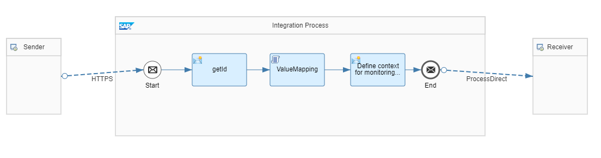

<!-- loio12536ee29f7547bf9fb177b4350309b4 -->

# Access Value Mappings in Scripts

To illustrate this rule, see the *Scripting – Value Mapping* integration flow. This integration flow represents the use case in which a value mapping is applied to an incoming message by means of a script.



To call this integration flow, use the corresponding request from Postman collection providing the productID \(123\) in the payload.


As a prerequisite for calling this integration flow, the value mapping *MyValueMapping* provided in the package must be deployed. As example, the ID *123* of Agency *CompanyA* is mapped to the ProductCode *010023A* of Agency *CompanyB*.


The integration flow receives the product ID from payload and saves it as property.

In the next step, by means of a script, a value mapping is accessed by with an API and the result is saved as property “productCode”.

> ### Sample Code:  
> ```
> import com.sap.gateway.ip.core.customdev.util.Message;
> import java.util.HashMap;
> import com.sap.it.api.ITApiFactory
> import com.sap.it.api.mapping.ValueMappingApi
> 
> def Message processData(Message message) {
>        def map = message.getProperties();
>        productId = map.get("id");
>        
>        def valueMapApi = ITApiFactory.getService(ValueMappingApi.class, null)
>        def productCode = valueMapApi.getMappedValue('CompanyA', 'ID', productId, 'CompanyB', 'ProductCode')
>        message.setProperty("productCode", productCode);
>        
>        return message;
> }
> 
> ```

In the last step, the integration flow sets the context and receiver headers for the subsequent generic integration flow. In addition, it creates the body with the value extracted from the value mapping.


