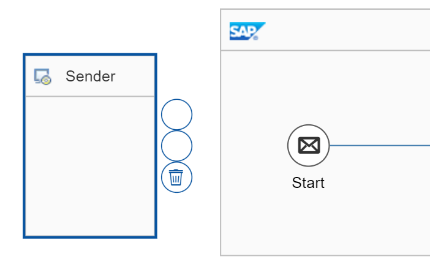
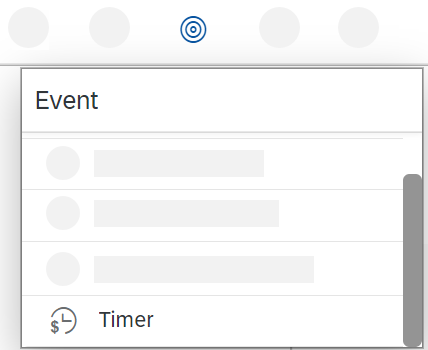
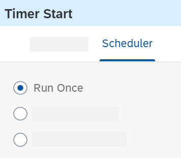

<!-- copy4ede1b465aff413c9f8e4c6306316e33 -->

# Add a Timer Start Event

1.  Open the integration flow model \(Edit mode\), select the Sender shape, and choose the recycle bin icon \(to remove the Sender shape\).

    

2.  In the same way, remove the Start event.

3.  In the palette, select the *Events* entry, and then select the Timer shape.

    

4.  Place the Timer shape in the Integration Process shape \(at the point where the Start event was previously located\).

5.  In the properties section of the Timer event \(displayed below the integration flow model when the Timer event is selected in the model\), go to the *Scheduler* tab.

    

6.  Make sure that the option *Run Once* is selected.

    > ### Note:  
    > You can, of course, try out the other settings, which enable the Timer to start message processing periodically. However, take care when selecting these options and you have added a receiver to your scenario. For example, in another demo scenario provided in this documentation, the receiver of the message is an e-mail account, and you don't want your e-mail account to be inundated with periodically generated e-mails.

**Related Information**  

[Define a Timer Start Event](define-a-timer-start-event-ae14ad7.md "You can configure an integration flow to automatically start and run on a particular schedule.")

