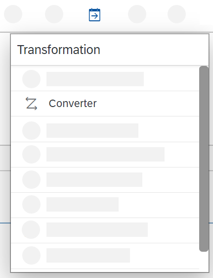
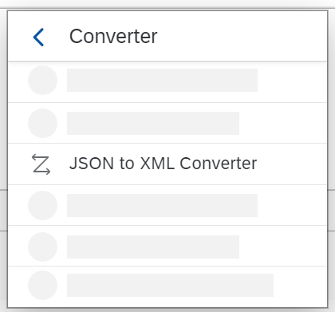
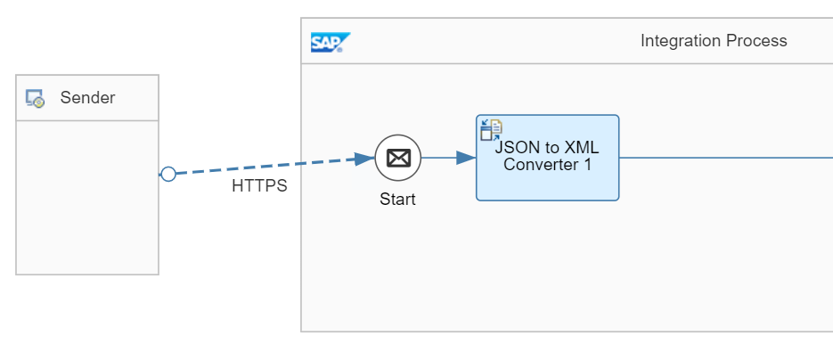

<!-- loio2c49c109a28a4ebbb9585d0574fb7afb -->

# Add the JSON to XML Converter

Add a JSON-to-XML converter to convert the HTTP request, which is in JavaScript Object Notation \(JSON\) format, to XML for further processing.

With the HTTP client, we send a POST request with a request body in JSON format. To enable the subsequent steps to process the message, it needs to be converted to XML first. To perform the required conversion, you can use the JSON-to-XML converter.

1.  In the palette, select the *Message Transformers* entry and then choose *Converter*.

    

2.  In the submenu, choose *JSON to XML Converter*.

    

3.  In the integration flow model, place the shape inside the Integration Process shape after the Start event.

    The model should now look like this:

    

**Related Information**  

[Define JSON to XML Converter](define-json-to-xml-converter-5a7c0cd.md "The JSON to XML converter enables you to transform messages in JSON format to XML format.")

