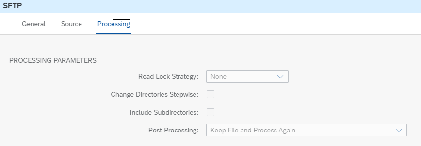

<!-- loio7b971052e46e4a1084eb5bf434a4df1e -->

# Combine XML Files via Poll Enrich

Learn how to enrich the payload with data retrieved from a file on the SFTP server using ‘Combine XML’ Aggregation Algorithm.


<a name="loio7b971052e46e4a1084eb5bf434a4df1e__section_j54_ghy_vrb"/>

## Implementation

To showcase the poll enrich capability, we use a simple scenario.

The example integration flow **File Transfer - Combine XML Files via Poll Enrich** is designed the following way:


Add the following files on your SFTP server whereas the name of the file should be the **product ID with suffix xml**:

`HT-1000.xml`

> ### Sample Code:  
> ```
> <root>
> 	<Product>
> 		<ProductId>HT-1000</ProductId>
> 		<ProductName>Notebook Basic 15</ProductName>
> 		<Category>Notebooks</Category>
> 		<CurrencyCode>EUR</CurrencyCode>
> 		<Price>956.00</Price>
> 	</Product>
> </root>
> 
> ```

`HT-1001.xml`

> ### Sample Code:  
> ```
> <root>
> 	<Product>
> 		<ProductId>HT-1001</ProductId>
> 		<ProductName>Notebook Basic 17</ProductName>
> 		<Category>Notebooks</Category>
> 		<CurrencyCode>EUR</CurrencyCode>
> 		<Price>1249.00</Price>
> 	</Product>
> </root>
> 
> ```

`HT-1002.xml`

> ### Sample Code:  
> ```
> <root>
> 	<Product>
> 		<ProductId>HT-1002</ProductId>
> 		<ProductName>Notebook Basic 18</ProductName>
> 		<Category>Notebooks</Category>
> 		<CurrencyCode>EUR</CurrencyCode>
> 		<Price>1570.00</Price>
> 	</Product>
> </root>
> 
> ```

In the first step **Content Modifier** ‘Define file name’, the exchange property ‘file’ is defined using the following XPath:

`concat(//PurchaseOrder/Item/ProductId , ".xml")`.

See [Access Header and Properties in XPath](access-header-and-properties-in-xpath-996ce78.md).

In the *Source* tab of the *SFTP* sender adapter, enter the *Directory*, *Address* of the SFTP server \(`host:port`\), *Proxy Type* \(On-Premise/Internet\), *Location ID* \(if On-Premise\) and *Credential Name* to access the SFTP server. Those parameters are externalized so that you can use your own SFTP server.

See [Configure Externalized Parameters of an Integration Flow](configure-externalized-parameters-of-an-integration-flow-462a478.md).

*Directory* and *File Name* are set dynamically via the header and the beforehand created message property.


If you switch to the *Processing* tab, you will notice that the file is kept on the SFTP server after the message has been processed:



In the *Processing* tab of *Poll Enrich* set the *Aggregation Algorithm* to *Combine XML*.


In this case the message polled from the SFTP server will be combined with the source message. After the **Poll Enrich step** the message has the following structure:

> ### Sample Code:  
> ```
> <?xml version='1.0' encoding='UTF-8'?>
> <multimap:Messages xmlns:multimap="http://sap.com/xi/XI/SplitAndMerge">
>     <multimap:Message1>
>         <PurchaseOrder PurchaseOrderNumber="99401" OrderDate="2019-05-06">
>             <Item ItemNumber="10">
>                 <ProductId>HT-1000</ProductId>
>                 <Quantity>2</Quantity>
>             </Item>
>         </PurchaseOrder>
>     </multimap:Message1>
>     <multimap:Message2>
>         <root>
>             <Product>
>                 <ProductId>HT-1000</ProductId>
>                 <ProductName>Notebook Basic 15</ProductName>
>                 <Category>Notebooks</Category>
>                 <CurrencyCode>EUR</CurrencyCode>
>                 <Price>956.00</Price>
>             </Product>
>         </root>
>     </multimap:Message2>
> </multimap:Messages>
> 
> ```

The subsequent Message Mapping step maps from this multimap message to a multimap order and the overall **Price** is calculated based on the **Quantity** and **Price** per item of the product.

The subsequent Filter step removes the multimapping from the message. It uses the following XPath expression:

`//PurchaseOrder`

To execute the scenario, expand the Postman collection *Modeling Basics* and the folder*FileTransfer* in the Postman client. There you can find the POST request **CombineXMLFiles** including the following body:

> ### Sample Code:  
> ```
> <PurchaseOrder PurchaseOrderNumber="99401" OrderDate="2019-05-06">
> 	<Item ItemNumber="10">
> 		<ProductId>HT-1002</ProductId>
> 		<Quantity>10</Quantity>
> 	</Item>
> </PurchaseOrder>
> 
> ```

Before running the scenario, maintain the **value of the header directory** of the Postman request corresponding to the **folder** on your sftp server where you put the file, see above. Once the scenario is executed, it creates a new entry in the Data Store *FileTransfer-Combine* with the content of the combined files:

> ### Sample Code:  
> ```
> <PurchaseOrder PurchaseOrderNumber="99401" OrderDate="2019-05-06">
>     <Item ItemNumber="10">
>         <ProductId>HT-1002</ProductId>
>         <ProductName>Notebook Basic 18</ProductName>
>         <Category>Notebooks</Category>
>         <Quantity>10</Quantity>
>         <CurrencyCode>EUR</CurrencyCode>
>         <Price>15700.00</Price>
>     </Item>
> </PurchaseOrder>
> 
> ```

