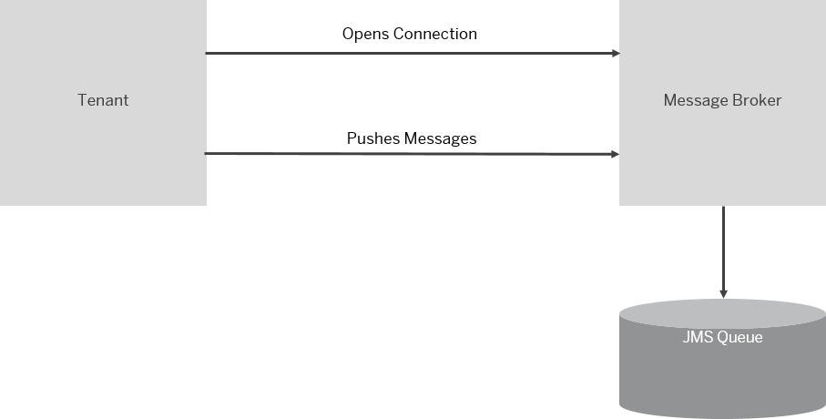

<!-- loio79edc04c91574a6bb8c15ae3e1a27b03 -->

# Configure the JMS Receiver Adapter

The JMS \(Java Message Service\) receiver adapter enables asynchronous decoupling of inbound and outbound processing by using message queues. The receiver adapter stores messages and schedules them for processing in a queue. The messages are processed concurrently.

> ### Note:  
> In the following cases certain features might not be available for your current integration flow:
> 
> -   You are using a runtime profile other than the one expected. See: [Runtime Profiles](../IntegrationSettings/runtime-profiles-8007daa.md).
> 
> -   A feature for a particular adapter or step was released after you created the corresponding shape in your integration flow.
> 
>     To use the latest version of a flow step or adapter – edit your integration flow, delete the flow step or adapter, add the step or adapter, and configure the same. Finally, redeploy the integration flow. See: [Updating your Existing Integration Flow](updating-your-existing-integration-flow-1f9e879.md).

> ### Note:  
> Note that this adapter works with a message broker provided by SAP \(based on the SAP Event Mesh capability\). It does not support connectivity to any other, customer-provided message brokers. The usage of this adapter is supported by all SAP Integration Suite editions, except the basic edition \(see SAP note [2903776](https://me.sap.com/notes/2903776)\).

To understand the concept of asynchronous decoupling, assume that a sender sends a message to SAP Cloud Integration \(inbound processing\). If there's an error in outbound processing \(for example, a receiver can't be reached temporarily\), the middleware \(SAP Cloud Integration\) retries message processing independently. There's no need that the sender triggers a reprocessing of the message as soon as the error situation has been solved. The sender relies on the middleware to do that. To support this scenario, the message received from the sender is stored in a queue \(using the JMS receiver adapter\). Outbound processing is modeled in an integration flow that initially consumes the message from the queue \(using the JMS sender adapter\). The outbound integration flow retries the message from the queue as long as the error situation lasts.

The figure illustrates how the JMS receiver adapter works.

Assuming that you've designed an integration flow with a JMS receiver adapter. On deployment of the integration flow, a JMS queue \(as specified in the adapter\) is created and the tenant opens a provider connection to the message broker. The tenant pushes messages through this connection.

Certain constraints apply with regard to the number and capacity of involved queues, as well as for the headers and exchange properties defined in the integration flow before the message is saved to the queue. See [JMS Resource Limits and Optimizing their Usage](../Operations/jms-resource-limits-and-optimizing-their-usage-4857054.md).

> ### Note:  
> If a `content-type` header is provided with the message, the content-type must match the actual content-type of the message. If that's the case, the following issue can occur:
> 
> See: SAP note [3356078](https://me.sap.com/notes/3356078)

Once you've created a receiver channel and selected the JMS Receiver Adapter, you can configure the following attributes. See [Overview of Integration Flow Editor](overview-of-integration-flow-editor-db10beb.md).

Select the *General* tab and provide values in the fields as follows.

**General**

<table>
<tr>
<th valign="top">

Parameter

</th>
<th valign="top">

Description

</th>
</tr>
<tr>
<td valign="top">

Name

</td>
<td valign="top">

Enter the name of the channel.

</td>
</tr>
</table>

Select the *Processing* tab and provide values in the fields as follows.

**Processing**

<table>
<tr>
<th valign="top">

Parameters

</th>
<th valign="top">

Description

</th>
</tr>
<tr>
<td valign="top">

*Queue Name*

</td>
<td valign="top">

Enter the name of the message queue \(aA-zZ, 0–9, \_\) without white spaces.

A maximum length of 80 characters is allowed.

You can dynamically configure this field, for instance, by using expressions like ***$\{header.myQueue\}*** or ***$\{property.myQueue\}***, depending on whether you like to use a header or an exchange property.

> ### Note:  
> Header or property name must start with a character aA-zZ.

</td>
</tr>
<tr>
<td valign="top">

*Retention Threshold for Alerting \(in d\)*

</td>
<td valign="top">

Enter the time period \(in days\) by which the messages have to be fetched. The default value is 2.

</td>
</tr>
<tr>
<td valign="top">

*Expiration Period \(in d\)*

</td>
<td valign="top">

Enter the time period \(in days\) by which the messages have to be fetched. Specify a time period for *Expiration Period* which is no less than the number of days entered for the *Retention Threshold for Alerting*. The recommendation is to use at least twice the retention threshold. The default is set to 30.

</td>
</tr>
<tr>
<td valign="top">

*Compress Stored Message*

</td>
<td valign="top">

Select this option to compress the message in the JMS queue. Compressing the message reduces disk space usage and network traffic.

</td>
</tr>
<tr>
<td valign="top">

*Encrypt Stored Message* 

</td>
<td valign="top">

Select this option to encrypt the message in the JMS queue.

</td>
</tr>
<tr>
<td valign="top">

*Transfer Exchange Properties* 

</td>
<td valign="top">

You can select this option to also transfer the exchange properties to the JMS queue.

However, we don't recommend using this option because headers and exchange properties are subject to size restrictions, which can result in problems or errors.

</td>
</tr>
</table>

**Related Information**  

[JMS Resource Limits and Optimizing their Usage](../Operations/jms-resource-limits-and-optimizing-their-usage-4857054.md "The JMS messaging instance that is used in asynchronous messaging scenarios with the JMS, AS2, AS4, or XI adapter has limited resources.")

[Apply the Retry Pattern with JMS Queue](apply-the-retry-pattern-with-jms-queue-da17d2d.md "")

