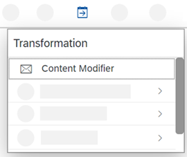
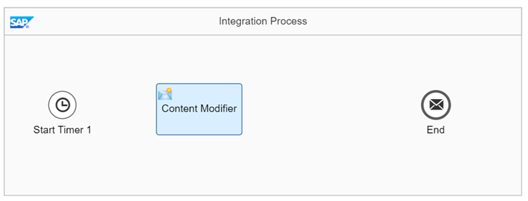
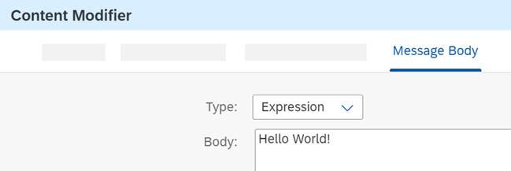
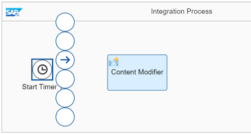
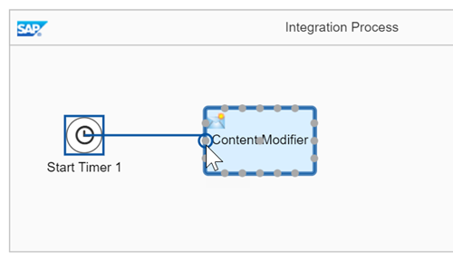

<!-- loio766db408db48412c9bdca58879a726d3 -->

# Create a Content Modifier to Define the Message Body

Add a Content Modifier step to create the message body.

As the integration flow has no sender, we use a Content Modifier to create a message from scratch.

1.  To add a Content Modifier, go to the palette, choose the *Message Transformers* icon, and select the *Content Modifier* icon.

    

2.  Place the Content Modifier in the model after the Timer Start event.

    

3.  In the Content Modifier properties section, go to the *Message Body* tab and enter the following string sequence in the entry field:

    `Hello World!`

    

    This simulates the inbound XML message.

4.  Connect the Timer event with the Content Modifier. To do this, select the Timer event.

    

5.  Click the arrow icon, and drag and drop the cursor to the Content Modifier.

    

