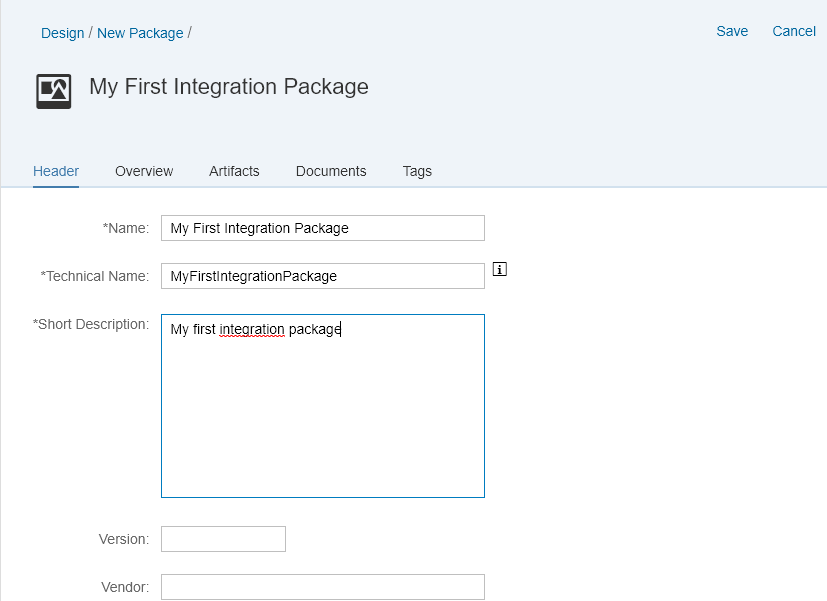

<!-- copy748968a0f43d442f98d93a9a197cdbd2 -->

# Create an Integration Package

Create an integration package that contains your integration flows.

An integration package is used like a folder for your integration content \(integration flows, value mappings, and OData services\). You can transport an integration package, for example, if you want to design your integration content on a test tenant first and then transport it to a production tenant.

1.  Open the Web UI using the hyperlink provided to you in the mail from SAP \(the links ends with `/itspaces`\).

2.  Go to the *Design* section of the Web UI.

3.  Choose *Create*.

4.  Enter a name and description for your integration package and choose *Save*.

    

