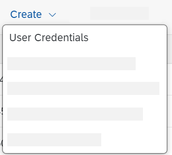

<!-- loio1c1fced010e744d48decd305fb0abadb -->

# Create and Deploy a User Credentials Artifact for the E-Mail Account

Deploy a User Credentials artifact that contains the user name and password for your receiver mail account.

1.  Go to the *Monitor* section, and select the *Security Material* tile under *Manage Security*.

2.  Choose *Create* \> *User Credentials*.

    

3.  As *Name*, enter the *User Credentials* name that you specified in the Mail receiver adapter, and as *User* enter the e-mail account user name \(also specified in the fields *From* and *To* in the Mail receiver adapter\).

    Also provide the password of the mail account.

    

    > ### Note:  
    > Storing the user name and password in a separate artifact increases the security level of integration development.

4.  Choose *Deploy*.

**Related Information**  

[Deploying a User Credentials Artifact](../Operations/deploying-a-user-credentials-artifact-6912d63.md "To set up a connection using basic authentication or username token authentication, you have to specify the required attributes (for example, user name and password).")

