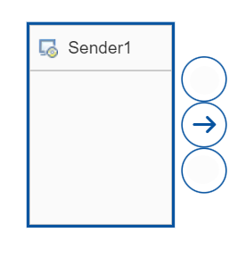
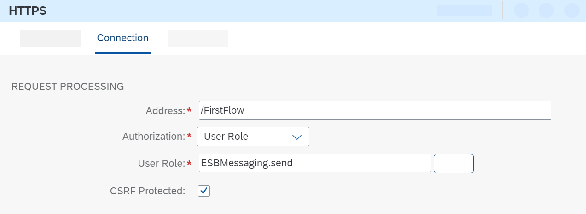

<!-- loiobd53c6ecb62e43bfab3ed018acfb285b -->

# Create the HTTPS Sender Channel

Add an HTTPS sender channel to enable the integration flow to receive HTTP requests.

1.  Select the integration flow and choose *Edit*.

2.  Click the Sender shape. The context icons for the Sender appear.

    

    > ### Note:  
    > If you choose the information icon, the version of the integration flow component is displayed.
    > 
    > Do not confuse the version of an individual integration flow component with the software version of SAP Cloud Integration. An integration flow component gets a new version each time a new feature is added to it by SAP. Let's imagine a situation where you started modeling an integration flow some time ago and now want to continue working on it. Let's assume that SAP has updated the software in the meantime. A new version of an integration flow step or shape that you have used is now available, containing a new feature. You can continue to use the old component version, but if you want to use the new feature you need to update to the new version.

3.  Click the arrow icon and drag and drop the cursor on the Start event.

    The list of available adapter types is displayed in a dialog.

4.  Choose adapter type *HTTPS*.

    The properties of the adapter are shown below the model.

5.  Go to the *Connection* tab.

    

    Specify the following parameters:

    -   *Address*: This parameter defines the endpoint under which the integration flow can be called from the sender. Start the address with a slash, for example,`/FirstFlow`.

    -   *Authorization* and *User Role*: You want to configure your first integration flow so that the inbound request is authenticated using basic authentication \(based on user credentials\). To keep it simple, you use your dialog user. During onboarding, you also made sure that the role `ESBMessaging.send` was assigned to your user \(and this setting was also used when configuring the HTTP client\).

        You can select other roles for inbound authentication \(if you have defined these roles for the runtime node in Neo\), but you don't use this option in this scenario.

    -   *CSRF Protected*: Keep this option selected \(default setting\). It ensures that your integration flow is protected against Cross-Site-Request-Forgery, a kind of attack where a malicious party can perform harmful actions by masquerading as the logged in user \(the user specified for the HTTP client in our case\).

**Related Information**  

[HTTPS Sender Adapter](https-sender-adapter-0ae4a78.md "")

[Authentication and Authorization Options \(Inbound\)](../ConnectionSetup/authentication-and-authorization-options-inbound-983f2a5.md "When a client calls a server using a secure communication channel, two different kinds of checks are performed subsequently.")

