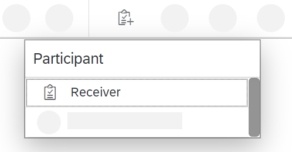
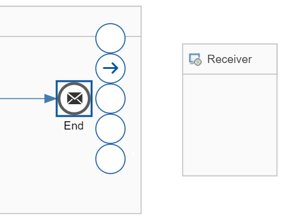
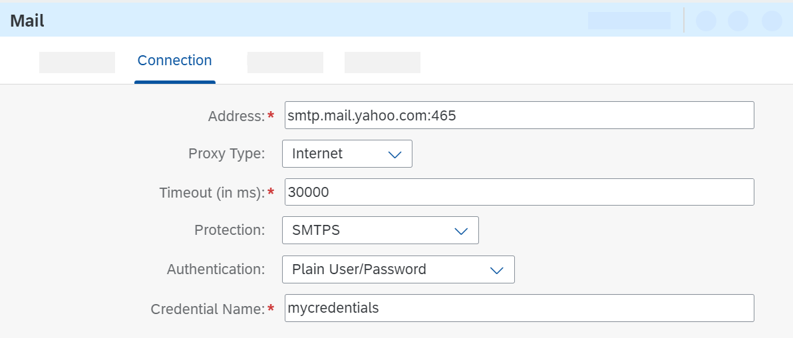
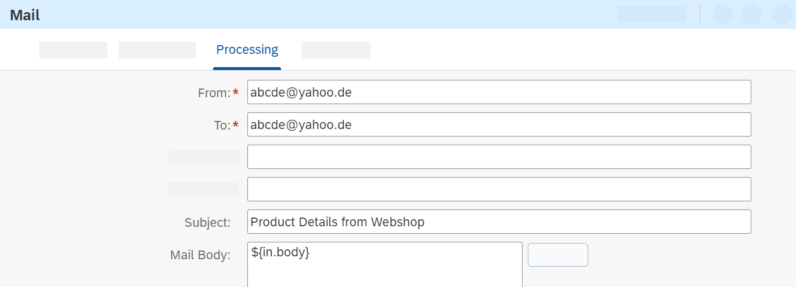

<!-- loioa6966fd46aef4e61ada1dcd11dadfc8b -->

# Create the Mail Receiver Channel

Add a Mail receiver channel to enable the integration flow to send messages to an e-mail account.

1.  First, add a second receiver to represent the e-mail account. In the integration flow model \(in *Edit* mode\), select the *Participants* entry from the palette and select *Receiver*.

    

2.  Place the Receiver shape on the right side of the model, outside the Integration Process shape.

    You can rename the shape to `Mail_Receiver` \(for example\).

3.  Select the End event, click the arrow button and drag and drop the cursor on the Receiver shape.

    

4.  Select *Mail* as the *Adapter Type*.

5.  In the Mail adapter properties section \(below the model\), go to the *Connection* tab and specify the following Mail adapter parameters.

    The figure shows example settings, which are explained further below.

    

    -   *Address*: Enter the address of your mail provider, followed by a colon and the port number. The example in the figure shows the address for Yahoo Mail \(`smtp.mail.yahoo.com:465`\) and SMTP protocol.

    -   *Proxy Type*: Select *Internet*.

    -   *Protection*: Select *SMTPS*.

    -   *Authentication*: Select *Plain User/Password*.

    -   *Credential Name*: Enter a name for a User Credentials artifact that you will create in a subsequent step, for example, `MyCredentials`.

        The User Credentials artifact will contain the user name and password for the e-mail account to which the message is to be sent.

    Keep the default settings for the other parameters.

6.  In the Mail adapter properties section \(below the model\), go to the *Processing* tab and specify the following Mail adapter parameters.

    

    -   *From* and *To*: Enter the mail address of the e-mail account that should receive the message.

    -   *Subject*: Enter a meaningful text.

7.  Save and deploy the integration flow.

**Related Information**  

[Mail Adapter](mail-adapter-f1145cc.md "The mail adapter allows you to connect the tenant to an email server. The sender mail adapter can download e-mails and access the e-mail body content as well as attachments. The receiver mail adapter allows you to send encrypted messages by e-mail.")

