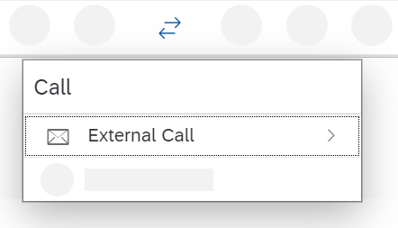
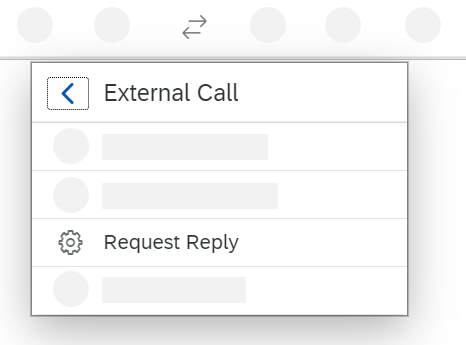
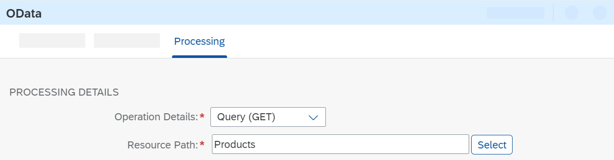
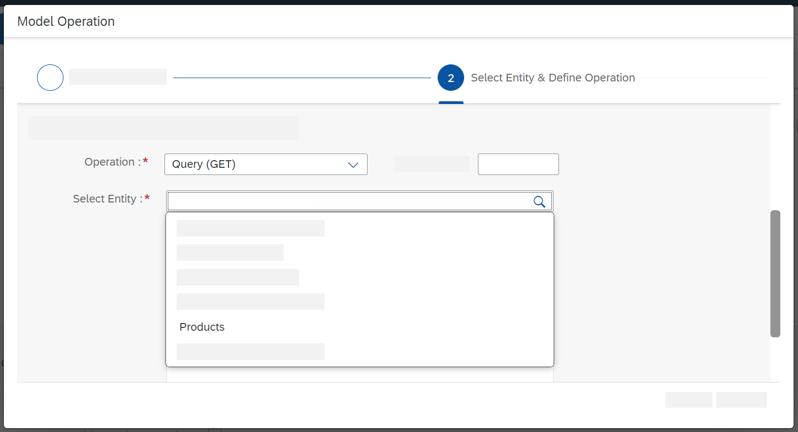
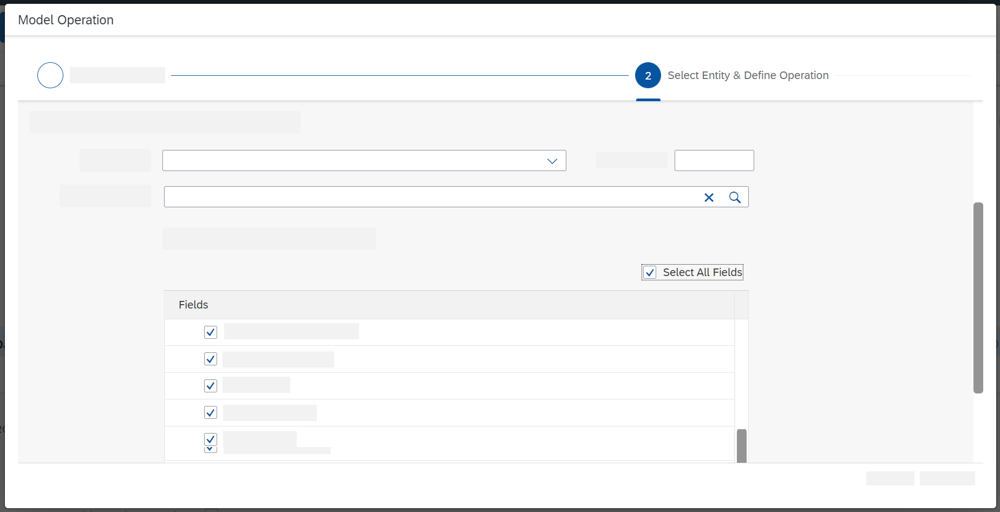

<!-- copya83638f8d90b4a83b5165a2cae2afaa3 -->

# Create the Outbound OData Channel

To call the external data source, add a Request Reply step to the integration flow model and connect this step with the external system using an OData channel.

> ### Note:  
> Follow this procedure in case you use SAP Cloud Integration in the Neo environment.

To configure SAP Cloud Integration to send a request message to the external OData API \(to retrieve the required data\), you need to do the following:

-   Create a Request Reply step.

-   Connect the Request Reply step to a Receiver shape and select the OData adapter type.

-   Configure the OData adapter to specify how the OData API of the external service should be called \(to define query options, for example\).

    > ### Remember:  
    > There are currently certain limitations when working in the Cloud Foundry environment. For more information on the limitations, see SAP Note [2752867](https://me.sap.com/notes/2752867).

1.  Go to the palette and select the *Call* entry.

    

2.  Select *External Call* and in the submenu choose *Request Reply*.

    

3.  Place the Request Reply shape between the second Content Modifier and the End event in the model.

    Furthermore, connect the second Content Modifier with the Request Reply step and the Request Reply step with the End event.

4.  Move the Receiver shape closer to the Request Reply shape \(below the Request Reply shape but outside the Integration Process shape, as shown in the overall integration flow model under [Smoke Test Scenario with External Data Source](smoke-test-scenario-with-external-data-source-e4bef74.md)\).

5.  Connect the Request Reply shape to the Receiver shape \(by selecting the Request Reply shape, clicking the arrow icon, and dragging and dropping the cursor on the Receiver shape\).

6.  In the next dialog, choose adapter type *OData* \> *OData V2*.

7.  In the next dialog, as *Message Protocol* select *OData V2*.

    > ### Note:  
    > This adapter supports different versions of the OData protocol. Select version 2.0.

8.  Go to the *Connection* tab of the OData adapter and enter the following as *Address*:

    `https://refapp-espm-ui-cf.cfapps.eu10.hana.ondemand.com/espm-cloud-web/espm.svc`

    > ### Tip:  
    > This is the endpoint address of the ESPM WebShop's OData application programming interface.

9.  Go to the *Processing* tab.

10. Next to *Resource Path*, choose *Select*.

    

    In the Query Editor opens, you can conveniently define the OData query.

    The *Address* field is already populated with the value you just entered.

11. Make sure that *Remote* is selected as the *Connection Source*, and choose *Step 2*.

    The system connects to the WebShop service and retrieves the metadata from its OData API.

12. Choose the search icon in the *Select Entity* field.

    

    Select *Products*.

13. A list of the available elements is provided, using the information from the OData API.

    Choose a set of elements for which you want to retrieve data \(for example, all elements, as shown in the next figure\) and choose *Step 3*.

    

14. Choose the copy icon in the *Filter By* field and select `ProductId`.

15. Select `Equal`.

16. In the third field, enter an expression that allows the integration framework to access the message header `productIdentifier` that you created in the preceding *Content Modifier* step: `${header.productIdentifier}`.

    

    > ### Tip:  
    > The dollar sign and the curled brackets indicate that we're dealing with Apache's *Simple Expression Language*, which is often used in SAP Cloud Integration. In particular, here, you see a *dynamic parameter*, which has the following effect: The value of the header `productIdentifier` \(which is identical to the value of the `productIdentifier` field of the incoming message\) is used dynamically at runtime to define the OData query.

17. Choose *Finish*.

**Related Information**  

[Define Request Reply](define-request-reply-dc39fdd.md "You use this step to call an external receiver system in a synchronous step and get back a response.")

[Configure the OData V2 Receiver Adapter](configure-the-odata-v2-receiver-adapter-c5c2e38.md "Configure the OData receiver adapter by understanding the adapter parameters.")

[Dynamically Configure Integration Flow Parameters](dynamically-configure-integration-flow-parameters-fff5b2a.md "For certain integration flow parameters you can enter a reference to a header or property instead of a fixed value. At runtime, the actual value of the header or property in the incomung message is then used as parameter value. This is referred to as dynamic configuration.")

