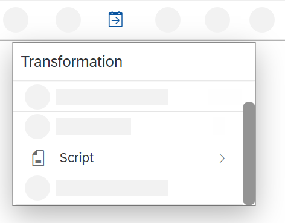
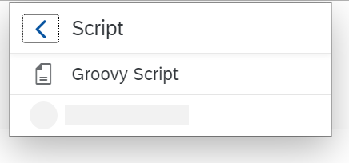
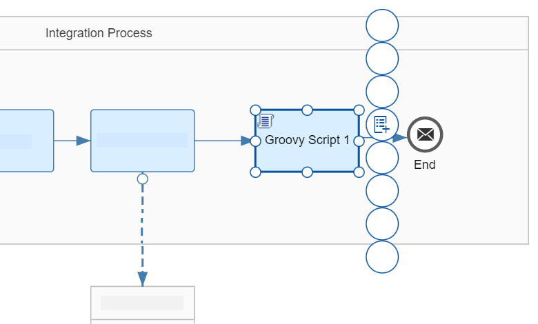
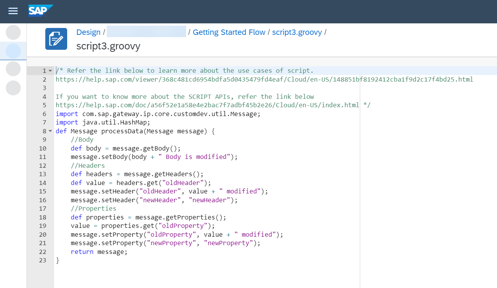

<!-- loio613181e318d14fc1b64feaef44a3036e -->

# Create the Script Step to Log the Payload

Add a Script step to log the message payload.

With a Groovy Script step, you can configure the integration in such a way that the payload of the message is written to the message processing log.

1.  To add a Script step \(containing a Groovy script\), go to the palette and choose the *Message Transformers* icon and select the *Script* icon.

    

2.  In the *Script* submenu, select *Groovy Script*.

    

3.  Place the Script Step shape after the Request Reply step and connect both shapes.

4.  Select the Script step.

    The context icons are displayed.

    

5.  Choose the*\+* icon.

6.  The default script coding of the step is displayed.

    

7.  Replace this content by the script provided in the coding example below.

    ```
    import com.sap.gateway.ip.core.customdev.util.Message;
    import java.util.HashMap;
    
    def Message processData(Message message) 
    {
    	def body = message.getBody(java.lang.String) as String;
    	def messageLog = messageLogFactory.getMessageLog(message);
    	if(messageLog != null)
    	{
    	messageLog.addAttachmentAsString("Log current Payload:", body, "text/plain");
         }
    	return message;
    }
    ```

8.  Choose *OK*.

    The integration flow model is again displayed.

9.  Save and deploy the integration flow.


