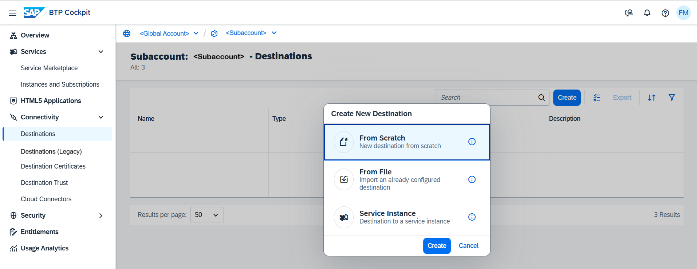
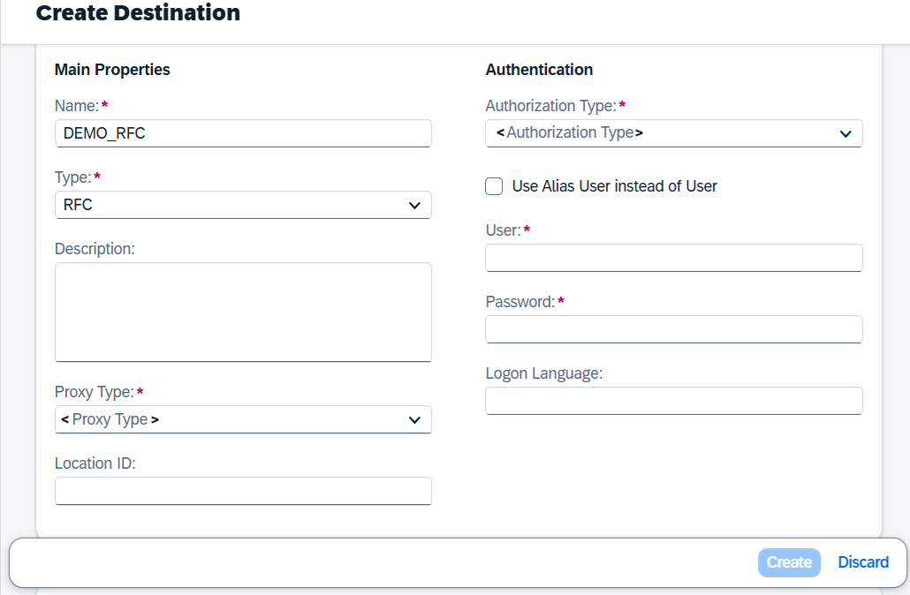

<!-- loio3b55fa7b83874b5ca3b6b6b5998a73f6 -->

# Creating and Modifying RFC Destination

Create an RFC destination by adding necessary properties before using it in the integration flow of RFC adapter.

## Context

This section outlines on how to create or modify a RFC Destination for your runtime profiles.

> ### Note:  
> SAP System Identification \(SID\) code must be unique for RFC backend, see: SAP Note [1405466](https://launchpad.support.sap.com/#/notes/1405466).

## Procedure

1.  Log into the SAP BTP cockpit and navigate to your subaccount.

2.  Choose *Connectivity* \> *Destinations*.

3.  Choose *Create* \> *From Scratch* \> *Create*.

    

4.  Enter the details for the parameters *<Name\>*, *<User\>*, *<Password\>*, and select *<Type\>* as *RFC*.

5.  From the *<Proxy Type\>* dropdown box, select `Internet`, `OnPremise`, or `Local`, depending on the connection type you want to provide for your application.

    

    > ### Note:  
    > -   When using *<Proxy Type\>* `Internet` , you can connect your application to any target service that is exposed to the Internet. *<Proxy Type\>* `OnPremise` requires the to access resources within your on-premise network.

6.  As *Authorization Type*, choose `CONFIGURED_USER`, `PrincipalPropagation` \(for *OnPremise* connections only\), or `TechnicalUserPropagation` \(for *OnPremise* connections only\), and enter the required parameters for the selected authorization type.

    > ### Note:  
    > -   For Cloud Integration runtime profile, setting up an RFC connectivity for ABAP environment using principal propagation, select `OnPremise` from *<Proxy Type\>* and then for *<Authentication Type\>*, select `PrincipalPropagation`.
    > 
    > -   `PrincipalPropagation` is only supported on Cloud Foundry but is not supported on Edge Integration Cell runtime.
    > 
    > -   `TechnicalUserPropagation` is not supported on Cloud Foundry and Edge Integration Cell runtime.

7.  Add the following properties and assign appropriate values:

    **Java Connectivity Parameters**

    <table>
    <tr>
    <th valign="top">

    Parameters
    
    </th>
    <th valign="top">

    Description
    
    </th>
    </tr>
    <tr>
    <td valign="top" colspan="2">
    
    **Connection Parameters** \(first four properties are mandatory\)
    
    </td>
    </tr>
    <tr>
    <td valign="top">
    
    jco.client.ashost
    
    </td>
    <td valign="top">
    
    The IP address or hostname of the SAP application server.

    > ### Note:  
    > For runtimes other than , the value provided for application server host \(ashost\) property is the access control value created in the Cloud Connector.

    
    </td>
    </tr>
    <tr>
    <td valign="top">
    
    jco.client.client
    
    </td>
    <td valign="top">
    
    The SAP client number.
    
    </td>
    </tr>
    <tr>
    <td valign="top">
    
    jco.client.lang
    
    </td>
    <td valign="top">
    
    The language for communication with SAP SAP \(e.g., en for English\)
    
    </td>
    </tr>
    <tr>
    <td valign="top">
    
    jco.client.sysnr
    
    </td>
    <td valign="top">
    
    The system number of the SAP instance \(e.g., 27\)
    
    </td>
    </tr>
    <tr>
    <td valign="top">
    
    jco.client.user
    
    </td>
    <td valign="top">
    
    The SAP username for authentication
    
    </td>
    </tr>
    <tr>
    <td valign="top">
    
    jco.client.passwd
    
    </td>
    <td valign="top">
    
    The password for the SAP user.
    
    </td>
    </tr>
    <tr>
    <td valign="top">
    
    jco.destination.auth\_type
    
    </td>
    <td valign="top">
    
    While configuring for principal propagation the value for the property is "jco.destination.auth\_type = PrincipalPropagation".

    > ### Note:  
    > -   `PrincipalPropagation` is only supported on Cloud Foundry but is not supported on Edge Integration Cell runtime.
    > 
    > -   `TechnicalUserPropagation` is not supported on Cloud Foundry and Edge Integration Cell runtime.

    
    </td>
    </tr>
    <tr>
    <td valign="top" colspan="2">
    
    **Connection Pool Parameters**
    
    </td>
    </tr>
    <tr>
    <td valign="top">
    
    \(optional\) jco.destination.pool\_capacity
    
    </td>
    <td valign="top">
    
    The number of connections that are kept open in the connection pool for reuse.
    
    </td>
    </tr>
    <tr>
    <td valign="top">
    
    \(optional\) jco.destination.peak\_limit
    
    </td>
    <td valign="top">
    
    The maximum number of concurrent connections allowed at peak times.
    
    </td>
    </tr>
    <tr>
    <td valign="top" colspan="2">
    
    WebSocket Connection

    > ### Note:  
    > WebSocket RFC via Cloud Connector is not supported on Cloud Foundry and Edge Integration Cell; WebSocket RFC over Internet is supported on Cloud Foundry only and is not supported on Edge Integration Cell.

    
    </td>
    </tr>
    <tr>
    <td valign="top">
    
    jco.destination.auth\_type
    
    </td>
    <td valign="top">
    
    If you’re using principal propagation for authentication, for the property jco.destination.auth\_type, specify the value as PrincipalPropagation. Don’t specify any additional credentials in the destination.

    Location ID should correspond to the cloud connector name found in the master instance.
    
    </td>
    </tr>
    <tr>
    <td valign="top">
    
    jco.client.client
    
    </td>
    <td valign="top">
    
    The SAP client number
    
    </td>
    </tr>
    <tr>
    <td valign="top">
    
    jco.client.tls\_trust\_all
    
    </td>
    <td valign="top">
    
     
    
    </td>
    </tr>
    <tr>
    <td valign="top">
    
    jco.client.wshost
    
    </td>
    <td valign="top">
    
    Host for websocket connection
    
    </td>
    </tr>
    <tr>
    <td valign="top">
    
    jco.client.wsport
    
    </td>
    <td valign="top">
    
    Port for websocket connection
    
    </td>
    </tr>
    <tr>
    <td valign="top">
    
    jco.destination.repository\_roundtrip\_optimization
    
    </td>
    <td valign="top">
    
    The default value is 1, which helps you to minimizes the number of roundtrip calls made to the server
    
    </td>
    </tr>
    </table>
    
8.  Once you have verified all the details, choose *Save* and then perform a connection check.

9.  To modify an existing destination, choose the *Destination* and choose *Edit*. Make the necessary edits and choose *Save*.

10. When you are done, choose *Create*.

**Related Information**  

[Create and Delete Destinations on the Cloud](https://help.sap.com/viewer/b865ed651e414196b39f8922db2122c7/Cloud/en-US/94dddf7d9e56401ba1719b7e836d8ee9.html)

[Create RFC Destinations](https://help.sap.com/docs/connectivity/sap-btp-connectivity-cf/create-rfc-destinations?version=Cloud)

[Managing Destinations](https://help.sap.com/docs/connectivity/sap-btp-connectivity-cf/managing-destinations?version=Cloud)

