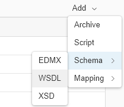
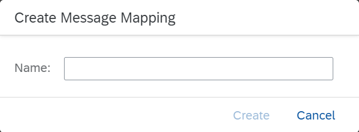

<!-- loio418a9603c1954f759e7ce8f2464a02fd -->

# Creating the Pre-Exit Integration Flow

<a name="loio418a9603c1954f759e7ce8f2464a02fd__section_yxw_phl_mgb"/>

## Creating the Pre-Exit Mapping

Let's assume that you want to extend the source structure by additional fields.

1.  Extend the source structure of the message \(to get message A'\).

    You want to add additional elements to the source message, for example, the following element: `Z101YANEXT2`.

    Edit the WSDL file for message A \(`COD_STOCK_REPLICATE.COD_STOCK_REPLICATE01.wsdl`\) accordingly \(using the WSDL for message A from the *Resources* tab of the standard integration flow\).

    Save the new WSDL file under any name \(for example, `YANCOD_STOCK_REPLICATE01.wsdl`\).

2.  Create a new integration flow.

    We recommend that you add this new integration flow to the package that contains the standard integration flow \(both have to be deployed on the same tenant\).

3.  Model the integration flow according to the following figure:

    

4.  When connecting the sender shape with the message start event, select the *ProcessDirect* adapter type.

    Go to the *Connection* tab of the ProcessDirect adapter and as *Address* enter any value starting with a slash \(`/`\), for example `/preexit_flow`.

5.  In the integration flow editor, click somewhere outside the *Integration Process* shape and select *Resources*.

6.  Choose *Add* \> *Schema* \> *WSDL* and browse to the `WSDL` file defining the source message \(message A', this is file `YANCOD_STOCK_REPLICATE01.wsdl`\).

    In the same way, add the WSDL file for message A to the integration flow \(file `COD_STOCK_REPLICATE.COD_STOCK_REPLICATE01.wsdl`\).

    

7.  Repeat these steps for the target message \(here, add the WSDL file for message A\). Note that the pre-exit steps map the extended source message A' to the original message A. As mentioned above, you get the resource for message A from the standard integration flow, whereas the resource for message A' depends on the specific enhancements of the source structure. Typically, it is similar to message A, but contains additional custom fields.

8.  In the integration flow model, select the *Message Mapping* shape from the palette \(under *Mapping*\) and place it in the model between the message start and message end event.

    

9.  Choose the *\+* icon next to the message mapping shape and enter a name for the message mapping \(for example, `pre_exit_mapping`\).

    

10. Choose *Create*.

11. The graphical mapping editor is opened.

12. Choose *Add source message* and browse to the WSDL file of the source message \(message A'\). Choose *Upload from file system*.

    

13. Choose *Add target message* and repeat the steps with the WSDL file for the target message \(`message A`\).

14. Connect all fields that are identical in the source and target mapping without assigning any mapping function. Do **not** connect the additional fields \(which have no equivalence in the target message A\) to any target field.

    

15. Save and deploy the integration flow.

