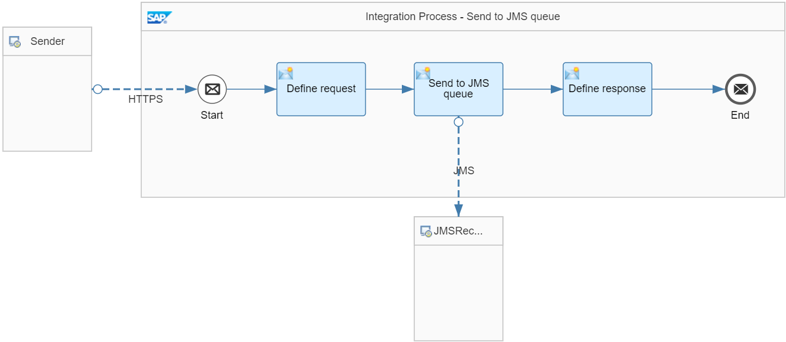
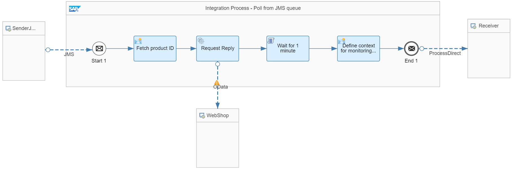

<!-- loio3c26902ed4eb4207b51ff7e19d436c99 -->

# Decouple Sender and Flows Using JMS Message Queues


In the [Decouple Sender and Flows Using Data Store](decouple-sender-and-flows-using-data-store-5467c77.md) scenario, a data store is used as persistency. In the current use case, a JMS message queue is used to decouple 2 integration flows.

Like in the [Decouple Sender and Flows Using Data Store](decouple-sender-and-flows-using-data-store-5467c77.md) rule, a long running service call or complex message processing is to be triggered. A response is to be sent back right away in order to not block the client while the service request is processed.

> ### Note:  
> The Cloud Integration JMS adapter is used for implementing asynchronous communication, that means: for the decoupling of integration flows. With the JMS adapter, you can't access an external message broker. To do this, use the AMQP adapter. An example of an external message broker is SAP Event Mesh. This fully managed cloud service of the SAP Business Technology Platform allows applications to communicate through asynchronous events. For more details about SAP Event Mesh, see [What Is SAP Event Mesh?](https://help.sap.com/viewer/bf82e6b26456494cbdd197057c09979f/Cloud/en-US/df532e8735eb4322b00bfc7e42f84e8d.html).


<a name="loio3c26902ed4eb4207b51ff7e19d436c99__section_iqf_zyg_gqb"/>

## Implementation

This rule is illustrated by the *Modeling Basics – Decouple Flows using JMS* integration flow.

The integration flow contains 2 integration processes:

-   The *Integration Process - Send to JMS queue* integration process receives the request from the client, writes the request into a JMS queue, and sends back a response to the calling client.

-   The *Integration Process - Poll from JMS queue* integration process reads the request from the same JMS queue, and then performs the actual long running service call and \(eventually\) further message orchestration steps.


The *Integration Process - Send to JMS queue* integration process is modeled in the following way:



The integration process performs the following steps:

1.  The integration flow receives a message through an HTTP adapter from the external client. In the message header, a product identifier is provided.

2.  The *Define request* Content Modifier defines the message body by using the provided product identifier header:

    ```
    <request>
    	<productId>${header.productId}</productId>
    </request> 
    
    ```

3.  In a *Send* step, the message is passed to a JSM queue with name *DecoupleFlows*.

    Once the message has been stored successfully, a response is to be created and sent back to the calling client.

4.  The *Define response* Content Modifier defines the message body in the following way:

    ```
    <response> 
    	<info>product ID ${header.productId} has been passed to the JMS queue and will be picked up soon for processing</info> 
    </response> 
    ```

    Furthermore, a new header with name `CamelHttpResponseCode` and constant value `202` is created \(see the *Message Header* tab\). This measure ensures that an HTTP response code `202 Accepted` is sent back instead of an HTTP response code `200 OK`.


The *Integration Process - Poll from JMS queue* integration process is modeled in the following way:



The integration process performs the following steps:

1.  The integration process starts with a *Message Start* event.

    The JMS sender adapter reads the message from the *DecoupleFlows* JMS queue.

2.  The *Request Reply* step calls the WebShop through the OData receiver adapter.

    The request query is defined in the following way:

    `$select=ProductId,Category,Name,DimensionDepth,DimensionHeight,DimensionUnit,DimensionWidth&$filter=ProductId eq '${property.productId}'`

    The external data source supports the Open DataProtocol \(OData\). For our scenario, we use the ESPM WebShop, which is based on the Enterprise Sales and Procurement Model \(ESPM\) provided by SAP.

3.  The *Wait for 1 minute* Script step delays the processing of the message.

    In order to simulate further processing steps, the integration flow is put to sleep for 1 minute. This gives you the chance to see that the response doesn't take 1 minute to get back to the actual sender from the first integration process. Instead of this, the response rather gets back almost immediately.

    For delaying the integration flow processing, the following Groovy script is used:

    ```
    import com.sap.gateway.ip.core.customdev.util.Message;
    import java.util.HashMap;
    def Message processData(Message message) {
    
    	Thread.sleep(1*60*1000); //sleep for 1 minute
    	return message;
    
    }
    ```


<a name="loio3c26902ed4eb4207b51ff7e19d436c99__section_dd4_cbh_gqb"/>

## Executing the Scenario

To run the sample integration scenario that is provided within the *Integration Flow Design Guidelines - Learn the Basics* package, the *Generic Receiver* integration flow needs to be deployed. You can find the integration flow in the same package that contains the sample integration flow.

To call this integration scenario, provide a `productId` header together with the HTTP request \(from the HTTP client\) and give it any value for a product published in the WebShop catalog \(for example, the value `HT-2002`\).

> ### Note:  
> When using Postman together with the Postman collections provided with the integration package, a value for this header is already specified for the request. You can, however, overwrite this value.
> 
> To check for products, you can open the WebShop frontend at:
> 
> `https://refapp-espm-ui-cf.cfapps.eu10.hana.ondemand.com/webshop/index.html`

A custom response as defined by the integration flow will be sent back right away.

