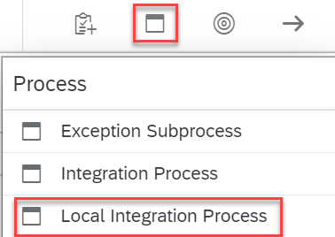
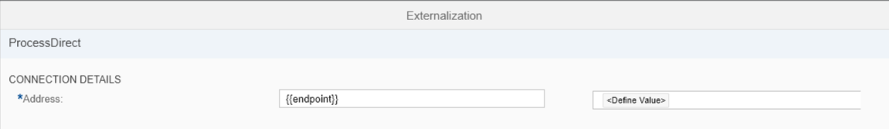
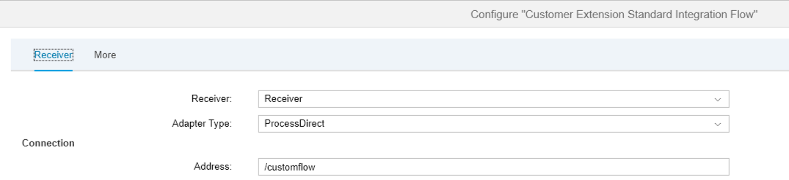

<!-- loio88faa5c1056c4c179a8d1967b2ce5669 -->

# Defining the Local Integration Process

Before continuing to the routing step, we first add a local integration process shape to the integration flow model.

1.  In the palette, select *Process* \> *Local Integration Process* and position the shape below the \(main\) *Integration Process* shape.

    

2.  In the palette, select *Transformation* \> *Filter* and place the filter shape to the right of the start event of the local integration process.

3.  Click the *Filter* shape and, on the *Processing* tab, enter the following string in the *XPath Expression* field: `/p1:Order_MT` 

    Keep the default setting of *Value Type* as *Nodelist*.

    This step will filter the required elements from the message structure `Order_MT` \(associated with the namespace mapped to prefix `p1`\) from the processed message B \(to prepare the message for the subsequent merge step\).

4.  Add a Content Modifier to the right of the Filter step \(you can find this under *Message Transformers* in the palette\).

    On the *Message Body* tab, enter the following:

    > ### Sample Code:  
    > ```
    > <ns1:Messages xmlns:ns1="http://sap.com/xi/XI/SplitAndMerge">
    > <ns1:Message1> 
    > ${property.originalpayload}
    > </ns1:Message1>
    > <ns1:Message2>
    > ${in.body}
    > </ns1:Message2>
    > </ns1:Messages>
    > ```

    This step creates the message \(A,B\), which will be passed on to the custom integration flow.

    Again, you will notice the following dynamic expressions:

    -   Expression `${property.original_payload}` is replaced at runtime by the content of the original message A \(which was stored prior to the standard mapping step in the Exchange property\).

    -   Expression `${in.body}` is replaced at runtime by the content of the message that enters the Content Modifier. This is message B, which results from the standard mapping.


5.  Add a Request-Reply step \(you can find this in the palette under *Call* \> *External Call*\) to the right of the Content Modifier.

6.  Add a receiver shape below the local integration process and connect it to the Request-Reply step.

7.  When connecting the shapes, select *ProcessDirect* as the *Adapter Type*.

8.  The ProcessDirect adapter has only one parameter that you need to configure. Specify the *Address* as an externalized parameter.

    Select Externalize and, on the next screen, enter `{{endpoint}}` as *Address*.

    

9.  Choose *Define Value* and enter any value starting with `/`.

10. Choose *OK*.


The local integration process should now look something like this:


Click in the area outside the integration process and the local integration process shapes and select *Externalized Parameters*.

You will find the two parameters that you have already defined as externalized parameters \(one from the Content Modifier on the *More* tab and the endpoint address of the ProcessDirect adapter on the *Receiver* tab\).



