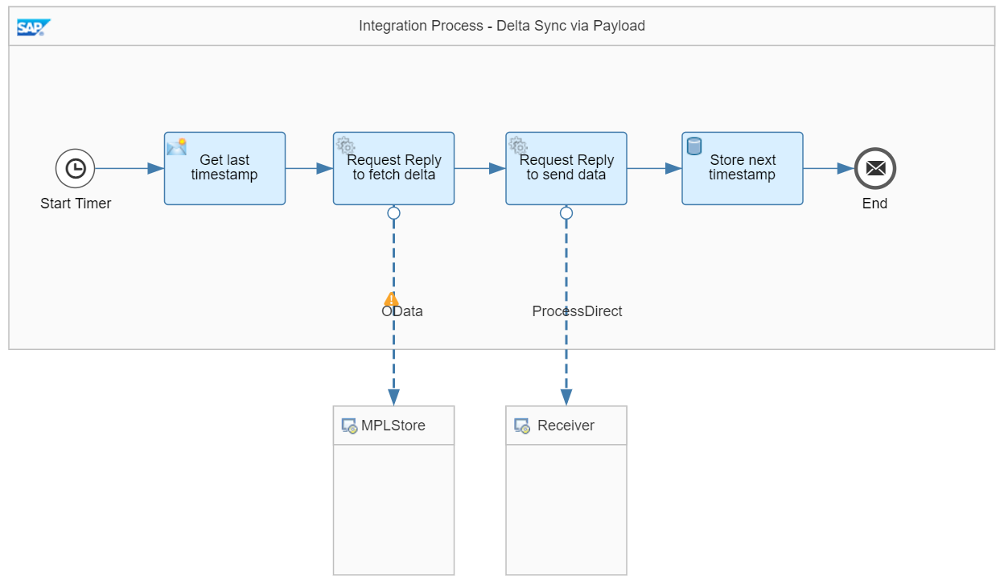

<!-- loio28a600620386493994b971299f220c00 -->

# Delta Synchronization Via Timestamp in Payload

This variant contains the same steps as the [Delta Synchronization Via Date Now XPath](delta-synchronization-via-date-now-xpath-698307a.md) variant, however, the calculation of the timestamp for the subsequent call is different.

The example integration flow *Modeling Basics - Delta Sync With Timestamp Via Payload* is designed in the following way:

It works as follows:

1.  The integration flow starts with a Timer event.

    Usually, you schedule the timer on a regular basis. For demo purposes, the timer is scheduled to run once. The message is triggered immediately after the integration flow is deployed. For the 2nd and all subsequent runs, the integration flow must be deployed again.

2.  In the *Get last timestamp* Content Modifier step, the `dateNow` exchange property is specified in the following way:

    ****

    <table>
    <tr>
    <th valign="top">

    Name
    
    </th>
    <th valign="top">

    Type
    
    </th>
    <th valign="top">

    Value
    
    </th>
    <th valign="top">

    Default Value
    
    </th>
    </tr>
    <tr>
    <td valign="top">
    
    lastSync
    
    </td>
    <td valign="top">
    
    Local Variable
    
    </td>
    <td valign="top">
    
    timestamp\_DS\_TSvPayload
    
    </td>
    <td valign="top">
    
    \{\{defaultDate\}\}
    
    </td>
    </tr>
    </table>
    
    The value of the `timestamp_DS_TSvPayload` local variable is written into the `lastSync` property. During the first run of the process, the `timestamp_DS_TSvPayload` local variable does not exist yet. Therefore, the default value is assigned to the property. In this case, in order to avoid a huge amount of data being retrieved, a default timestamp is used that isn't too far in the past.

    As a result, the first run picks up all records from the source system. For all subsequent scheduled executions of the process, a timestamp stored in the `timestamp_DS_TSvPayload` variable is used.

3.  In the next step, the OData channel requests message processing logs via the OData API.

    The OData receiver channel contains the following details:

    ****

    <table>
    <tr>
    <th valign="top">

    Parameter
    
    </th>
    <th valign="top">

    Value
    
    </th>
    </tr>
    <tr>
    <td valign="top">
    
    Operation Details
    
    </td>
    <td valign="top">
    
    GET
    
    </td>
    </tr>
    <tr>
    <td valign="top">
    
    Resource Path
    
    </td>
    <td valign="top">
    
    MessageProcessingLogs
    
    </td>
    </tr>
    <tr>
    <td valign="top">
    
    Query Options
    
    </td>
    <td valign="top">
    
    $select=MessageGuid, Status, LogStart&$filter=LogStart gt datetime'$\{property.lastSync\}'&$orderby=LogStart desc
    
    </td>
    </tr>
    </table>
    
    The received records are sorted by `LogStart` in descending order. Therefore, the top record has the latest `LogStart` date. This date is persisted during the last step and used as the timestamp during the next call.

4.  In the 2nd call, the result set is sent to the receiver integration flow where it is stored in the *DeltaSync* Data Store.

5.  Once the data exchange is complete, the *Store next timestamp* Write Variables step fetches the `LogStart` date from the top record in the payload and persists the timestamp in the `timestamp_DS_TSvPayload` variable.

    To fetch the `LogStart` value from the top record, the following XPath expression is used:

    `//MessageProcessingLogs/MessageProcessingLog[1]/LogStart`

    > ### Note:  
    > To guarantee data consistency, the *Store next timestamp* step \(that stores data in the tenant database\) is placed at the very end of the overall process on purpose. Furthermore, prevents database transactions from being kept open for too long. If an exception occurs during integration flow processing, the old timestamp isn't overwritten, and a subsequent integration flow execution fetches the same data again. With this setup, quality of service *at least once* is implemented. With respect to the database transaction, *Transaction Handling* for the Integration Process is set to *Not Required*. Otherwise, a database transaction is already opened at the beginning of the overall process and kept open until the whole process ends. For large messages, this can cause transaction log issues on the database.

