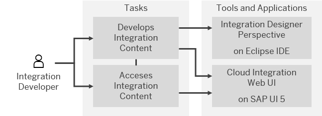

<!-- loio78d23d4d913e4f5e9bbe065df30075f7 -->

# Development

Design integration content in order to specify how messages are to be exchanged between the connected components.

SAP Cloud Integration provides a set of tools and applications that help you perform end-to-end tasks on development and deployment, packaging and publishing, accessing and editing the integration content.

This topic provides an overview of roles, working environment and tasks involved in managing integration content.

Since the tasks are performed by different roles, in different working environment such as, Integration Designer on Eclipse platform or SAP Cloud Integration Web application on SAP UI5, the figure below helps you understand the relationship between the roles, tools/applications, and tasks:

**Related Information**  

[Getting Started with Integration Flow Development](getting-started-with-integration-flow-development-e5724cd.md "Learn how to develop and run your first integration flow.")

[Packaging Integration Content in Cloud Integration](packaging-integration-content-in-cloud-integration-89da0a2.md "")

[Developing Integration Content with SAP Cloud Integration](developing-integration-content-with-sap-cloud-integration-e6b43b4.md "You can use SAP Cloud Integration to access and design integration content.")

[Developing an OData API Project](developing-an-odata-api-project-d961654.md "")

[Developing Script and Script Collection](developing-script-and-script-collection-e60f706.md "Cloud Integration lets you create and upload scripts, assemble them into script collection artifacts, and reuse them across different integration artifacts.")

[Developing Custom Adapters](developing-custom-adapters-7392cc4.md "Develop adapters tailored for your specific requirements.")

[Parameterizing Integration Flows Using the Partner Directory](parameterizing-integration-flows-using-the-partner-directory-b7812a5.md "The Partner Directory is a tenant-specific storage option that allows you to store information on business partners that are connected to the tenant in the context of a larger business network.")

[API Documentation](api-documentation-3fd9fc9.md "Cloud Integration provides various application programming interfaces (APIs) with which you can access data.")

[Integration Flow Design Guidelines](integration-flow-design-guidelines-6803389.md "As an integration developer, you need to make sure that you design integration flows in a robust fashion in order to safeguard your company's mission-critical business processes.")

