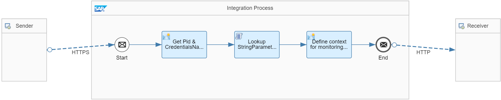

<!-- loiodde6b3a212db425c97417d2295187deb -->

# Dynamically Address Receivers

Dynamically address a receiver system based on information stored in the Partner Directory.

Assume that you need to establish communication with different receiver systems for different partners. The receiver address and the credentials to use to call the receiver are partner-specific. You can store the relevant information \(receiver address and credentials alias\) per partner in the Partner Directory. You can use the information stored in the Partner Directory to parameterize an integration flow in the following way: You can use the same integration flow to communicate with different receivers. The receiver address and user credentials to be used are dynamically chosen from the Partner Directory at runtime \(based on a partner identifier provided with the inbound message\).

To illustrate this rule, check out the *Partner Directory – Dynamic Receiver* integration flow. It's modeled as shown in the figure.



The integration flow performs the following steps:

1.  It receives a request from the corresponding Postman collection. This request provides the partner id \(`PartnerA`\) in the request body.

    > ### Sample Code:  
    > ```
    > <Order>
    > 	<Header>
    > 		<PID>{{partner_id}}</PID>
    > 	</Header>
    > 	<Items>
    > 		<item>
    > 			<ProductId>Product</ProductId>
    > 			<Description>Description</Description>
    > 			<Price>10.00</Price>
    > 			<Qtty></Qtty>
    > 		</item>
    > 	</Items>
    > </Order>
    > ```

2.  The Content Modifier *Get Pid & CredentialsName* gets the values of the elements `PID` from payload \(using XPath\) and saves them as properties.

3.  The Groovy Script step *Lookup StringParameter from PD* uses a script to access the Partner Directory using the actual value of `PID`. Furthermore, it gets the String Parameter `ReceiverUrl`, and saves it as property.

    This value is used in a later step by the HTTP adapter to address the receiver endpoint.

    The following sample code shows the script:

    > ### Sample Code:  
    > ```
    > def Message processData(Message message) {
    > 
    >     def service = ITApiFactory.getApi(PartnerDirectoryService.class, null); 
    >     if (service == null){
    >         throw new IllegalStateException("Partner Directory Service not found");
    >     }       
    >     
    >     // PD Partner ID
    >     def properties = message.getProperties(); 
    >     def Pid = properties.get("pid");
    >     if (Pid == null){
    >         throw new IllegalStateException("Partner ID not found in sent message");   
    >     }
    >     
    >     // Partner URL
    >     def receiverUrl = service.getParameter("ReceiverUrl", Pid , String.class);
    >     if (receiverUrl == null){
    >         throw new IllegalStateException("Partner ID " + Pid + " not found or ReceiverUrl parameter not found in the Partner Directory for the partner ID " + Pid);      
    >     }
    >     message.setProperty("receiverUrl", receiverUrl);    
    >     
    >     // This expression can be used also directly in receiver channel or in content modifier "pd:${property.pid}:${property.credentialsName}:UserCredential"
    >     message.setProperty("credentialAlias", "pd:" + Pid + ":ReceiverCredentials:UserCredential");
    > 
    >     return message;
    > }
    > 
    > ```

4.  The Content Modifier *Define context for monitoring purposes & set credentials* sets the `context` and `receiver` headers for the subsequent *Generic Receiver* integration flow.

    The headers are defined with the following expressions:

    ****


    <table>
    <tr>
    <th valign="top">

    Header
    
    </th>
    <th valign="top">

    Expression
    
    </th>
    <th valign="top">

    Description
    
    </th>
    </tr>
    <tr>
    <td valign="top">
    
    context
    
    </td>
    <td valign="top">
    
    `PartnerDirectory-DynamicReceiver`
    
    </td>
    <td valign="top">
    
    Defines the Data Store name. In this case, the name reflects this guideline.
    
    </td>
    </tr>
    <tr>
    <td valign="top">
    
    receiver
    
    </td>
    <td valign="top">
    
    `Partner ${property.pid}` 
    
    </td>
    <td valign="top">
    
    Defines the Data Store entry ID. In this case, the value is given by the partner ID from the Partner Directory.
    
    </td>
    </tr>
    </table>
    
5.  Finally, the integration flow calls the *Generic Receiver* integration flow.

    In the example scenario, the *Generic Receiver* integration flow isn't called through the Process Direct adapter like in the example scenarios for the other guidelines. The *Generic Receiver* integration flow is called through an HTTP adapter. This design was chosen to illustrate the dynamic determination of the receiver at runtime based on the data stored in the Partner Directory.

    -   Expression `${property.receiverUrl}` is used to dynamically define the *Address* parameter of the receiver channel \(based on the Cloud Integration runtime address stored in the Partner Directory\).

    -   Expression `${property.credentialAlias}` is used to dynamically define the *Credential Name* parameter of the receiver channel \(based on the User Credentials alias stored in the Partner Directory\).


To process the integration flow, perform the following steps:

1.  Deploy the integration flows *Partner Directory – Dynamic Receiver* and *Generic Receiver*.

2.  Start the Postman Runner and select collection *CPI Partner Directory Example Flows*.

3.  Select folder *Dynamic Receiver* in the folder structure for the relevant cloud environment \(under *Neo Environment* \> *Integration Flows \(Neo\)* or *CF Environment* \> *Integration Flows \(CF\)*\).

4.  Start the Postman runner for folder *Dynamic Receiver*.


On successful processing, the integration flow creates the following Data Store entry:

-   Data Store name: *PartnerDirectory-DynamicReceiver*

-   Data Store entry ID: *Partner <PID\>*


