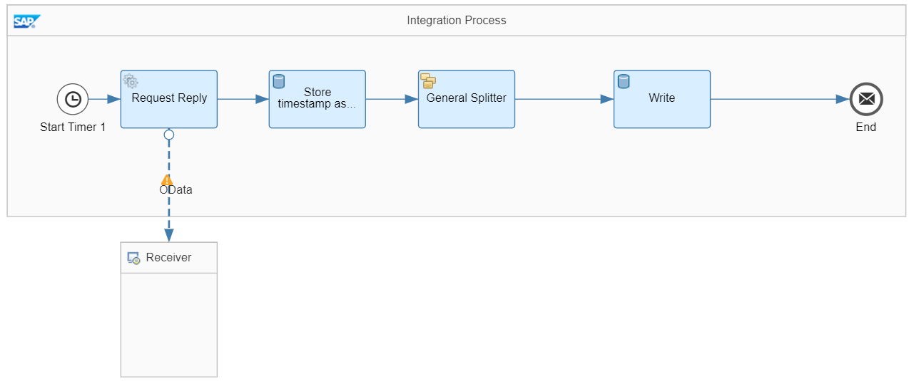

<!-- loio773a7ec0b51b4857815e7e2bfb5f74ca -->

# Example Using a Global Data Store and a Global Variable

You can use global data stores and global variables to share data across different integration flows deployed on the same tenant.

The following example shows how to use global data stores and global variables combined in a simple integration scenario. This example illustrates the use case where two integration flows that run independently from each other share common data. For more information, see [Variant: Sharing Data Across Integration Flows That Operate Independently from Each Other](variant-sharing-data-across-integration-flows-that-operate-independently-from-each-other-1459948.md).

The following use case is implemented.

A seller of electronic products \(referred to as WebShop\) provides the feature that customers can give feedback to each product listed in a product catalog. You like to implement a scenario where the actual customer feedback is analyzed. However, you like to keep the number of calls to the seller to a minimum to reduce dependency from Cloud Integration to external systems. Furthermore, it's sufficient for your use case that the data from the seller is up to date on a daily basis.

Therefore, you implement one integration flow that reads the actual customer review data from the WebShop once per day, triggered by a *Timer* step. This integration flow in detail performs the following steps:

1.  It stores the actual system time as a global variable.

2.  It stores all customer reviews in a data store.

The external data source supports the Open DataProtocol \(OData\). For our scenario, we use the ESPM WebShop, which is based on the Enterprise Sales and Procurement Model \(ESPM\) provided by SAP.

A second integration flow is triggered by an HTTP client and reads out the actual number of customer reviews by accessing the data store. Furthermore, the timestamp from the latest update of the data store entries is read out as well and added to the integration flow response. As you remember, the timestamp has been created during the last run of the first integration flow. For sakes of simplicity, only the number of customer reviews is retrieved in our example scenario. In a real-world scenario, you can imagine a more sophisticated processing of the data, for example, filtering out customer review data with a certain rating.

In other words, both integration flows share data that is provided as global variable and as data store content.

The first, timer-triggered integration flow is modeled in the following way:

The integration flow performs the following steps:

1.  A *Timer* event triggers the operation of the integration flow. In the example, this component is configured in such a way that the integration flow runs once per day.

2.  A *Request Reply* step calls the WebShop component through the OData V2 receiver adapter.

    The adapter is configured in a similar way as described under [Variant: Timer-Initiated Scenario with External Data Source and Receiver](variant-timer-initiated-scenario-with-external-data-source-and-receiver-7e766dd.md).

    However, as we are interested in customer reviews, when configuring the channel make sure to specify as *Resource Path* the entity *CustomerReviews* without any further query options.

    In other words, the adapter gets a response from the WebShop component that contains multiple customer reviews.

3.  The *Write Variables* step *Store timestamp as variable* is configured in the following way \(tab *Processing*\):

    ****

    <table>
    <tr>
    <th valign="top">

    Parameter
    
    </th>
    <th valign="top">

    Value
    
    </th>
    </tr>
    <tr>
    <td valign="top">
    
    Name
    
    </td>
    <td valign="top">
    
    timestamp
    
    </td>
    </tr>
    <tr>
    <td valign="top">
    
    Type
    
    </td>
    <td valign="top">
    
    Expression
    
    </td>
    </tr>
    <tr>
    <td valign="top">
    
    Data Type
    
    </td>
    <td valign="top">
    
    java.lang.String
    
    </td>
    </tr>
    <tr>
    <td valign="top">
    
    Value
    
    </td>
    <td valign="top">
    
    $\{date:now:yyyy-MM-dd HH:mm:ss\}
    
    </td>
    </tr>
    </table>
    
    The option *Global Scope* is selected.

    This variable is at runtime updated with the actual system time and can be shared with other integration flows on the same tenant.

4.  The *General Splitter* is configured so that it splits the message from the WebShop so that for each customer review an individual message is created.

    ****

    <table>
    <tr>
    <th valign="top">

    Parameter
    
    </th>
    <th valign="top">

    Value
    
    </th>
    </tr>
    <tr>
    <td valign="top">
    
    Expression Type
    
    </td>
    <td valign="top">
    
    XPath
    
    </td>
    </tr>
    <tr>
    <td valign="top">
    
    XPath Expression
    
    </td>
    <td valign="top">
    
    //CustomerReview
    
    </td>
    </tr>
    </table>
    
    The default settings remain unchanged.

5.  The Data Store *Write* step is configured in the following way:

    ****

    <table>
    <tr>
    <th valign="top">

    Parameter
    
    </th>
    <th valign="top">

    Value
    
    </th>
    </tr>
    <tr>
    <td valign="top">
    
    Data Store Name
    
    </td>
    <td valign="top">
    
    CustomerReviews
    
    </td>
    </tr>
    <tr>
    <td valign="top">
    
    Visibility
    
    </td>
    <td valign="top">
    
    Global
    
    </td>
    </tr>
    <tr>
    <td valign="top">
    
    Entry ID
    
    </td>
    <td valign="top">
    
    $\{xpath./CustomerReviews/CustomerReview/CustomerReviewId/text\(\)\}

    For the actual customer review, an entry is created in the data store with an ID identical to the `CustomerReviewId` value from the message.
    
    </td>
    </tr>
    </table>
    

The second integration flow is modeled in the following way:

The integration flow performs the following steps:

1.  Execution of the integration flow is triggered by an HTTP client \(for example, Postman\) through the HTTPS sender adapter.

2.  The Data Store *Select* step is configured in the following way:

    ****

    <table>
    <tr>
    <th valign="top">

    Parameter
    
    </th>
    <th valign="top">

    Value
    
    </th>
    </tr>
    <tr>
    <td valign="top">
    
    Data Store Name
    
    </td>
    <td valign="top">
    
    CustomerReviews
    
    </td>
    </tr>
    <tr>
    <td valign="top">
    
    Visibility
    
    </td>
    <td valign="top">
    
    Global
    
    </td>
    </tr>
    <tr>
    <td valign="top">
    
    Number of Polled Messages
    
    </td>
    <td valign="top">
    
    1000

    A large number is entered to make sure that all data store entries are retrieved.
    
    </td>
    </tr>
    </table>
    
3.  The Content Modifier *Get timestamp and store payload* is configured in the following way \(tab *Exchange Property*\):

    ****

    <table>
    <tr>
    <th valign="top">

    Name
    
    </th>
    <th valign="top">

    Type
    
    </th>
    <th valign="top">

    Data Type
    
    </th>
    <th valign="top">

    Value
    
    </th>
    </tr>
    <tr>
    <td valign="top">
    
    count
    
    </td>
    <td valign="top">
    
    XPath
    
    </td>
    <td valign="top">
    
    java.lang.String
    
    </td>
    <td valign="top">
    
    count\(//message\)
    
    </td>
    </tr>
    <tr>
    <td valign="top">
    
    timestamp
    
    </td>
    <td valign="top">
    
    Global Variable
    
    </td>
    <td valign="top">
    
     
    
    </td>
    <td valign="top">
    
    timestamp
    
    </td>
    </tr>
    </table>
    
4.  The Content Modifier *Define message body* is \(tab *Message Body*\):

    `There are ${property.count} customer reviews (updated at ${property.timestamp}).`

> ### Note:  
> When using integration flow components that store data in the system, it is important to make sure that a proper transaction handling is implemented. Only then you can ensure that data consistency is preserved also if errors occur. The data store and variables are JDBC-transacted resources.
> 
> To configure transaction handling for JDBC resources, click the *Integration Process* shape of your integration flow model and make sure that the following setting is configured for both integration flows \(*Processing* tab\):
> 
> ****
> 
> 
> <table>
> <tr>
> <th valign="top">
> 
> Parameter
> 
> </th>
> <th valign="top">
> 
>  
> 
> </th>
> </tr>
> <tr>
> <td valign="top">
> 
> Transaction Handling
> 
> </td>
> <td valign="top">
> 
> Required for JDBC
> 
> </td>
> </tr>
> </table>
> 
> For more information, check out:
> 
> -   [Cloud Integration – How to configure Transaction Handling in Integration Flow](https://blogs.sap.com/2017/05/31/cloud-integration-how-to-configure-transaction-handling-in-integration-flow/) \(SAP Community blog\)
> 
> -   [Define Proper Transaction Handling](define-proper-transaction-handling-1c31963.md) \(integration flow design guidelines\)

<a name="loio773a7ec0b51b4857815e7e2bfb5f74ca__section_h22_z2l_ypb"/>

## Executing the Scenario

First deploy the first integration flow.

When going to the *Monitor* application and selecting the *Data Stores* tile under *Manage Stores*, you notice that a data store with several entries has been created. The entry IDs are 3-digit numbers.

When going to the *Monitor* application and selecting the *Variables* tile under *Manage Stores*, you notice that a `timestamp` variable has been created that contains the system time of the execution of the integration flow.

Deploy the second integration flow and set up the inbound connection with an HTTP client \(for example, Postman\).

Call the integration flow with the HTTP client to receive a response like the following one:

`There are 20 customer reviews (updated at 2021-06-14 12:26:55).`

You can add a new customer review on the WebShup user frontend at: [https://refapp-espm-ui-cf.cfapps.eu10.hana.ondemand.com/webshop/index.html](https://refapp-espm-ui-cf.cfapps.eu10.hana.ondemand.com/webshop/index.html).

When you call the second integration flow again, you get the same response as before. When you first deploy the first. Timer-triggered integration flow and, thereafter, execute the second one, you get a response with the number of customer reviews increased by one.

