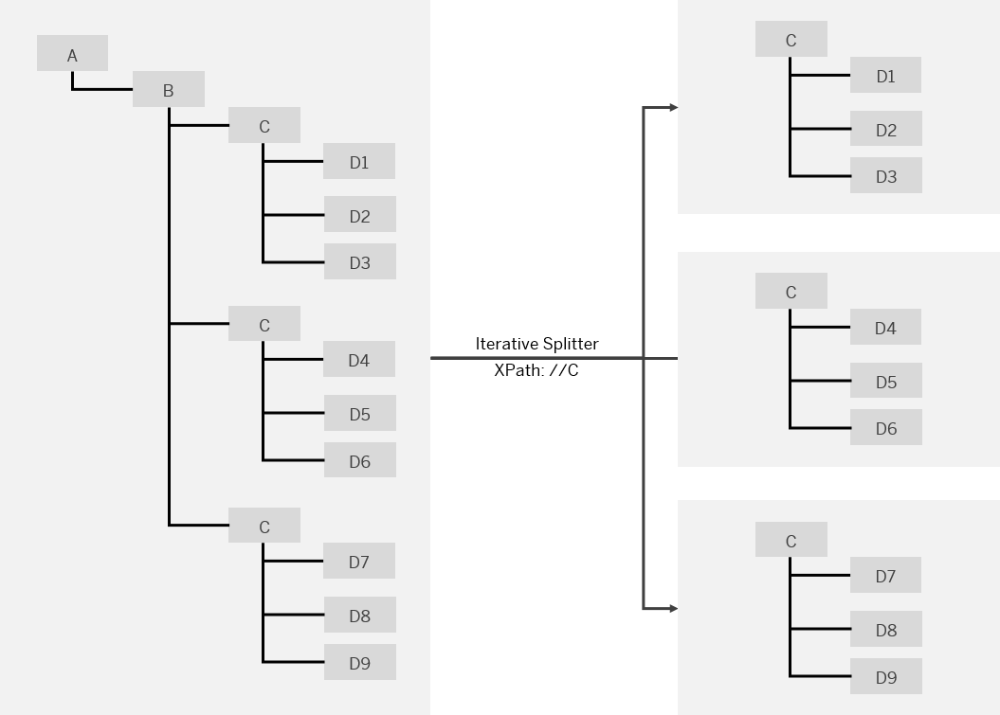

<!-- loiob49d088a87854a07a761596bf0890389 -->

# General and Iterating Splitter

The two splitter types General Splitter and Iterative Splitter behave differently in their handling of the enveloping elements of the input message.

The following figures illustrate the behavior of both splitter types. In both cases an input message comprising a dedicated number of items is split into individual messages.

<a name="loiob49d088a87854a07a761596bf0890389__section_djv_fxw_lkb"/>

## General Splitter

The *General Splitter* splits a composite message comprising N messages into N individual messages, each containing one message with the enveloping elements of the composite message. We use the term *enveloping elements* to refer to the elements above and including the split point. Note elements that follow the one which is indicated as split point in the original message \(but on the same level\), are'nt counted as enveloping elements. They will not be part of the resulting messages.

  
  
**General Splitter**

> ### Caution:  
> Note that in case there are elements in the original message that follow the one indicated as split point \(and on the same level\), the *General Splitter* generates result messages where these elements are missing. In the following example \(for sakes of simplicity with only two instead of three split messages\), the split point is set to element `C` that is followed by element `E`. As shown in the figure, element `E` is missing in each result message.
> 
>   
>   
> **General Splitter \(Example for Specific Case\)**
> 
> ")

<a name="loiob49d088a87854a07a761596bf0890389__SplitterGeneralIterating"/>

## Iterating Splitter

The *Iterating Splitter* splits a composite message into a series of messages without copying the enveloping elements of the composite message.

  
  
**Iterating Splitter**

**Related Information**  

[General and Iterating Splitter \(Examples\)](general-and-iterating-splitter-examples-698e594.md "")

