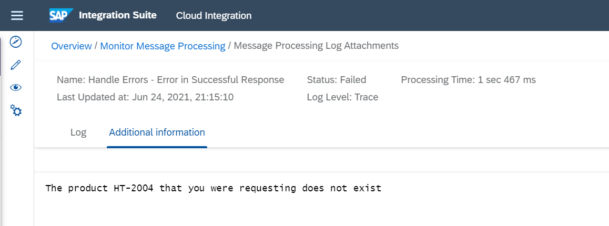

<!-- loiof066020e373c4a31bff0fc7bf3e73d2b -->

# Handle Errors in Successful Responses

Learn how to handle error situations where the response message transfer is successful, however the response contains an error message.

There are situations where the return HTTP status code of the receiver is `200` even if an error occurred. If the integration flow only checked the HTTP status code, the message processing would finish successfully. Therefore, the integration flow would get status *Completed* in the message monitor. So, the risk is that you don't even notice that an issue in the receiving application happened.

Since the error is given in the message payload, the message can be parsed and you, the integration developer, can react accordingly if an error is contained. In such a case, you've different options how to handle such error cases:

-   Adding additional logs to the message processing log

-   Preparing a custom response for the sender application

-   Raising an error in the integration flow using different end events


For more information, see [Handle Exceptions](handle-exceptions-ca95c61.md).

This topic shows you how to raise an error to the sender application so that the sender gets informed about the situation and can react accordingly. For better logging, the returned error message is added to the message processing log as attachment.

Another example can be found in the following SAP Community blog: [How to tackle “disguised” errors in your integration flows](https://blogs.sap.com/2018/06/08/how-to-tackle-disguised-errors-in-your-integration-flows/).


<a name="loiof066020e373c4a31bff0fc7bf3e73d2b__section_vb1_pdk_1qb"/>

## Implementation

The *Handle Errors - Error in Successful Response* integration flow retrieves product information from the WebShop component. Depending on the response of the WebShop call, the integration flow either sends the product details back to the sender or triggers an error.

Unlike in most other integration flow design guidelines, here the WebShop is called through the ProcessDirect adapter for the following reason: There's a helper integration process with the name *Integration Process simulating web shop with modified response* that performs the actual call to the WebShop and then adds additional log information to the response. This integration process is called from the main process through the ProcessDirect adapter. Since this helper integration process isn't relevant for understanding the guideline, it isn't described in detail.

It’s sufficient to know that in case of an error, the call itself is successful. However, in this case, a log record of severity `Error` is returned.


The integration flow performs the following steps:

1.  The Request Reply step calls the 2nd integration process \(that mocks the WebShop\) through the ProcessDirect adapter.

2.  A Router step checks if the response contains any log record with severity `Error`. The condition for the error path is defined by the following expression:

    `/Products/Log/Record/Severity = 'Error'` 

    The other path is defined as default route.

    -   For the default route, the log entries are filtered out using a *Filter* step. The *XPath Expression* of the *Filter* step is set to: */Products/Product*.

        The *Value Type* parameter is specified as *Node* as a single XML node `Product` is expected.

    -   For the error route, the response message is to be added to the log. For that purpose, the relevant part is extracted from the message body using a *Filter* step. The *XPath Expression* of the filter step is set to: */Products/Log/Record/Message*.

        The *Value Type* parameter is specified as *String*.


3.  After extracting the relevant message in the error route, a Groovy script adds the filtered body to the MPL as attachment.

    ```
    import com.sap.gateway.ip.core.customdev.util.Message
    import java.util.HashMap
    
    def Message processData(Message message) {
        def body = message.getBody(java.lang.String)
        def messageLog = messageLogFactory.getMessageLog(message)
        if (messageLog != null) {
            messageLog.addAttachmentAsString('Additional information', body, 'text/plain')
        }
        return message
    }
    ```

4.  Finally, the error path ends with an *Error End* event. This event sets the message processing log \(MPL\) to status *Error*, and the sender receives a generic response message containing the MPL ID. The response also contains the error information.


<a name="loiof066020e373c4a31bff0fc7bf3e73d2b__section_xy3_b15_1qb"/>

## Executing the Scenario

If you use Postman together with the Postman collection provided with the package, expand the collection folder *ErrorInSucccessfulResponse*. In this folder, you find a request with `productId` as header.

If you run the scenario with an existing product, for example associated with a `productId` value `HT-2001`, the mocked WebShop returns the following message payload:

```

<Products>
   <Product>
      <DimensionWidth>0.2400</DimensionWidth>
      <Category>Portable Players</Category>
      <LongDescription>10 inch LCD Screen, storage battery holds up to 8 hours</LongDescription>
      <ProductId>HT-2001</ProductId>
      <DimensionUnit>m</DimensionUnit>
      <DimensionHeight>0.2900</DimensionHeight>
      <Weight>0.840</Weight>
      <DimensionDepth>0.1950</DimensionDepth>
      <Name>10 inch Portable DVD player</Name>
   </Product>
   <Log>
      <Record>
         <Severity>Info</Severity>
         <Message>Product HT-2001 exists</Message>
         <Timestamp>2021-06-24T19:13:02</Timestamp>
      </Record>
      <Record>
         <Severity>Warning</Severity>
         <Message>Only 2 PC on stock</Message>
         <Timestamp>2021-06-24T19:13:02</Timestamp>
      </Record>
   </Log>
</Products>
```

As described above, the filter of the default router path is used to remove the log records, so your response looks as follows:

```
<Product>
    <DimensionWidth>0.2400</DimensionWidth>
    <Category>Portable Players</Category>
    <LongDescription>10 inch LCD Screen, storage battery holds up to 8 hours</LongDescription>
    <ProductId>HT-2001</ProductId>
    <DimensionUnit>m</DimensionUnit>
    <DimensionHeight>0.2900</DimensionHeight>
    <Weight>0.840</Weight>
    <DimensionDepth>0.1950</DimensionDepth>
    <Name>10 inch Portable DVD player</Name>
</Product>
```

If you rerun the scenario, specify a `product` ID that doesn't exist, for example, `HT-2004`. The mocked WebShop returns the following message payload to the main integration process:

```
<Products>
   <Log>
      <Record>
         <Severity>Error</Severity>
         <Message>The product HT-2004 that you were requesting does not exist</Message>
         <Timestamp>2021-06-24T19:15:09</Timestamp>
      </Record>
   </Log>
</Products>
```

Since the response contains a log record with severity `Error`, the error path is carried out. In this case, you receive an error message pointing to the MPL ID. Furthermore, an http status code 500 Internal Server Error is returned.

```
An internal server error occured: The MPL ID for the failed message is : Abcd-1234-Xyz
For more details please check tail log.
```

In the message monitor, select the log in status *Failed*, and navigate to the attachments. You see the error message in the *Additional information* attachment:



