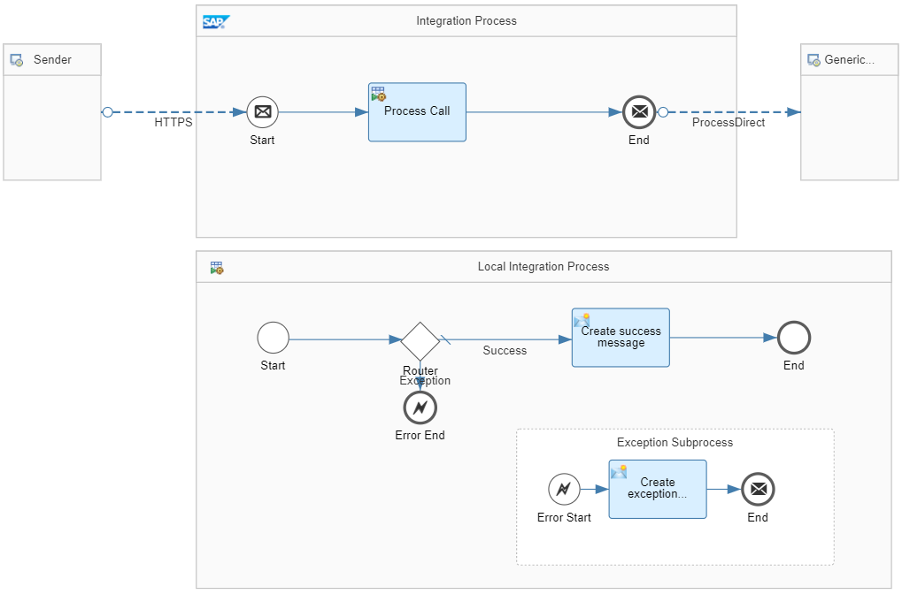

<!-- loioe8b10b6eaac24c8f9ad7ab0874fefef6 -->

# Handle Exceptions in Subprocess \(Simple Scenario\)

Handle exception raised in a subprocess.

Let's assume that you've modularized your integration logic using subprocesses, and an exception is raised in a subprocess.

<a name="loioe8b10b6eaac24c8f9ad7ab0874fefef6__section_ekj_mb1_fsb"/>

## Implementation

To learn how to handle such an exception, check out the integration flow *Handle Errors - Local Integration Process*.

The integration flow performs the following steps \(only exception use case considered\).

1.  The integration flow receives a message from an HTTP client with a header that indicates that an exception is to be triggered in the subprocess \(header `exception_in_subprocess` is by default set to `true`\).

2.  The *Process Call* step calls the local integration process subprocess.

3.  Because header `exception_in_subprocess` is set to `true`, the subprocess ends with an *Error End* event \(taking the `Exception` route\). Consequently, the exception subprocess takes over the message processing.

4.  The Content Modifier *Create exception message* in the exception subprocess generates the following message body:

    `Error: Message processing failed.`

5.  The system hands over the message body and the headers to the main integration process.

6.  The main integration process sends back the exception message to the HTTP client. Furthermore, the system ends processing of the main integration process. This means that the *Generic Receiver* integration flow isn't called and no data store entry is created.

However, in case of successful procesing \(when header `exception_in_subprocess` is set to `false`\), the other route of the subprocess is taken and generates a success message to be stored in a data store entry with the entry ID *Success*.

To execute the integration scenario using Postman, perform the following steps:

1.  Open the Postman collection that comes with the integration package.

2.  Go to the folder *Subprocess*.

3.  Perform the HEAD and then the POST request. The header `exception_in_subprocess` by default has the value `true`.

    You get the following response:

    `Error: Message processing failed.`

4.  However, no data store entry is created. You can also set the log level of the integration flow to *Trace*, run the integration flow again, and verify in the monitoring that the steps after the *Process Call* haven't been processed.

To run the integration scenario in success mode, change the value of header `exception_in_subprocess` in Postman \(at the POST request\) to `false`.

> ### Note:  
> When setting up the integration scenario, you learned the following: If an exception occurs, the steps after the local *Process Call* step aren't processed any more. Consequently, the *Generic Receiver* integration flow isn't called and no data store entry is created.
> 
> The integration flow *Handle Errors - Dependent Integration Flows - Simple Scenario* is designed analogously \(see [Handle Exceptions in Dependent Integration Flows \(Simple Scenario\)](handle-exceptions-in-dependent-integration-flows-simple-scenario-984e51a.md)\). However, instead of a subprocess, it uses a separate integration process \(connected with the ProcessDirect adapter\). If in this scenario an exception occurs, the steps after the Request Reply step are processed. That means that the *Generic Receiver* integration flow is called and a data store entry is created.

